

# Artifact Evaluation Report (Small Machine): VLASelect

In this report, we reproduce all the experiments in the VLASelect paper following the step-by-step instructions in [README](./README.md). All experiments were conducted on a small machine using the minimal working examples.

## Outline

- [Artifact Evaluation Report (Small Machine): VLASelect](#artifact-evaluation-report-small-machine-vlaselect)
  - [Outline](#outline)
  - [1. Hardware and Software Specifications](#1-hardware-and-software-specifications)
  - [2. Evaluation Reproduction](#2-evaluation-reproduction)
    - [2.1 One-click Reproduction](#21-one-click-reproduction)
    - [2.2 Step-by-Step Reproduction](#22-step-by-step-reproduction)
      - [2.2.1 Experiment 1: (Figure 7 in Section 5.2.1) Accuracy Under Tasks/Environment Changes](#221-experiment-1-figure-7-in-section-521-accuracy-under-tasksenvironment-changes)
      - [2.2.2 Experiment 2: (Figure 8 in Section 5.2.2) Accuracy Under Available Resource Changes](#222-experiment-2-figure-8-in-section-522-accuracy-under-available-resource-changes)
      - [2.2.3 Experiment 3: (Figure 9 and Tables 2/3 in Section 5.3.1) Overheads Under The Same Accuracy](#223-experiment-3-figure-9-and-tables-23-in-section-531-overheads-under-the-same-accuracy)
      - [2.2.4 Experiment 4: (Figure 10 in Section 5.3.2) Time Breakdown of VLASelect's Modules](#224-experiment-4-figure-10-in-section-532-time-breakdown-of-vlaselects-modules)
      - [2.2.5 Experiment 5: (Figure 11 in Section 5.3.2) Training Time Breakdown in Each Workload](#225-experiment-5-figure-11-in-section-532-training-time-breakdown-in-each-workload)
      - [2.2.6 Experiment 6: (Figure 12 in Section 5.4) Design Choice Validation by Ablation](#226-experiment-6-figure-12-in-section-54-design-choice-validation-by-ablation)
      - [2.2.7 Experiment 7: (Discussion 1 in Section 5.5) Sim-to-Real Transfer](#227-experiment-7-discussion-1-in-section-55-sim-to-real-transfer)
      - [2.2.8 Experiment 8: (Discussion 2 in Section 5.5) ICL (In-Context Learning)](#228-experiment-8-discussion-2-in-section-55-icl-in-context-learning)
      - [2.2.9 Experiment 9: (Discussion 3 in Section 5.5) Maximum Supported Model Size](#229-experiment-9-discussion-3-in-section-55-maximum-supported-model-size)
      - [2.2.10 Experiment 10: (Discussion 4 in Section 5.5) Applicability to Multi-Agent Scenarios](#2210-experiment-10-discussion-4-in-section-55-applicability-to-multi-agent-scenarios)
      - [2.2.11 Experiment 11: (Discussion 5 in Section 5.5) Comparison with Alternative Model Scaling Techniques](#2211-experiment-11-discussion-5-in-section-55-comparison-with-alternative-model-scaling-techniques)
      - [2.2.12 Experiment 12: (Discussion 6 in Section 5.5) Comparison between Different Knowledge Exchange Granularities](#2212-experiment-12-discussion-6-in-section-55-comparison-between-different-knowledge-exchange-granularities)
      - [2.2.13 Experiment 13: (Discussion 7 in Section 5.5) Forgetting on Previously Learned Environments/Tasks](#2213-experiment-13-discussion-7-in-section-55-forgetting-on-previously-learned-environmentstasks)
      - [2.2.14 Experiment 14: (Discussion 8 in Section 5.5) Applicability to MLP/CNN models](#2214-experiment-14-discussion-8-in-section-55-applicability-to-mlpcnn-models)
  - [3. Reusability: Integrating VLASelect with VLA Models, Scaling Strategies, and Knowledge Exchange Granularities](#3-reusability-integrating-vlaselect-with-vla-models-scaling-strategies-and-knowledge-exchange-granularities)
    - [3.1 Example 1: VLA-Adapter](#31-example-1-vla-adapter)
      - [3.1.1 Integrating the model](#311-integrating-the-model)
      - [3.1.2 Integrating different scaling strategies](#312-integrating-different-scaling-strategies)
      - [3.1.3 Integrating different knowledge exchange granularities](#313-integrating-different-knowledge-exchange-granularities)
    - [3.2 Example 2: TinyVLA](#32-example-2-tinyvla)
      - [3.2.1 Integrating the model](#321-integrating-the-model)
      - [3.2.2 Integrating different scaling strategies](#322-integrating-different-scaling-strategies)
      - [3.2.3 Integrating different knowledge exchange granularities](#323-integrating-different-knowledge-exchange-granularities)
    - [3.3 Example 3: EdgeVLA](#33-example-3-edgevla)
      - [3.3.1 Integrating the model](#331-integrating-the-model)
      - [3.3.2 Integrating different scaling strategies](#332-integrating-different-scaling-strategies)
      - [3.3.3 Integrating different knowledge exchange granularities](#333-integrating-different-knowledge-exchange-granularities)

## 1. Hardware and Software Specifications

<strong>Table 1: Hardware and Software Configuration Comparison</strong>

| Subsystem | Platform in VLASelect Paper (Full Run) | Small Machine (Minimal Working Example) |
| :---: | :---: | :---: |
| Operating System | Ubuntu 20.04/22.04 LTS (Kernel 5.4/5.15) | Ubuntu 22.04.4 LTS (Kernel 6.8) |
| CPU Architecture | 2 × Intel Xeon Gold 6430 (64C) | Intel Xeon E5-2698 v4 (16C) |
| System Memory | 128 GB DDR5 | 32 GB DDR4 |
| GPU & VRAM | NVIDIA A100 80GB (+ Edge AGX) | NVIDIA Tesla V100 (32 GB) |
| CUDA Toolchain | Driver 550.144.03, CUDA 12.4 | Driver 550.127.05, CUDA 12.4 |

 

## 2. Evaluation Reproduction

### 2.1 One-click Reproduction

This artifact evaluation did not run the one-click reproduction script. All reported results were reproduced using only the step-by-step procedure in Section 2.2.

### 2.2 Step-by-Step Reproduction

#### 2.2.1 Experiment 1: (Figure 7 in Section 5.2.1) Accuracy Under Tasks/Environment Changes

**Key observation:** VLASelect consistently achieves the **highest average accuracy** under tasks and environment changes.

<table align="center" style="width: 100%; table-layout: fixed;">
  <thead>
    <tr>
      <th style="width: 15%;"></th>
      <th style="width: 17%;">Used Resources</th>
      <th style="width: 68%; text-align: center;">Result</th>
    </tr>
  </thead>
  <tbody>
    <tr>
      <td><strong>Full Run</strong></td>
      <td> <strong>Time:</strong> 140 h  <strong>Memory (VRAM):</strong> 60 GB</td>
      <td align="center">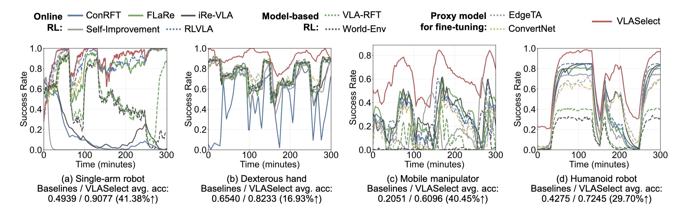</td>
    </tr>
    <tr>
      <td><strong>Minimal Working Example</strong></td>
      <td> <strong>Time:</strong> 1 h  <strong>Memory (VRAM):</strong> 20 GB</td>
      <td align="center">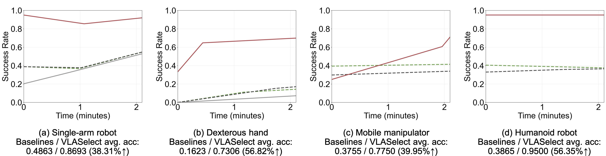</td>
    </tr>
  </tbody>
</table>

 

#### 2.2.2 Experiment 2: (Figure 8 in Section 5.2.2) Accuracy Under Available Resource Changes

**Key observation:** VLASelect consistently achieves the **highest overall accuracy** under fluctuating resource availability.

<table align="center" style="width: 100%; table-layout: fixed;">
  <thead>
    <tr>
      <th style="width: 15%;"></th>
      <th style="width: 17%;">Used Resources</th>
      <th style="width: 68%; text-align: center;">Result</th>
    </tr>
  </thead>
  <tbody>
    <tr>
      <td><strong>Full Run</strong></td>
      <td><strong>Time:</strong> 140 h <strong>Memory (VRAM):</strong> 60 GB</td>
      <td align="center">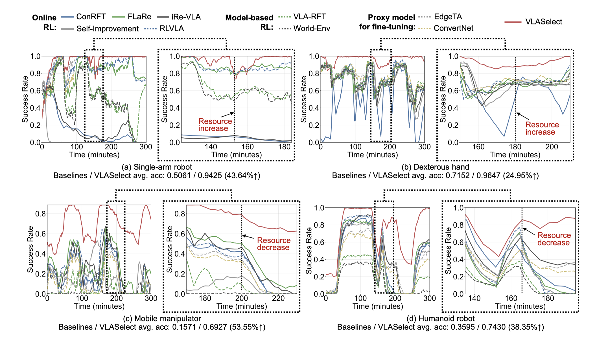</td>
    </tr>
    <tr>
      <td><strong>Minimal Working Example</strong></td>
      <td><strong>Time:</strong> 1 h <strong>Memory (VRAM):</strong> 20 GB</td>
      <td align="center">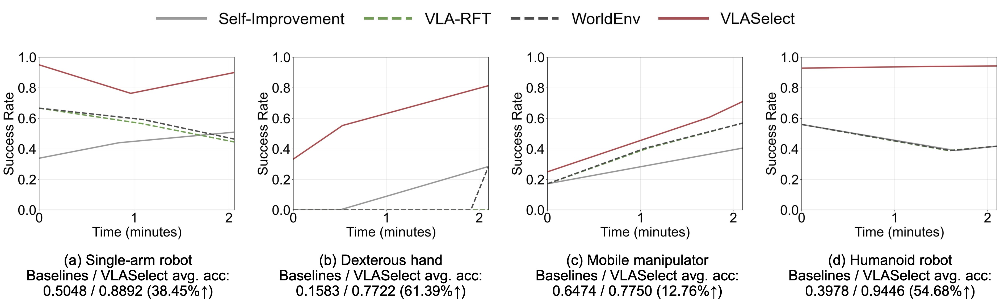</td>
    </tr>
  </tbody>
</table>
 

#### 2.2.3 Experiment 3: (Figure 9 and Tables 2/3 in Section 5.3.1) Overheads Under The Same Accuracy

**Key observation:** VLASelect consistently achieves the target accuracy with the **shortest execution time**  and the **most reduced resource consumption** compared to all baseline methods.

<table align="center" style="width: 100%; table-layout: fixed;">
  <thead>
    <tr>
      <th style="width: 15%;"></th>
      <th style="width: 17%;">Used Resources</th>
      <th style="width: 68%; text-align: center;">Result</th>
    </tr>
  </thead>
  <tbody>
    <tr>
      <td><strong>Full Run</strong></td>
      <td><strong>Time:</strong> 140 h <strong>Memory (VRAM):</strong> 60 GB</td>
      <td align="center"></td>
    </tr>
    <tr>
      <td><strong>Minimal Working Example</strong></td>
      <td><strong>Time:</strong> 1 h <strong>Memory (VRAM):</strong> 20 GB</td>
      <td align="center"></td>
    </tr>
  </tbody>
</table>

  

**Energy Consumption Analysis**

**Key observation:** VLASelect achieves the highest operational efficiency by **maintaining the lowest energy consumption** across diverse workloads and experimental settings.

> For experiments in this paper, this table was generated concurrently with the previous step.

<strong>Table 2 (Full Run): Energy Consumption Analysis: Average Energy Consumption (kJ) in Each New Task</strong>

| Method | Single-Arm Robot | Dexterous Hand | Mobile Manipulator | Humanoid Robot |
| :---: | :---: | :---: | :---: | :---: |
| ConRFT | 342.37 / 403.51 | 346.31 / 274.05 | 499.84 / 291.68 | 787.19 / 570.22 |
| FlaRe | 318.06 / 254.18 | 477.07 / 317.51 | 461.29 / 379.37 | 671.17 / 452.06 |
| iRe-VLA | 383.33 / 213.81 | 530.53 / 204.04 | 505.4 / 273.55 | 661.88 / 564.21 |
| Self-Improvement | 551.76 / 473.14 | 416.37 / 293.83 | 497.49 / 297.81 | 801.52 / 673.49 |
| RLVLA | 326.26 / 206.67 | 360.71 / 314.32 | 573.44 / 466.58 | 622.44 / 458.46 |
| VLA-RFT | 323.69 / 277.8 | 433.42 / 280.17 | 374.09 / 257.39 | 795.6 / 632.21 |
| World-Env | 329.26 / 265.45 | 339.87 / 451.14 | 666.9 / 480.57 | 775.05 / 639.55 |
| EdgeTA | 349.4 / 549.99 | 383.21 / 282.31 | 464.28 / 355.5 | 629.97 / 444.5 |
| ConvertNet | 608.37 / 454.23 | 456.51 / 327.35 | 451.61 / 378.12 | 536.37 / 451.6 |
| VLASelect | 46.06 / 44.24 | 35.41 / 25.63 | 39.46 / 25.57 | 64.71 / 45.18 |

 

<strong>Table 2 (Minimal Working Example): Energy Consumption Analysis: Average Energy Consumption (kJ) in Each New Task</strong>

| Method | Single-Arm Robot | Dexterous Hand | Mobile Manipulator | Humanoid Robot |
| :---: | :---: | :---: | :---: | :---: |
| Self-Improvement | 15.82 | 62.99 | 37.17 | 26.22 |
| VLA-RFT | 13.83 | 27.52 | 26.83 | 24.62 |
| World-Env | 12.98 | 23.96 | 33.92 | 33.03 |
| VLASelect | 0.68 | 11.37 | 12.28 | 2.58 |

 

**Experiment 3.3: Overhead comparison under the same learning accuracy**

**Key observation:** VLASelect consistently achieves the target accuracy with the **shortest execution** time and the **most reduced resource consumption** compared to all baseline methods.

> For experiments in this paper, this table was generated concurrently with the previous step.

<strong>Table 3 (Full Run): Overhead Comparison Under the Same Learning Accuracy</strong>

<table align="center" style="min-width: 1100px; text-align:center">
<thead>
<tr><th></th><th colspan="4">Time (h)</th><th colspan="4">Memory Footprint (GB)</th><th colspan="4">Energy (kJ)</th></tr>
<tr><th>Method</th><th>Single-Arm Robot</th><th>Dexterous Hand</th><th>Mobile Manipulator</th><th>Humanoid Robot</th><th>Single-Arm Robot</th><th>Dexterous Hand</th><th>Mobile Manipulator</th><th>Humanoid Robot</th><th>Single-Arm Robot</th><th>Dexterous Hand</th><th>Mobile Manipulator</th><th>Humanoid Robot</th></tr>
</thead>
<tbody>
<tr><td>ConRFT</td><td>3.88</td><td>3.14</td><td>2.83</td><td>3.78</td><td>19.12</td><td>20.88</td><td>27.92</td><td>35.71</td><td>360.39</td><td>294.89</td><td>334.87</td><td>600.23</td></tr>
<tr><td>FlaRe</td><td>2.56</td><td>3.6</td><td>2.92</td><td>2.91</td><td>23.14</td><td>31.39</td><td>27.49</td><td>33.7</td><td>295.13</td><td>384.55</td><td>384.75</td><td>492.3</td></tr>
<tr><td>iRe-VLA</td><td>2.71</td><td>3.38</td><td>2.78</td><td>3.31</td><td>21.93</td><td>24.55</td><td>27.3</td><td>42.19</td><td>253.73</td><td>374</td><td>382.41</td><td>630.36</td></tr>
<tr><td>Self-Improvement</td><td>4.52</td><td>3.48</td><td>2.86</td><td>3.95</td><td>20.93</td><td>23.52</td><td>27.53</td><td>42.11</td><td>547.71</td><td>309.29</td><td>337.9</td><td>763.35</td></tr>
<tr><td>RLVLA</td><td>2.74</td><td>3.32</td><td>3.52</td><td>3.2</td><td>15.26</td><td>17.31</td><td>18.78</td><td>32.11</td><td>275.99</td><td>353.41</td><td>546.13</td><td>608.56</td></tr>
<tr><td>VLA-RFT</td><td>3.2</td><td>3.39</td><td>2.39</td><td>4.07</td><td>28.54</td><td>30.99</td><td>29.04</td><td>60.02</td><td>319.56</td><td>412.78</td><td>341.89</td><td>704.55</td></tr>
<tr><td>World-Env</td><td>3.1</td><td>3.63</td><td>3.87</td><td>4.16</td><td>25.66</td><td>30.05</td><td>29.27</td><td>60.23</td><td>279.42</td><td>429.66</td><td>505.86</td><td>738.14</td></tr>
<tr><td>EdgeTA</td><td>4.59</td><td>3.17</td><td>2.84</td><td>3.12</td><td>17.54</td><td>19.23</td><td>21.12</td><td>37.87</td><td>523.8</td><td>382.06</td><td>440.83</td><td>467.9</td></tr>
<tr><td>ConvertNet</td><td>4.82</td><td>3.67</td><td>2.69</td><td>2.73</td><td>15.26</td><td>17.31</td><td>18.78</td><td>32.11</td><td>478.14</td><td>434.77</td><td>430.1</td><td>510.83</td></tr>
<tr><td>VLASelect</td><td>0.39</td><td>0.29</td><td>0.21</td><td>0.32</td><td>15.26</td><td>17.31</td><td>18.78</td><td>32.11</td><td>45.53</td><td>34.53</td><td>28.76</td><td>47.56</td></tr>
</tbody>
</table>

 

<strong>Table 3 (Minimal Working Example): Overhead Comparison Under the Same Learning Accuracy</strong>

<table align="center" style="min-width: 1100px; text-align:center">
<thead>
<tr><th></th><th colspan="4">Time (h)</th><th colspan="4">Memory Footprint (GB)</th><th colspan="4">Energy (kJ)</th></tr>
<tr><th>Method</th><th>Single-Arm Robot</th><th>Dexterous Hand</th><th>Mobile Manipulator</th><th>Humanoid Robot</th><th>Single-Arm Robot</th><th>Dexterous Hand</th><th>Mobile Manipulator</th><th>Humanoid Robot</th><th>Single-Arm Robot</th><th>Dexterous Hand</th><th>Mobile Manipulator</th><th>Humanoid Robot</th></tr>
</thead>
<tbody>
<tr><td>Self-Improvement</td><td>0.04</td><td>0.17</td><td>0.09</td><td>0.08</td><td>7.32</td><td>13.41</td><td>12.47</td><td>12.94</td><td>15.82</td><td>62.99</td><td>37.17</td><td>25.65</td></tr>
<tr><td>VLA-RFT</td><td>0.03</td><td>0.08</td><td>0.07</td><td>0.07</td><td>8.48</td><td>13.09</td><td>11.07</td><td>11.21</td><td>13.83</td><td>27.52</td><td>26.83</td><td>25.24</td></tr>
<tr><td>World-Env</td><td>0.03</td><td>0.07</td><td>0.08</td><td>0.08</td><td>9.77</td><td>13.03</td><td>10.25</td><td>11.12</td><td>12.98</td><td>23.96</td><td>33.92</td><td>33.02</td></tr>
<tr><td>VLASelect</td><td>0.01</td><td>0.01</td><td>0.03</td><td>0.03</td><td>5.23</td><td>11.97</td><td>10.4</td><td>10.4</td><td>0.58</td><td>2.96</td><td>12.28</td><td>9.91</td></tr>
</tbody>
</table>

 

#### 2.2.4 Experiment 4: (Figure 10 in Section 5.3.2) Time Breakdown of VLASelect's Modules

**Key observation:** The execution time of VLASelect core modules is **obviously less than the training iteration time**.

<table align="center" style="width: 100%; table-layout: fixed;">
  <thead>
    <tr>
      <th style="width: 15%;"></th>
      <th style="width: 17%;">Used Resources</th>
      <th style="width: 68%; text-align: center;">Result</th>
    </tr>
  </thead>
  <tbody>
    <tr>
      <td><strong>Full Run</strong></td>
      <td><strong>Time:</strong> 20 min <strong>Memory (VRAM):</strong> 60 GB</td>
      <td align="center"></td>
    </tr>
    <tr>
      <td><strong>Minimal Working Example</strong></td>
      <td><strong>Time:</strong> 20 min <strong>Memory (VRAM):</strong> 20 GB</td>
      <td align="center"></td>
    </tr>
  </tbody>
</table>

#### 2.2.5 Experiment 5: (Figure 11 in Section 5.3.2) Training Time Breakdown in Each Workload

**Key observation:** Under identical workloads, VLASelect achieves **shorter runtime** while maintaining high accuracy compared with other baselines.

<table align="center" style="width: 100%; table-layout: fixed;">
  <thead>
    <tr>
      <th style="width: 15%;"></th>
      <th style="width: 17%;">Used Resources</th>
      <th style="width: 68%; text-align: center;">Result</th>
    </tr>
  </thead>
  <tbody>
    <tr>
      <td><strong>Full Run</strong></td>
      <td><strong>Time:</strong> 140 h <strong>Memory (VRAM):</strong> 60 GB</td>
      <td align="center"></td>
    </tr>
    <tr>
      <td><strong>Minimal Working Example</strong></td>
      <td><strong>Time:</strong> 1 h <strong>Memory (VRAM):</strong> 20 GB</td>
      <td align="center"></td>
    </tr>
  </tbody>
</table>

#### 2.2.6 Experiment 6: (Figure 12 in Section 5.4) Design Choice Validation by Ablation

**Key observation:** All individual modules in VLASelect consistently **contribute to the overall task accuracy** across both configurations.

<table align="center" style="width: 100%; table-layout: fixed;">
  <thead>
    <tr>
      <th style="width: 15%;"></th>
      <th style="width: 17%;">Used Resources</th>
      <th style="width: 68%; text-align: center;">Result</th>
    </tr>
  </thead>
  <tbody>
    <tr>
      <td><strong>Full Run</strong></td>
      <td><strong>Time:</strong> 40 h <strong>Memory (VRAM):</strong> 60 GB</td>
      <td align="center"></td>
    </tr>
    <tr>
      <td><strong>Minimal Working Example</strong></td>
      <td><strong>Time:</strong> 1 h <strong>Memory (VRAM):</strong> 20 GB</td>
      <td align="center"></td>
    </tr>
  </tbody>
</table>

#### 2.2.7 Experiment 7: (Discussion 1 in Section 5.5) Sim-to-Real Transfer

A supplementary video will be provided to compare simulation and real practice, further verifying the method’s consistency and generalization across virtual and real environments.

#### 2.2.8 Experiment 8: (Discussion 2 in Section 5.5) ICL (In-Context Learning)

**Key observation:** VLASelect **achieves 37.2% higher accuracy than RICL**.

 

<strong>Resource Requirements</strong>

|  | Runtime | Peak Memory (VRAM) |
| :---: | :---: | :---: |
| Minimal Working Example | 10 minutes | 20 GB |

#### 2.2.9 Experiment 9: (Discussion 3 in Section 5.5) Maximum Supported Model Size

**Key observation:** Under different configurations, the platforms support a maximum model size of **up to 24.0 GB**.

 

<strong>Example of maximum supported model size and resource requirements</strong>

| | Runtime | Maximum Model Size |
| :---: | :---: | :---: |
| Full Run | 1 hour | 11.3 GB (Xavier), 24.0 GB (Orin) |
| Minimal Working Example | 1 hour | 24.0 GB (V100 GPU) |

#### 2.2.10 Experiment 10: (Discussion 4 in Section 5.5) Applicability to Multi-Agent Scenarios

**Key observation:** MAPPO achieves lower accuracy due to short runtime being insufficient for policy updates, whereas VLASelect **achieves 60.0% higher accuracy than MAPPO**.

 

<strong>Resource Requirements</strong>

|  | Runtime | Peak Memory (VRAM) |
| :---: | :---: | :---: |
| Full Run | 7 hours | 60 GB |
| Minimal Working Example | 20 minutes | 20 GB |

#### 2.2.11 Experiment 11: (Discussion 5 in Section 5.5) Comparison with Alternative Model Scaling Techniques

**Key observation:** VLASelect achieves <strong>17.19% higher accuracy</strong> compared with the alternative knowledge exchange techniques.

 

<strong>Resource Requirements</strong>

|  | Runtime | Peak Memory (VRAM) |
| :---: | :---: | :---: |
| Full Run | 40 hours | 60 GB |
| Minimal Working Example | 20 minutes | 20 GB |

#### 2.2.12 Experiment 12: (Discussion 6 in Section 5.5) Comparison between Different Knowledge Exchange Granularities

**Key observation:** VLASelect achieves **23.13% higher accuracy** with channel/neuron-level knowledge exchange than with coarser granularities.

 

<strong>Resource Requirements</strong>

|  | Runtime | Peak Memory (VRAM) |
| :---: | :---: | :---: |
| Full Run | 15 hours | 60 GB |
| Minimal Working Example | 30 minutes | 20 GB |

#### 2.2.13 Experiment 13: (Discussion 7 in Section 5.5) Forgetting on Previously Learned Environments/Tasks

**Key observation:** VLASelect achieves **33.18% higher accuracy** than the baseline techniques by mitigating interference across previously learned environments and tasks.

 

<strong>Resource Requirements</strong>

|  | Runtime | Peak Memory (VRAM) |
| :---: | :---: | :---: |
| Full Run | 13 hours | 60 GB |
| Minimal Working Example | 20 minutes | 20 GB |

#### 2.2.14 Experiment 14: (Discussion 8 in Section 5.5) Applicability to MLP/CNN models

**Key observation:** VLASelect achieves **33.62% and 34.72% higher accuracy** than ConRFT on MLP and CNN models, respectively.

 

<strong>Resource Requirements</strong>

|  | Runtime | Peak Memory (VRAM) |
| :---: | :---: | :---: |
| Full Run | 13 hours | 60 GB |
| Minimal Working Example | 20 minutes | 20 GB |

## 3. Reusability: Integrating VLASelect with VLA Models, Scaling Strategies, and Knowledge Exchange Granularities

VLASelect integrates various VLA models, scaling strategies, and knowledge exchange granularities.

### 3.1 Example 1: VLA-Adapter

#### 3.1.1 Integrating the model

**Key observation:** VLASelect adapts models through a unified interface via VLA-Adapter and runs <strong>training successfully</strong>.

<table align="center" style="width: 100%; table-layout: fixed;">
  <thead>
    <tr>
      <th style="width: 15%;"></th>
      <th style="width: 17%;">Used Resources</th>
      <th style="width: 68%; text-align: center;">Result</th>
    </tr>
  </thead>
  <tbody>
    <tr>
      <td><strong>Minimal Working Example</strong></td>
      <td><strong>Time:</strong> 3 min <strong>Memory (VRAM):</strong> 20 GB</td>
      <td align="center">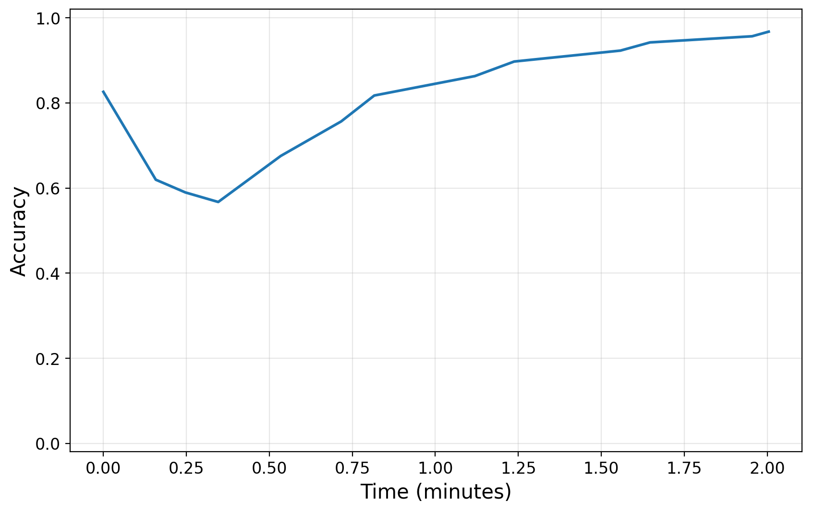</td>
    </tr>
  </tbody>
</table>
 

#### 3.1.2 Integrating different scaling strategies

**Key observation:** VLASelect integrates VLA-Adapter in selective model scaling and achieves the <strong>highest average accuracy</strong> in this evaluation.

<table align="center" style="width: 100%; table-layout: fixed;">
  <thead>
    <tr>
      <th style="width: 15%;"></th>
      <th style="width: 17%;">Used Resources</th>
      <th style="width: 68%; text-align: center;">Result</th>
    </tr>
  </thead>
  <tbody>
    <tr>
      <td><strong>Minimal Working Example</strong></td>
      <td><strong>Time:</strong> 20 min <strong>Memory (VRAM):</strong> 20 GB</td>
      <td align="center">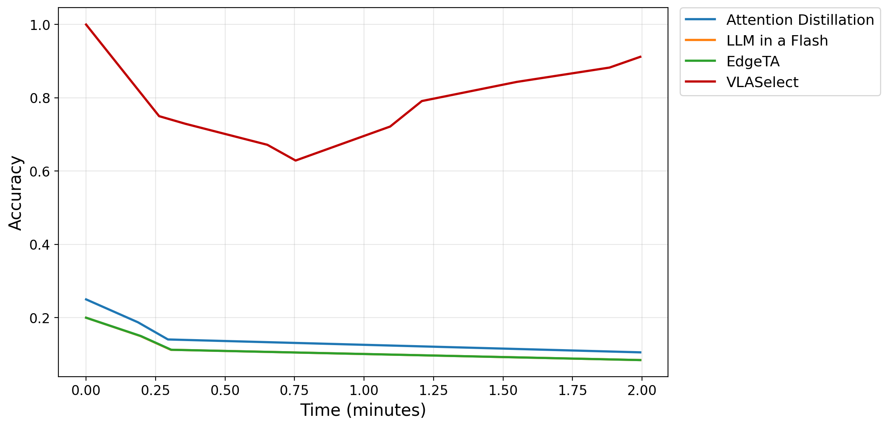</td>
    </tr>
  </tbody>
</table>
 

The curves of **EdgeTA** and **LLM in a Flash** overlap completely due to identical performance.

 

#### 3.1.3 Integrating different knowledge exchange granularities

**Key observation:** VLASelect with VLA-Adapter integrates multiple knowledge exchange granularities and achieves the <strong>highest average accuracy</strong> at the channel/neuron level.

<table align="center" style="width: 100%; table-layout: fixed;">
  <thead>
    <tr>
      <th style="width: 15%;"></th>
      <th style="width: 17%;">Used Resources</th>
      <th style="width: 68%; text-align: center;">Result</th>
    </tr>
  </thead>
  <tbody>
    <tr>
      <td><strong>Minimal Working Example</strong></td>
      <td><strong>Time:</strong> 30 min <strong>Memory (VRAM):</strong> 20 GB</td>
      <td align="center">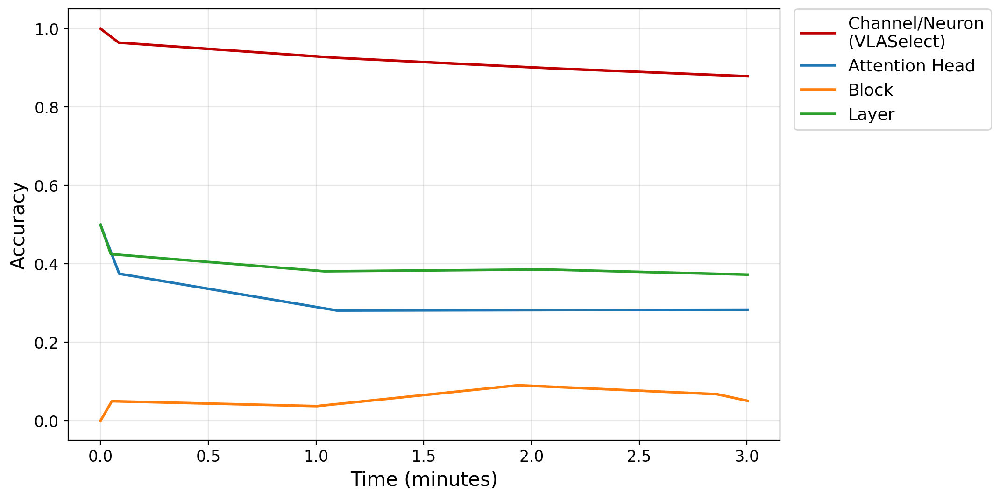</td>
    </tr>
  </tbody>
</table>
 

### 3.2 Example 2: TinyVLA

To evaluate the model's performance on the TinyVLA backbone, we conducted experiments on continual learning trajectories and scaling strategies.

#### 3.2.1 Integrating the model

**Key observation:** VLASelect integrates TinyVLA through a unified adapter interface and runs <strong>training successfully</strong> (only evaluated on constrained testbed).

<table align="center" style="width: 100%; table-layout: fixed;">
  <thead>
    <tr>
      <th style="width: 15%;"></th>
      <th style="width: 17%;">Used Resources</th>
      <th style="width: 68%; text-align: center;">Result</th>
    </tr>
  </thead>
  <tbody>
    <tr>
      <td><strong>Minimal Working Example</strong></td>
      <td><strong>Time:</strong> 3 min <strong>Memory (VRAM):</strong> 20 GB</td>
      <td align="center"></td>
    </tr>
  </tbody>
</table>
 

#### 3.2.2 Integrating different scaling strategies

**Key observation:** VLASelect combines TinyVLA with selective model scaling and achieves the <strong>highest average accuracy</strong> in this evaluation.

<table align="center" style="width: 100%; table-layout: fixed;">
  <thead>
    <tr>
      <th style="width: 15%;"></th>
      <th style="width: 17%;">Used Resources</th>
      <th style="width: 68%; text-align: center;">Result</th>
    </tr>
  </thead>
  <tbody>
    <tr>
      <td><strong>Minimal Working Example</strong></td>
      <td><strong>Time:</strong> 20 min <strong>Memory (VRAM):</strong> 20 GB</td>
      <td align="center">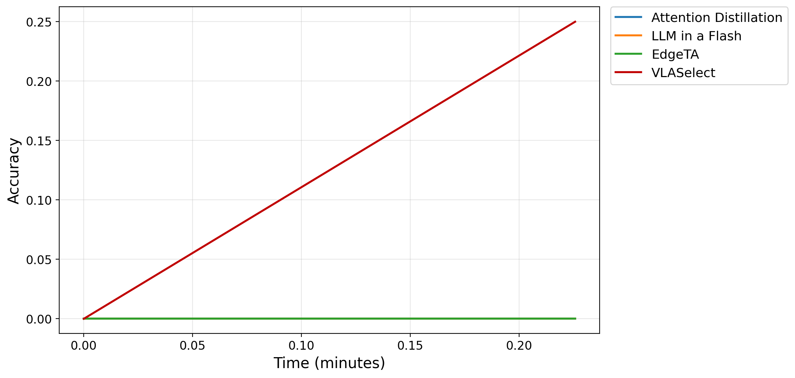</td>
    </tr>
  </tbody>
</table>
 

The curves of **Attention**, **LLM in a Flash**, and **EdgeTA** overlap completely due to identical performance.

 

#### 3.2.3 Integrating different knowledge exchange granularities

**Key observation:** For TinyVLA, VLASelect integrates different knowledge exchange granularities and achieves the <strong>highest average accuracy</strong> with channel/neuron-level exchange.

<table align="center" style="width: 100%; table-layout: fixed;">
  <thead>
    <tr>
      <th style="width: 15%;"></th>
      <th style="width: 17%;">Used Resources</th>
      <th style="width: 68%; text-align: center;">Result</th>
    </tr>
  </thead>
  <tbody>
    <tr>
      <td><strong>Minimal Working Example</strong></td>
      <td><strong>Time:</strong> 30 min <strong>Memory (VRAM):</strong> 20 GB</td>
      <td align="center">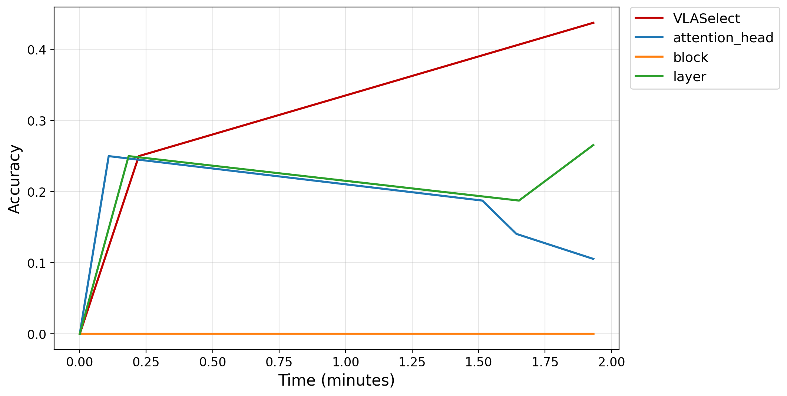</td>
    </tr>
  </tbody>
</table>
 

### 3.3 Example 3: EdgeVLA

VLASelect integrates the EdgeVLA model, scaling strategies, and knowledge exchange granularities.

#### 3.3.1 Integrating the model

**Key observation:** VLASelect adapts EdgeVLA via the same unified interface and runs <strong>training successfully</strong> (only evaluated on constrained testbed).

<table align="center" style="width: 100%; table-layout: fixed;">
  <thead>
    <tr>
      <th style="width: 15%;"></th>
      <th style="width: 17%;">Used Resources</th>
      <th style="width: 68%; text-align: center;">Result</th>
    </tr>
  </thead>
  <tbody>
    <tr>
      <td><strong>Minimal Working Example</strong></td>
      <td><strong>Time:</strong> 3 min <strong>Memory (VRAM):</strong> 20 GB</td>
      <td align="center">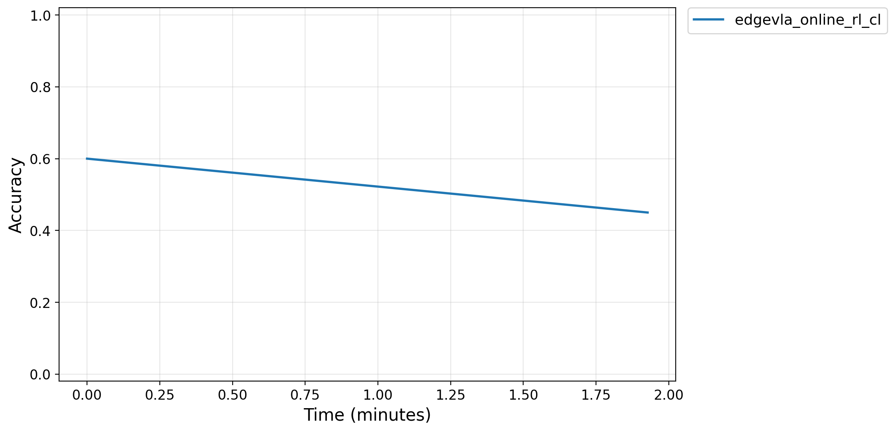</td>
    </tr>
  </tbody>
</table>
 

#### 3.3.2 Integrating different scaling strategies

**Key observation:** On EdgeVLA, VLASelect uses selective model scaling and achieves the <strong>highest average accuracy</strong> in this evaluation (only evaluated on constrained testbed).

<table align="center" style="width: 100%; table-layout: fixed;">
  <thead>
    <tr>
      <th style="width: 15%;"></th>
      <th style="width: 17%;">Used Resources</th>
      <th style="width: 68%; text-align: center;">Result</th>
    </tr>
  </thead>
  <tbody>
    <tr>
      <td><strong>Minimal Working Example</strong></td>
      <td><strong>Time:</strong> 20 min <strong>Memory (VRAM):</strong> 20 GB</td>
      <td align="center">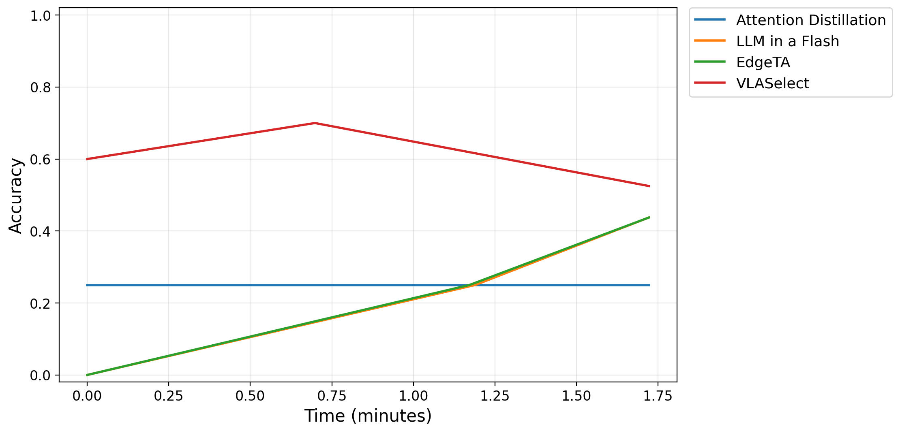</td>
    </tr>
  </tbody>
</table>
 

#### 3.3.3 Integrating different knowledge exchange granularities

**Key observation:** On EdgeVLA, VLASelect integrates different knowledge exchange granularities and achieves the <strong>highest average accuracy</strong> with channel/neuron-level exchange (only evaluated on constrained testbed).

<table align="center" style="width: 100%; table-layout: fixed;">
  <thead>
    <tr>
      <th style="width: 15%;"></th>
      <th style="width: 17%;">Used Resources</th>
      <th style="width: 68%; text-align: center;">Result</th>
    </tr>
  </thead>
  <tbody>
    <tr>
      <td><strong>Minimal Working Example</strong></td>
      <td><strong>Time:</strong> 30 min <strong>Memory (VRAM):</strong> 20 GB</td>
      <td align="center">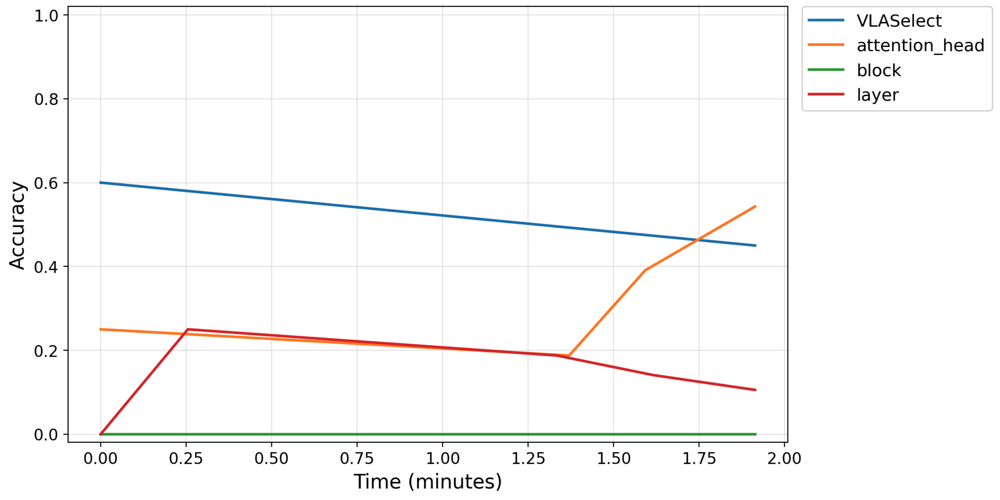</td>
    </tr>
  </tbody>
</table>

The curves of **Layer** and **Block** overlap completely due to identical performance.

 