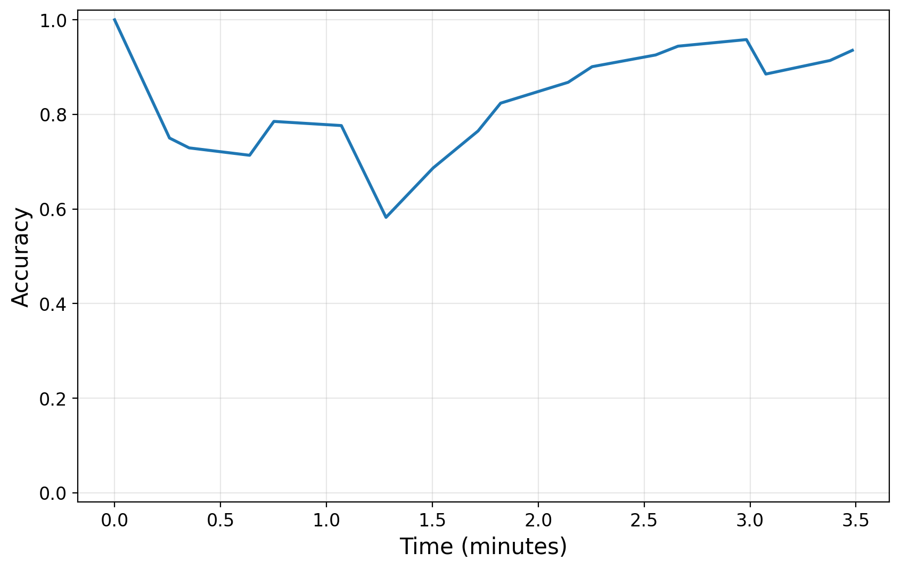
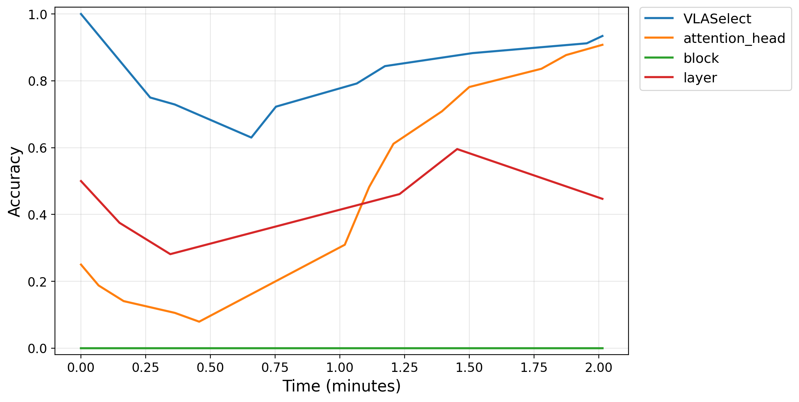

# Artifact Evaluation Report: VLASelect

## 1. Hardware and Software Specifications

<strong>Table 1: Hardware and Software Configuration Comparison</strong>

| Subsystem | Platform for Paper (Full Run) | Platform for MWE |
| :---: | :---: | :---: |
| Operating System | Ubuntu 20.04/22.04 LTS (Kernel 5.4/5.15) | Ubuntu 22.04.4 LTS (Kernel 6.8) |
| CPU Architecture | 2 × Intel Xeon Gold 6430 (64C) | Intel Xeon E5-2698 v4 (16C) |
| System Memory | 128 GB DDR5 | 32 GB DDR4 |
| GPU & VRAM | NVIDIA A100 80GB (+ Edge AGX) | NVIDIA Tesla V100 (32 GB) |
| CUDA Toolchain | Driver 550.144.03, CUDA 12.4 | Driver 550.127.05, CUDA 12.4 |

## 2. Evaluation Reproduction

To evaluate the extended deployment capabilities of VLASelect, we performed experiments following the step-by-step instructions in README to complete the tests, evaluating its accuracy, overhead, time breakdown, ablation, discussion metrics, and reusability.

### 2.2 Step-by-Step Reproduction

#### 2.2.1 (Figure 7 in Section 5.2.1) Accuracy Under Tasks/Environment Changes

To evaluate the accuracy under varying task and environment conditions, we tested VLASelect across four distinct workloads; both full and minimal runs (as shown in Figure 7 and Figure 7 (Minimal Working Example)) **achieved the best overall accuracy**. The minimal test evaluated a subset of models with shorter runtime, while the full test required longer execution, and both confirmed our method’s superior performance.

**Key observation:** VLASelect consistently achieves the **highest average accuracy** under tasks and environment changes.

> For experiments in this paper, the runtime is approximately **140 hours**, and the peak VRAM footprint is **60 GB**. \
> For the Minimal Working Example, the runtime is approximately **1 hour**, and the peak VRAM footprint is **20 GB**.

<strong>Figure 7: Full-scale experiment for Accuracy Under Tasks/Environment Changes</strong>

<strong>Figure 7 (Minimal Working Example): Minimal working example for Accuracy Under Tasks/Environment Changes</strong>

#### 2.2.2 (Figure 8 in Section 5.2.2) Accuracy Under Available Resource Changes

To evaluate VLASelect's performance under fluctuating resource availability, this section employs the same contrastive configuration as described above; results illustrate that **VLASelect consistently performs best under these conditions**. The full run (Figure 8) and the minimized run (Figure 8 (Minimal Working Example)) both confirm the model’s superior overall accuracy.

**Key observation:** VLASelect consistently achieves the **highest overall accuracy** under fluctuating resource availability.

> For experiments in this paper, the runtime is approximately **140 hours**, and the peak VRAM footprint is **60 GB**. \
> For the Minimal Working Example, the runtime is approximately **1 hour**, and the peak VRAM footprint is **20 GB**.

<strong>Figure 8: Full-scale experiment for Accuracy Under Available Resource Changes</strong>

<strong>Figure 8 (Minimal Working Example): Minimal working example for Accuracy Under Available Resource Changes</strong>

#### 2.2.3 (Figure 9 and Tables 2/3 in Section 5.3.1) Overheads Under The Same Accuracy

Across the full-scale and Minimal Working Example configurations, VLASelect consistently achieves the target accuracy with the shortest execution time and the most reduced resource consumption compared to all baseline methods.

**Key observation:** VLASelect consistently achieves the target accuracy with the **shortest execution time**  and the **most reduced resource consumption** compared to all baseline methods.

> For experiments in this paper, the runtime is approximately **140 hours**, and the peak VRAM footprint is **60 GB**. \
> For the Minimal Working Example, the runtime is approximately **1 hour**, and the peak VRAM footprint is **20 GB**.

<strong>Figure 9: Full-scale experiment for Overheads Under The Same Accuracy: Memory Footprint Comparison in a New Task</strong>

<strong>Figure 9 (Minimal Working Example): Minimal working example for Overheads Under The Same Accuracy: Memory Footprint Comparison in a New Task</strong>

#### Energy Consumption Analysis

Tables 2a and 2b compare the average energy consumption (kJ) across baseline methods under the full-scale and minimized experimental settings. VLASelect consistently **incurs the lowest energy consumption** across the evaluated workloads.

**Key observation:** VLASelect achieves the highest operational efficiency by **maintaining the lowest energy consumption** across diverse workloads and experimental settings.

> For experiments in this paper, this table was generated concurrently with the previous step.

<strong>Table 2a: Full-scale experiment for Energy Consumption Analysis: Average Energy Consumption (kJ) in Each New Task</strong>

| Method | Single-Arm Robot | Dexterous Hand | Mobile Manipulator | Humanoid Robot |
| :---: | :---: | :---: | :---: | :---: |
| ConRFT | 342.37 / 403.51 | 346.31 / 274.05 | 499.84 / 291.68 | 787.19 / 570.22 |
| FlaRe | 318.06 / 254.18 | 477.07 / 317.51 | 461.29 / 379.37 | 671.17 / 452.06 |
| iRe-VLA | 383.33 / 213.81 | 530.53 / 204.04 | 505.4 / 273.55 | 661.88 / 564.21 |
| Self-Improvement | 551.76 / 473.14 | 416.37 / 293.83 | 497.49 / 297.81 | 801.52 / 673.49 |
| RLVLA | 326.26 / 206.67 | 360.71 / 314.32 | 573.44 / 466.58 | 622.44 / 458.46 |
| VLA-RFT | 323.69 / 277.8 | 433.42 / 280.17 | 374.09 / 257.39 | 795.6 / 632.21 |
| World-Env | 329.26 / 265.45 | 339.87 / 451.14 | 666.9 / 480.57 | 775.05 / 639.55 |
| EdgeTA | 349.4 / 549.99 | 383.21 / 282.31 | 464.28 / 355.5 | 629.97 / 444.5 |
| ConvertNet | 608.37 / 454.23 | 456.51 / 327.35 | 451.61 / 378.12 | 536.37 / 451.6 |
| VLASelect | 46.06 / 44.24 | 35.41 / 25.63 | 39.46 / 25.57 | 64.71 / 45.18 |

<strong>Table 2b: Minimal working example for Energy Consumption Analysis: Average Energy Consumption (kJ) in Each New Task</strong>

| Method | Single-Arm Robot | Dexterous Hand | Mobile Manipulator | Humanoid Robot |
| :---: | :---: | :---: | :---: | :---: |
| Self-Improvement | 15.82 | 62.99 | 37.17 | 26.22 |
| VLA-RFT | 13.83 | 27.52 | 26.83 | 24.62 |
| World-Env | 12.98 | 23.96 | 33.92 | 33.03 |
| VLASelect | 0.68 | 11.37 | 12.28 | 2.58 |

#### Overhead comparison under the same learning accuracy

Across both the full-scale (Table 3a) and Minimal Working Example (Table 3b) settings, VLASelect consistently achieves the target accuracy with the shortest execution time and the most reduced resource consumption compared to all baseline methods.

**Key observation:** VLASelect consistently achieves the target accuracy with the **shortest execution** time and the **most reduced resource consumption** compared to all baseline methods.

> For experiments in this paper, this table was generated concurrently with the previous step.

<strong>Table 3a: Full-scale experiment for Overhead Comparison Under the Same Learning Accuracy</strong>

<table align="center" style="text-align:center">
<thead>
<tr><th></th><th colspan="4">Time (h)</th><th colspan="4">Memory Footprint (GB)</th><th colspan="4">Energy (kJ)</th></tr>
<tr><th>Method</th><th>Single-Arm Robot</th><th>Dexterous Hand</th><th>Mobile Manipulator</th><th>Humanoid Robot</th><th>Single-Arm Robot</th><th>Dexterous Hand</th><th>Mobile Manipulator</th><th>Humanoid Robot</th><th>Single-Arm Robot</th><th>Dexterous Hand</th><th>Mobile Manipulator</th><th>Humanoid Robot</th></tr>
</thead>
<tbody>
<tr><td>ConRFT</td><td>3.88</td><td>3.14</td><td>2.83</td><td>3.78</td><td>19.12</td><td>20.88</td><td>27.92</td><td>35.71</td><td>360.39</td><td>294.89</td><td>334.87</td><td>600.23</td></tr>
<tr><td>FlaRe</td><td>2.56</td><td>3.6</td><td>2.92</td><td>2.91</td><td>23.14</td><td>31.39</td><td>27.49</td><td>33.7</td><td>295.13</td><td>384.55</td><td>384.75</td><td>492.3</td></tr>
<tr><td>iRe-VLA</td><td>2.71</td><td>3.38</td><td>2.78</td><td>3.31</td><td>21.93</td><td>24.55</td><td>27.3</td><td>42.19</td><td>253.73</td><td>374</td><td>382.41</td><td>630.36</td></tr>
<tr><td>Self-Improvement</td><td>4.52</td><td>3.48</td><td>2.86</td><td>3.95</td><td>20.93</td><td>23.52</td><td>27.53</td><td>42.11</td><td>547.71</td><td>309.29</td><td>337.9</td><td>763.35</td></tr>
<tr><td>RLVLA</td><td>2.74</td><td>3.32</td><td>3.52</td><td>3.2</td><td>15.26</td><td>17.31</td><td>18.78</td><td>32.11</td><td>275.99</td><td>353.41</td><td>546.13</td><td>608.56</td></tr>
<tr><td>VLA-RFT</td><td>3.2</td><td>3.39</td><td>2.39</td><td>4.07</td><td>28.54</td><td>30.99</td><td>29.04</td><td>60.02</td><td>319.56</td><td>412.78</td><td>341.89</td><td>704.55</td></tr>
<tr><td>World-Env</td><td>3.1</td><td>3.63</td><td>3.87</td><td>4.16</td><td>25.66</td><td>30.05</td><td>29.27</td><td>60.23</td><td>279.42</td><td>429.66</td><td>505.86</td><td>738.14</td></tr>
<tr><td>EdgeTA</td><td>4.59</td><td>3.17</td><td>2.84</td><td>3.12</td><td>17.54</td><td>19.23</td><td>21.12</td><td>37.87</td><td>523.8</td><td>382.06</td><td>440.83</td><td>467.9</td></tr>
<tr><td>ConvertNet</td><td>4.82</td><td>3.67</td><td>2.69</td><td>2.73</td><td>15.26</td><td>17.31</td><td>18.78</td><td>32.11</td><td>478.14</td><td>434.77</td><td>430.1</td><td>510.83</td></tr>
<tr><td>VLASelect</td><td>0.39</td><td>0.29</td><td>0.21</td><td>0.32</td><td>15.26</td><td>17.31</td><td>18.78</td><td>32.11</td><td>45.53</td><td>34.53</td><td>28.76</td><td>47.56</td></tr>
</tbody>
</table>

<strong>Table 3b: Minimal working example for Overhead Comparison Under the Same Learning Accuracy</strong>

<table align="center" style="text-align:center">
<thead>
<tr><th></th><th colspan="4">Time (h)</th><th colspan="4">Memory Footprint (GB)</th><th colspan="4">Energy (kJ)</th></tr>
<tr><th>Method</th><th>Single-Arm Robot</th><th>Dexterous Hand</th><th>Mobile Manipulator</th><th>Humanoid Robot</th><th>Single-Arm Robot</th><th>Dexterous Hand</th><th>Mobile Manipulator</th><th>Humanoid Robot</th><th>Single-Arm Robot</th><th>Dexterous Hand</th><th>Mobile Manipulator</th><th>Humanoid Robot</th></tr>
</thead>
<tbody>
<tr><td>Self-Improvement</td><td>0.04</td><td>0.17</td><td>0.09</td><td>0.08</td><td>7.32</td><td>13.41</td><td>12.47</td><td>12.94</td><td>15.82</td><td>62.99</td><td>37.17</td><td>25.65</td></tr>
<tr><td>VLA-RFT</td><td>0.03</td><td>0.08</td><td>0.07</td><td>0.07</td><td>8.48</td><td>13.09</td><td>11.07</td><td>11.21</td><td>13.83</td><td>27.52</td><td>26.83</td><td>25.24</td></tr>
<tr><td>World-Env</td><td>0.03</td><td>0.07</td><td>0.08</td><td>0.08</td><td>9.77</td><td>13.03</td><td>10.25</td><td>11.12</td><td>12.98</td><td>23.96</td><td>33.92</td><td>33.02</td></tr>
<tr><td>VLASelect</td><td>0.01</td><td>0.01</td><td>0.03</td><td>0.03</td><td>5.23</td><td>11.97</td><td>10.4</td><td>10.4</td><td>0.58</td><td>2.96</td><td>12.28</td><td>9.91</td></tr>
</tbody>
</table>

#### 2.2.4 (Figure 10 in Section 5.3.2) Time Breakdown of VLASelect's Modules

The execution time of VLASelect core modules is obviously less than the training iteration time.

**Key observation:** The execution time of VLASelect core modules is **obviously less than the training iteration time**.

> For experiments in this paper, the runtime is approximately **20 minutes**, and the peak VRAM footprint is **60 GB**. \
> For the Minimal Working Example, the runtime is approximately **20 minutes**, and the peak VRAM footprint is **20 GB**.

<strong>Figure 10: Full-scale experiment for Time Breakdown of VLASelect's Modules</strong>

<strong>Figure 10 (Minimal Working Example): Minimal working example for Time Breakdown of VLASelect's Modules</strong>

#### 2.2.5 (Figure 11 in Section 5.3.2) Training Time Breakdown in Each Workload

Under identical workloads, VLASelect achieves shorter runtime while maintaining high accuracy compared with other baselines.

**Key observation:** Under identical workloads, VLASelect achieves **shorter runtime** while maintaining high accuracy compared with other baselines.

> For experiments in this paper, the runtime is approximately **140 hours**, and the peak VRAM footprint is **60 GB**.

<strong>Figure 11: Full-scale experiment for Training Time Breakdown in Each Workload</strong>

> For the Minimal Working Example, the runtime is approximately **1 hour**, and the peak VRAM footprint is **20 GB**.

<strong>Figure 11 (Minimal Working Example): Minimal working example for Training Time Breakdown in Each Workload</strong>

#### 2.2.6 (Figure 12 in Section 5.4) Design Choice Validation by Ablation

To evaluate the individual contribution of each module to overall performance, we conducted an ablation study; under both configurations (Figure 12 and Figure 12 (Minimal Working Example)), all modules consistently **contribute to the final accuracy**.

**Key observation:** All individual modules in VLASelect consistently **contribute to the overall task accuracy** across both configurations.

> For experiments in this paper, the runtime is approximately **40 hours**, and the peak VRAM footprint is **60 GB**. \
> For the Minimal Working Example, the runtime is approximately **1 hour**, and the peak VRAM footprint is **20 GB**.

<table><tr>
<td align="center"> <strong>Figure 12:</strong> Full-scale experiment for Design Choice Validation by Ablation</td>
<td align="center"> <strong>Figure 12 (Minimal Working Example):</strong> Minimal working example for Design Choice Validation by Ablation</td>
</tr></table>

#### 2.2.7 (Discussion 1 in Section 5.1): Sim-to-real transfer

A supplementary video will be provided to compare simulation and real practice, further verifying the method’s consistency and generalization across virtual and real environments.

#### 2.2.8 (Discussion 2 in Section 5.2): ICL (In-Context Learning)

In the Minimal Working Example, RICL struggles to converge because the brief runtime is insufficient for its policy to update, whereas VLASelect rapidly adapts and maintains an average accuracy of 37.2%.

**Key observation:** VLASelect **achieves 37.2% higher accuracy than RICL**.

> For the Minimal Working Example, the runtime is approximately **10 minutes**, and the peak VRAM footprint is **20 GB**.

#### 2.2.9 (Discussion 3 in Section 5.3): Maximum Supported Model Size

The supported model size varies by configuration: up to 11.3 GB on Xavier and 24.0 GB on Orin for the full run, and approximately 2.5–24.0 GB on a host with 32 GB VRAM for the Minimal Working Example.

**Key observation:** The full run supports **up to 11.3 GB on Xavier and 24.0 GB on Orin**; the Minimal Working Example supports **approximately 2.5–24.0 GB on a host with 32 GB VRAM**.

> For both experiments in this paper and Minimal Working Example, the runtime is approximately **1 hour**, and the peak VRAM footprint is **32 GB**.

<strong>Table 2.9: Example of Maximum supported model size</strong>

| Test Platform | Maximum Model Size |
| :---: | :---: |
| Full Run | 11.3 GB (Xavier), 24.0 GB (Orin) |
| MWE Run | From 2.5 to 24 GB (V100 32G) |

#### 2.2.10 (Discussion 4 in Section 5.4): Applicability to multi-agent scenarios

Under the Minimal Working Example setting, MAPPO achieves lower accuracy due to short runtime being insufficient for policy updates, whereas VLASelect **achieves 60.0% higher accuracy than MAPPO**.

**Key observation:** VLASelect achieves ** 60.0% higher accuracy** than MAPPO.

> For experiments in this paper, the runtime is approximately **7 hours**, and the peak VRAM footprint is **60 GB**. \
> For the Minimal Working Example, the runtime is approximately **20 minutes**, and the peak VRAM footprint is **20 GB**.

#### 2.2.11 (Discussion 5 in Section 5.5) Comparison with Alternative Knowledge Exchange Techniques

**Key observation:** The VLASelect achieves <strong>17.19% higher accuracy</strong> compared with the  alternative knowledge exchange techniques.

> For experiments in this paper, the runtime is approximately **40 hours**, and the peak VRAM footprint is **60 GB**. \
> For the Minimal Working Example, the runtime is approximately **20 minutes**, and the peak VRAM footprint is **20 GB**.

#### 2.2.12 (Discussion 6 in Section 5.5) Comparison between Different Knowledge Exchange Granularities

**Key observation:** VLASelect achieves **23.13% higher accuracy ** with channel/neuron-level knowledge exchange than with coarser granularities.

> For experiments in this paper, the runtime is approximately **15 hours**, and the peak VRAM footprint is **60 GB**. \
> For the Minimal Working Example, the runtime is approximately **30 minutes**, and the peak VRAM footprint is **20 GB**.

#### 2.2.13 (Discussion 7 in Section 5.5) Forgetting on Previously Learned Environments/Tasks

**Key observation:** VLASelect achieves **33.18% higher accuracy ** than the baseline techniques by mitigating interference across previously learned environments and tasks.

> For experiments in this paper, the runtime is approximately **13 hours**, and the peak VRAM footprint is **60 GB**. \
> For the Minimal Working Example, the runtime is approximately **20 minutes**, and the peak VRAM footprint is **20 GB**.

#### 2.2.14 (Discussion 8 in Section 5.5) Applicability to MLP/CNN models

**Key observation:** VLASelect achieves **33.62% and 34.72% higher accuracy ** than ConRFT on MLP and CNN models, respectively.

> For experiments in this paper, the runtime is approximately **13 hours**, and the peak VRAM footprint is **60 GB**. \
> For the Minimal Working Example, the runtime is approximately **20 minutes**, and the peak VRAM footprint is **20 GB**.

## 3. Reusability: Integrating VLASelect with VLA Models, Scaling Strategies, and Knowledge Exchange Granularities

VLASelect integrates various VLA models, scaling strategies, and knowledge exchange granularities.

### 3.1 Example 1: VLA-Adapter

#### 3.1.1 Integrating the model

For experiments in this paper, the runtime is approximately 3 hours, and the peak VRAM footprint is 60 GB.

<table><tr>
<td align="center"> <strong>Figure 3.1.1:</strong> Full-scale evaluation for supporting the model</td>
<td align="center"> <strong>Figure 3.1.1:</strong> Minimal working example for integrating the model</td>
</tr></table>

> For the Minimal Working Example, the runtime is approximately **3 minutes**, and the peak VRAM footprint is **20 GB**.

**Key observation:** VLASelect adapts models through a unified interface via VLA-Adapter and runs <strong>training successfully</strong>.

#### 3.1.2 Integrating different scaling strategies

<table><tr>
<td align="center"> <strong>Figure 3.1.2:</strong> Full-scale evaluation for integrating different scaling strategies</td>
<td align="center"> <strong>Figure 3.1.2:</strong> Minimal working example for integrating different scaling strategies</td>
</tr></table>

> For experiments in this paper, the runtime is approximately **40 hours**, and the peak VRAM footprint is **60 GB**.
> For the Minimal Working Example, the runtime is approximately **20 minutes**, and the peak VRAM footprint is **20 GB**.

**Key observation:** VLASelect integrates VLA-Adapter in selective model scaling and achieves the <strong>highest average accuracy</strong> in this evaluation.

#### 3.1.3 Integrating different knowledge exchange granularities

<table><tr>
<td align="center"> <strong>Figure 3.1.3:</strong> Full-scale evaluation for integrating different knowledge exchange granularities</td>
<td align="center"> <strong>Figure 3.1.3:</strong> Minimal working example for integrating different knowledge exchange granularities</td>
</tr></table>

> For experiments in this paper, the runtime is approximately **15 hours**, and the peak VRAM footprint is **60 GB**.
> For the Minimal Working Example, the runtime is approximately **30 minutes**, and the peak VRAM footprint is **20 GB**.

**Key observation:** VLASelect with VLA-Adapter integrates multiple knowledge exchange granularities and achieves the <strong>highest average accuracy</strong> at the channel/neuron level.

### 3.2 Example 2: TinyVLA

To evaluate the model's performance on the TinyVLA backbone, we conducted experiments on continual learning trajectories and scaling strategies.

#### 3.2.1 Integrating the model

 <strong>Figure 3.2.1:</strong> Minimal working example for integrating the model.

> For experiments in this paper, the runtime is approximately **3 hours**, and the peak VRAM footprint is **60 GB**.
> For Minimal Working Example, the runtime is approximately **3 minutes**, and the peak VRAM footprint is **20 GB**.

**Key observation:** VLASelect integrates TinyVLA through a unified adapter interface and runs <strong>training successfully</strong>(only evaluated on constrained testbed).

#### 3.2.2 Integrating different scaling strategies

<table><tr>
<td align="center"> <strong>Figure 3.2.2:</strong> Full-scale evaluation for integrating different scaling strategies</td>
<td align="center"> <strong>Figure 3.2.2:</strong> Minimal working example for integrating different scaling strategies</td>
</tr></table>

> For experiments in this paper, the runtime is approximately **40 hours**, and the peak VRAM footprint is **60 GB**.
> For Minimal Working Example, the runtime is approximately **20 minutes**, and the peak VRAM footprint is **20 GB**.

**Key observation:** VLASelect combines TinyVLA with selective model scaling and achieves the <strong>highest average accuracy</strong> in this evaluation.

#### 3.2.3 Integrating different knowledge exchange granularities

<table><tr>
<td align="center"> <strong>Figure 3.2.3:</strong> Full-scale evaluation for integrating different knowledge exchange granularities</td>
<td align="center"> <strong>Figure 3.2.3:</strong> Minimal working example for integrating different knowledge exchange granularities</td>
</tr></table>

> For experiments in this paper, the runtime is approximately **15 hours**, and the peak VRAM footprint is **60 GB**.
> For Minimal Working Example, the runtime is approximately **30 minutes**, and the peak VRAM footprint is **20 GB**.

**Key observation:** For TinyVLA, VLASelect integrates different knowledge exchange granularities and achieves the <strong>highest average accuracy</strong> with channel/neuron-level exchange.

### 3.3 Example 3: EdgeVLA

VLASelect integrates the EdgeVLA model, scaling strategies, and knowledge exchange granularities.

#### 3.3.1 Integrating the model

 <strong>Figure 3.3.1:</strong> Minimal working example for integrating the model.

> For experiments in this paper, the runtime is approximately **3 hours**, and the peak VRAM footprint is **60 GB**.
> For Minimal Working Example, the runtime is approximately **3 minutes**, and the peak VRAM footprint is **20 GB**.

**Key observation:** VLASelect adapts EdgeVLA via the same unified interface and runs <strong>training successfully</strong> (only evaluated on constrained testbed).

#### 3.3.2 Integrating different scaling strategies

 <strong>Figure 3.3.2:</strong> Minimal working example for integrating different scaling strategies.

> For experiments in this paper, the runtime is approximately **40 hours**, and the peak VRAM footprint is **60 GB**.
> For Minimal Working Example, the runtime is approximately **20 minutes**, and the peak VRAM footprint is **20 GB**.

**Key observation:** On EdgeVLA, VLASelect uses selective model scaling and achieves the <strong>highest average accuracy</strong> in this evaluation (only evaluated on constrained testbed).

#### 3.3.3 Integrating different knowledge exchange granularities

 <strong>Figure 3.3.3:</strong> Minimal working example for integrating different knowledge exchange granularities.

>For experiments in this paper, the runtime is approximately **15 hours**, and the peak VRAM footprint is **60 GB**.
>For Minimal Working Example, the runtime is approximately **30 minutes**, and the peak VRAM footprint is **20 GB**.

**Key observation:** On EdgeVLA, VLASelect integrates different knowledge exchange granularities and achieves the <strong>highest average accuracy</strong> with channel/neuron-level exchange (only evaluated on constrained testbed).
