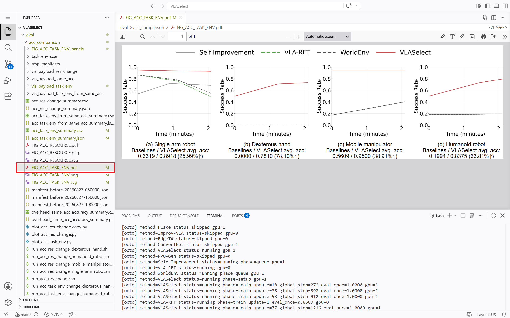

# Pre-configured CloudLab Environment Guide

We provide a browser-based CloudLab environment where reviewers can access the VLASelect repository and run the **Minimal Working Example** directly.

## 1. Hardware and Software Specifications

<p align="center">
  <table>
    <tr>
      <th></th>
      <th></th>
    </tr>
    <tr>
      <td><b>Operating System</b></td>
      <td>Ubuntu 22.04.2 LTS (Kernel 5.15)</td>
    </tr>
    <tr>
      <td><b>CPU Architecture</b></td>
      <td>AMD EPYC 7542 (32C)</td>
    </tr>
    <tr>
      <td><b>System Memory</b></td>
      <td>512 GB DDR4</td>
    </tr>
    <tr>
      <td><b>GPU & VRAM</b></td>
      <td>NVIDIA Tesla V100 (32 GB)</td>
    </tr>
    <tr>
      <td><b>CUDA Toolchain</b></td>
      <td>Driver 580.173.02, CUDA 13.0</td>
    </tr>
  </table>
</p>

## 2. Access the CloudLab Environment

Open the following URL in a web browser:

- **URL:** [http://clgpu015.clemson.cloudlab.us:8080](http://clgpu015.clemson.cloudlab.us:8080)

<p align="center">
  
</p>

After login, JupyterLab opens directly in the pre-configured VLASelect project environment.

## 3. Open a Terminal

In the CloudLab JupyterLab launcher, select **Terminal** under **Other**. A terminal will open in the project environment.

<p align="center">
  
</p>

<p align="center">
  
</p>

## 4. Start the Docker Container

In the terminal, start the pre-configured Docker container:

```bash
bash start_docker.sh
```

After the command attaches to the container, run all subsequent evaluation commands in the container shell.

<p align="center">
  
</p>

## 5. Run the Evaluation

After starting the container, follow [Section 2.2: Step-by-Step Reproduction](README.md#22-step-by-step-reproduction) in the README to run the evaluation experiments.

**Example:**

The following example reproduces **Experiment 1 (Figure 7): Accuracy Under Tasks/Environment Changes** in Minimal Working Example mode.

```bash
cd eval/acc_comparison
MWE=1 METHODS=self_improv,vla_rft,world_env,vlaselect \
  bash run_acc_task_env_change.sh
python3 plot_acc_task_env.py
```

**The expected terminal output is shown below:**

<p align="center">
  
</p>

**The resource requirements and output are listed below:**

<p align="center">
  <table>
    <tr>
      <th>Configuration</th>
      <th>Expected runtime</th>
      <th>Resource requirements</th>
      <th>Output</th>
    </tr>
    <tr>
      <td>Minimal Working Example</td>
      <td>1.5 hours</td>
      <td>20GB memory <br> 32GB disk space</td>
      <td><code>eval/acc_comparison/FIG_ACC_TASK_ENV.pdf</code></td>
    </tr>
  </table>
</p>

## 6. Check Results

Use the file manager on the left to inspect outputs.

<p align="center">
  
</p>
