# Instructions for Open Access to Our Preconfigured CloudLab Environment

We provide a preconfigured CloudLab environment for artifact evaluation. Reviewers can access this environment and run the **minimum working examples** directly by following the instructions below.

## 1. Hardware and Software Specifications

<p align="center">
  <table>
    <tr>
      <th></th>
      <th></th>
    </tr>
    <tr>
      <td><b>Operating System</b></td>
      <td>Ubuntu 22.04.2 LTS (Kernel 5.15)</td>
    </tr>
    <tr>
      <td><b>CPU Architecture</b></td>
      <td>AMD EPYC 7542 (32C)</td>
    </tr>
    <tr>
      <td><b>System Memory</b></td>
      <td>512 GB DDR4</td>
    </tr>
    <tr>
      <td><b>GPU & VRAM</b></td>
      <td>NVIDIA Tesla V100 (32 GB)</td>
    </tr>
    <tr>
      <td><b>CUDA Toolchain</b></td>
      <td>Driver 580.173.02, CUDA 13.0</td>
    </tr>
  </table>
</p>

## 2. Access the Environment

Open the following URL in a web browser:

- **URL:** [http://clgpu015.clemson.cloudlab.us:8080](http://clgpu015.clemson.cloudlab.us:8080)

<p align="center">
  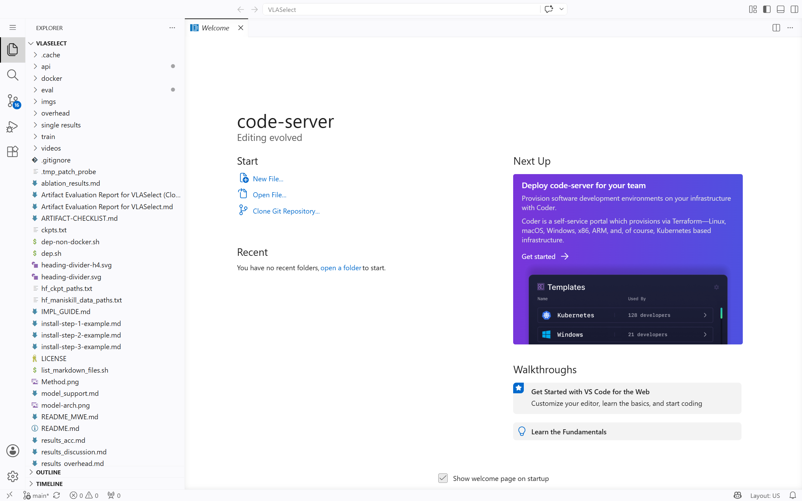
</p>

After login, JupyterLab opens directly in the preconfigured VLASelect project environment.

## 3. Open a Terminal

Select Terminal from the menu in the upper-left corner. A terminal will open in the project environment.

<p align="center">
  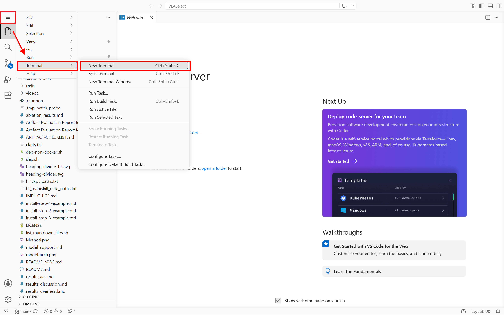
</p>

<p align="center">
  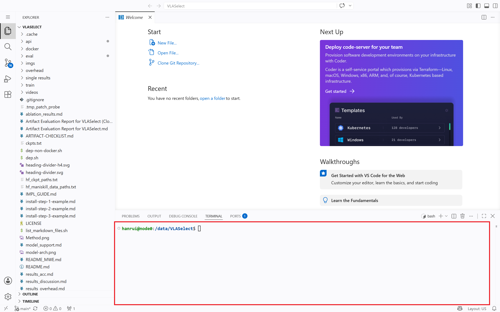
</p>

## 4. Start the Docker Container

Run the following command to start the Docker container:

```bash
bash start_docker.sh
```

<p align="center">
  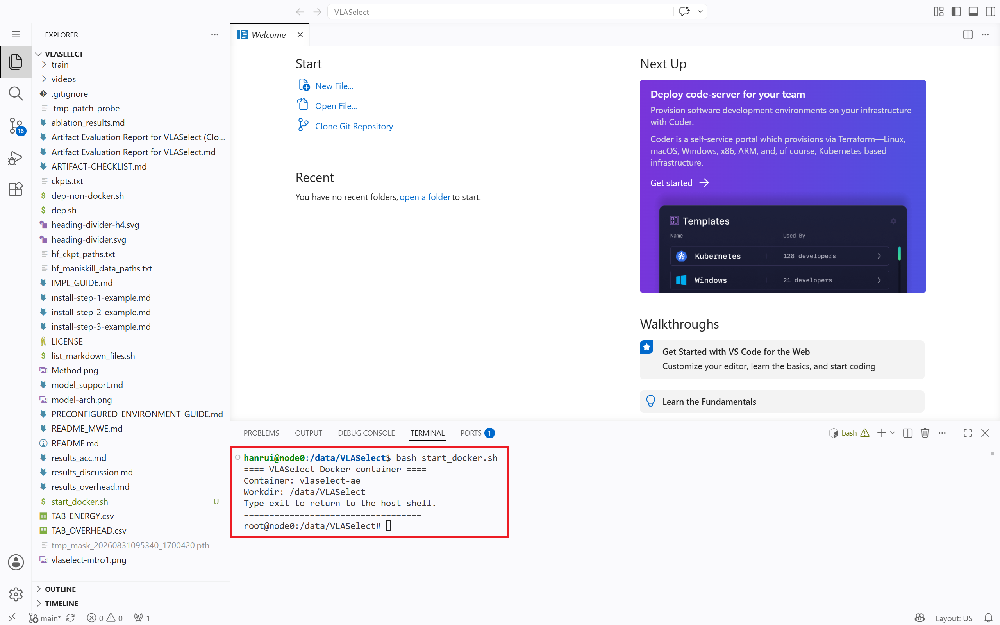
</p>

After the command attaches to the container, run all subsequent evaluation commands in the container shell.

## 5. Run the Evaluation

After starting the container, follow [Section 2.2: Step-by-Step Reproduction](README.md#22-step-by-step-reproduction) in the README to run the evaluation experiments.

**Example:**

The following example reproduces **Experiment 1 (Figure 7): Accuracy Under Tasks/Environment Changes** for the minimum working examples.

```bash
cd eval/acc_comparison
MWE=1 METHODS=self_improv,vla_rft,world_env,vlaselect \
  bash run_acc_task_env_change.sh
python3 plot_acc_task_env.py
```

**The expected terminal output is shown below:**

<p align="center">
  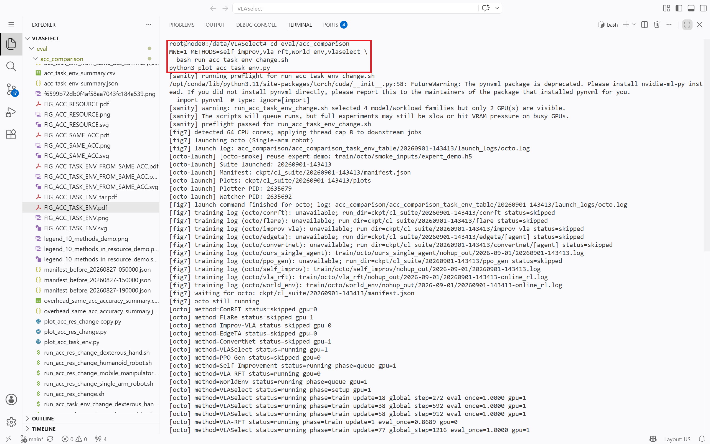
</p>

**The resource requirements and output are listed below:**

<p align="center">
  <table>
    <tr>
      <th>Configuration</th>
      <th>Expected runtime</th>
      <th>Resource requirements</th>
      <th>Output</th>
    </tr>
    <tr>
      <td>Minimum working example</td>
      <td>1.5 hours</td>
      <td>20GB memory <br> 32GB disk space</td>
      <td><code>eval/acc_comparison/FIG_ACC_TASK_ENV.pdf</code></td>
    </tr>
  </table>
</p>

## 6. Check Results

Use File Manager to locate the path and double-click to open the file. The result will display in the right window:

<p align="center">
  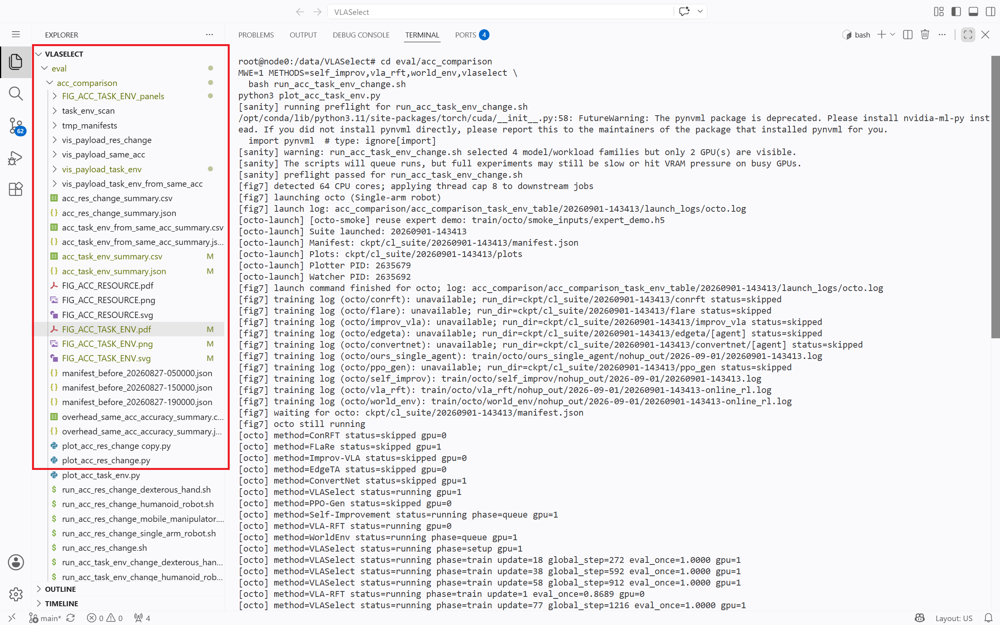
</p>

## 7. Example Experiment 1 (Figure 7): Accuracy Under Tasks/Environment Changes

After you enter the Docker environment, you can run **Example Experiment 1** with the following steps.

### Step 1: Find the evaluation script

You can find the evaluation script for **Example Experiment 1** in the **README** under Section [2.2.1 Experiment 1: (Figure 7 in Section 5.2.1) Accuracy Under Tasks/Environment Changes](README.md#221-experiment-1-figure-7-in-section-521-accuracy-under-tasksenvironment-changes).

The commands for the minimum working example:

```bash
cd eval/acc_comparison

MWE=1 METHODS=self_improv,vla_rft,world_env,vlaselect \
  bash run_acc_task_env_change.sh

python3 plot_acc_task_env.py
```

Resource requirements and expected output:

|  | Expected runtime | Resource requirements | Output |
| --- | --- | --- | --- |
| Minimum working example | 1.5 hours | 20 GB memory<br>32 GB disk space | `eval/acc_comparison/FIG_ACC_TASK_ENV.pdf` |

### Step 2: Run the evaluation

Enter the commands above in the terminal and run them:

<p align="center">
  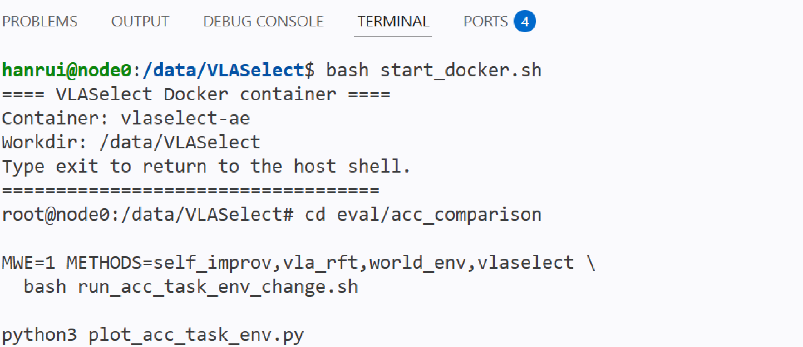
</p>

### Step 3: Check the results

After the evaluation finishes, the terminal will print the path of the output file:

<p align="center">
  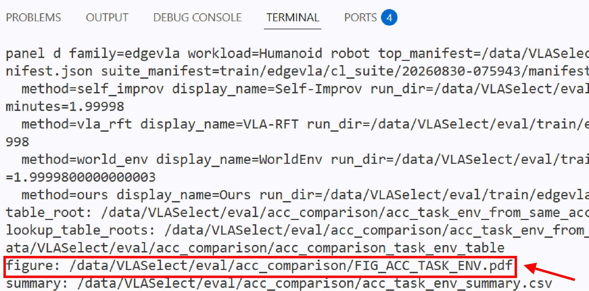
</p>

The output file is:

`eval/acc_comparison/FIG_ACC_TASK_ENV.pdf`

Use File Manager to locate this path and double-click the file. The result will be displayed in the right panel:

<p align="center">
  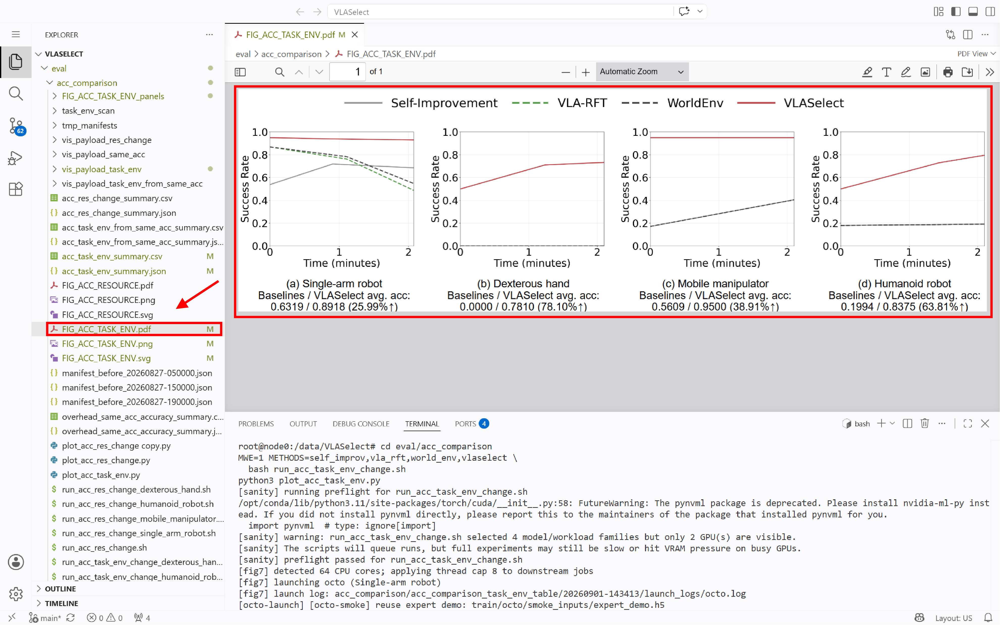
</p>

Note: If the image does not display, right-click the file and choose Download from the context menu to view it.

<p align="center">
  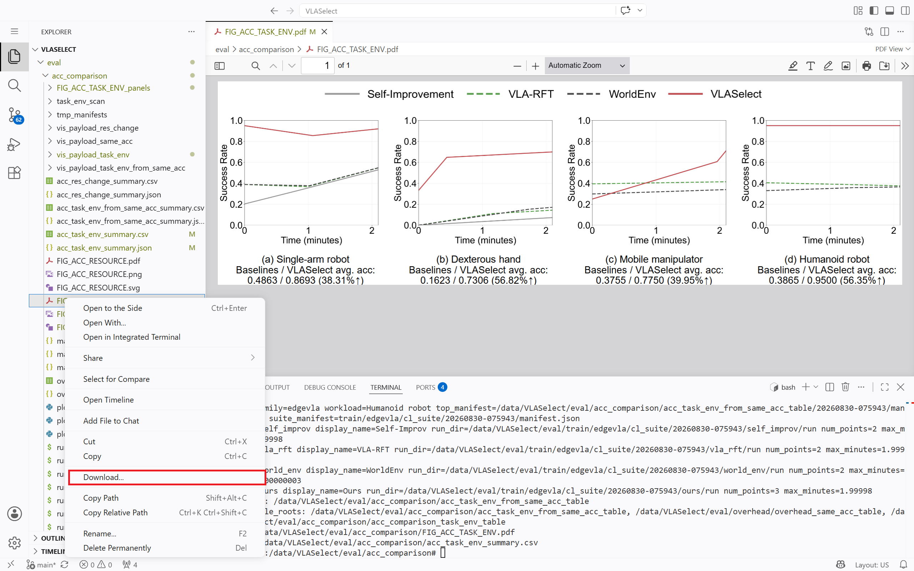
</p>

Alternatively, you can change the browser settings. For Edge browser, enter `edge://flags/#unsafely-treat-insecure-origin-as-secure` in the address bar.

<p align="center">
  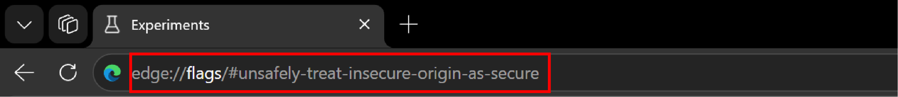
</p>

Then set **Insecure origins treated as secure** to **Enabled**, and enter `http://clgpu015.clemson.cloudlab.us:8080` in the box below.

<p align="center">
  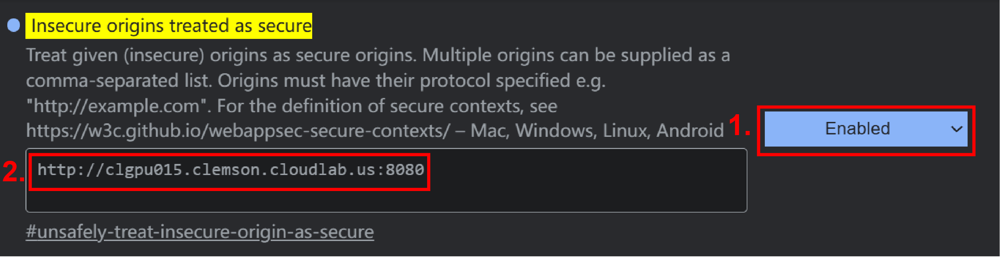
</p>

Finally, click **Restart**.

<p align="center">
  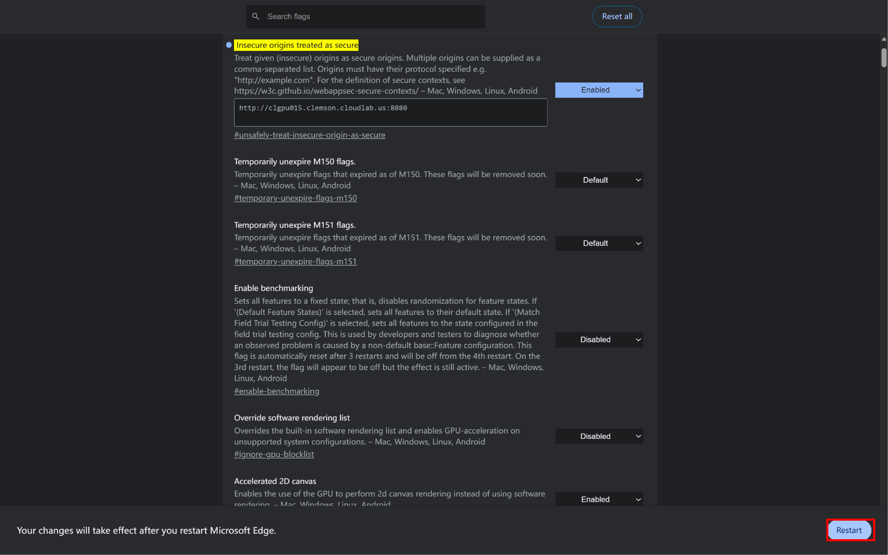
</p>

Open [http://clgpu015.clemson.cloudlab.us:8080](http://clgpu015.clemson.cloudlab.us:8080) again to view the images.
