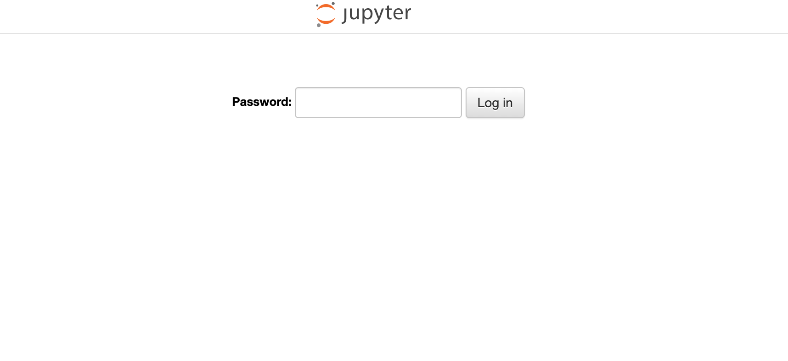
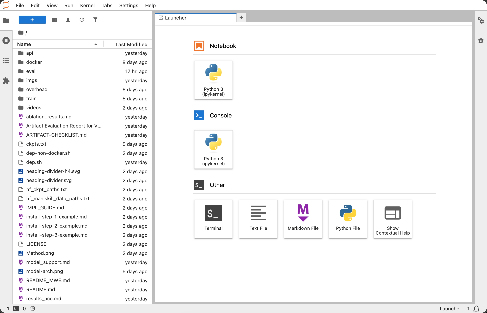
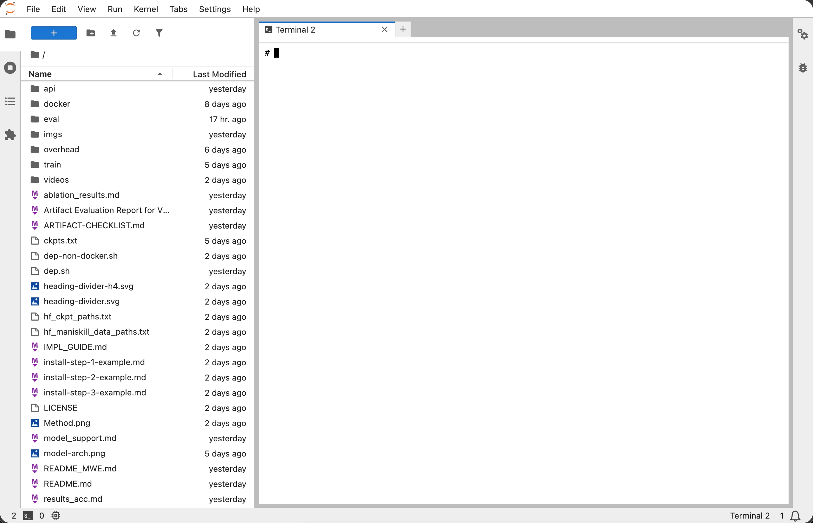

# VLASelect Artifact Evaluation

## Pre-configured Environment Guide

For artifact evaluation, we provide a browser-based **JupyterLab environment** in which reviewers can access the VLASelect repository and run the evaluation directly from a web terminal.

This environment has been fully configured for the **Minimal Working Example (MWE) on a small machine**. All required dependencies, Docker images, model checkpoints, and project files are already available.

## 1. Access the JupyterLab Environment

**Open the following URL in a web browser:**

- **URL:** [http://js4.blockelite.cn:24158](http://js4.blockelite.cn:24158)
- **Password:** `Jupyterserver` (case-sensitive)

**Enter the provided password to access the JupyterLab environment:**

<p align="center">
  
</p>


**After login, JupyterLab opens directly in the VLASelect project environment:**

<p align="center">
  
</p>

## 2. Open a Terminal

Click **Terminal** under **Other**. A web terminal will open in the project environment.

<p align="center">
  
</p>
<p align="center"><em>Use the web terminal to run the artifact evaluation commands.</em></p>

## 3. Run the Experiments

Then follow [`README.md`, Section 2.1: One-click Reproduction](README.md#21-one-click-reproduction), starting from:

```bash
bash start_docker.sh
```

The README provides the remaining steps for entering evaluation.