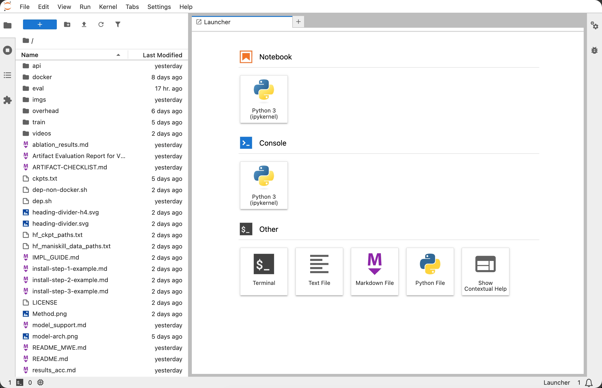
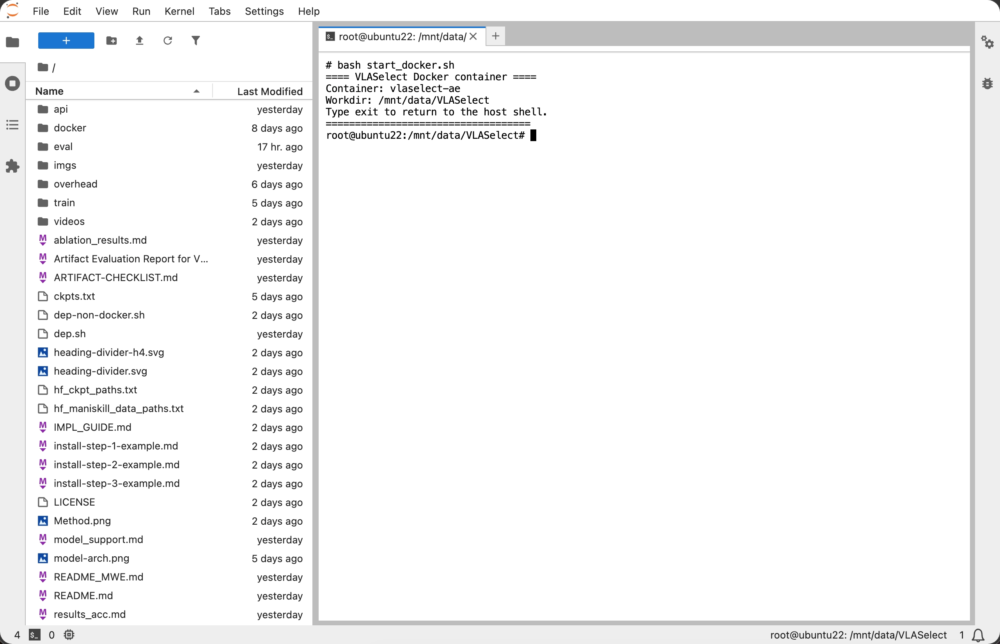
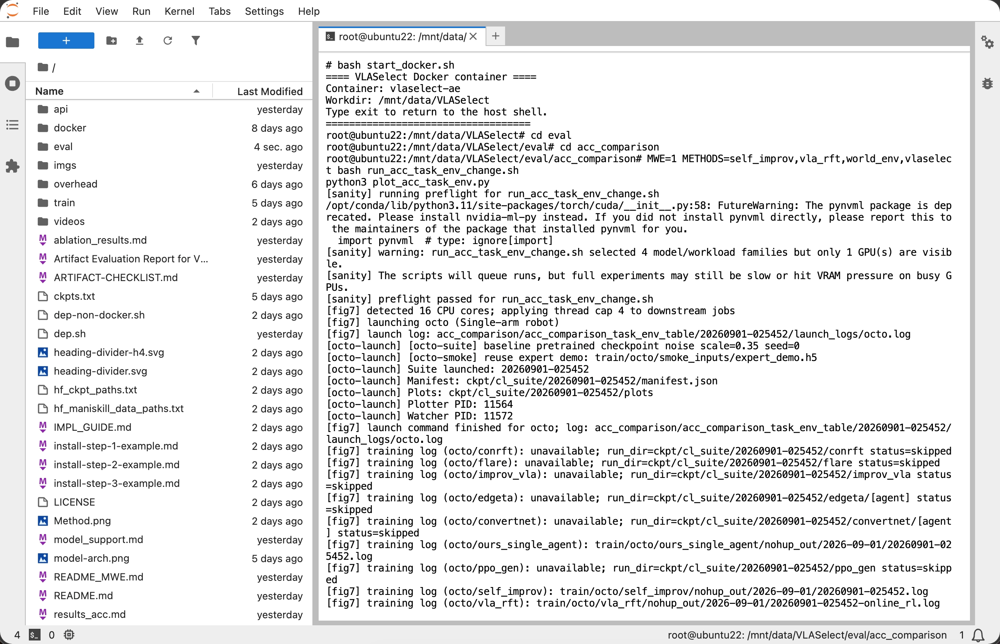
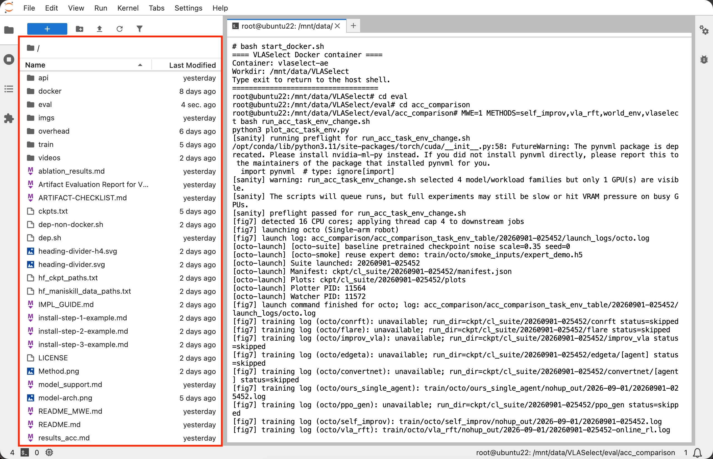
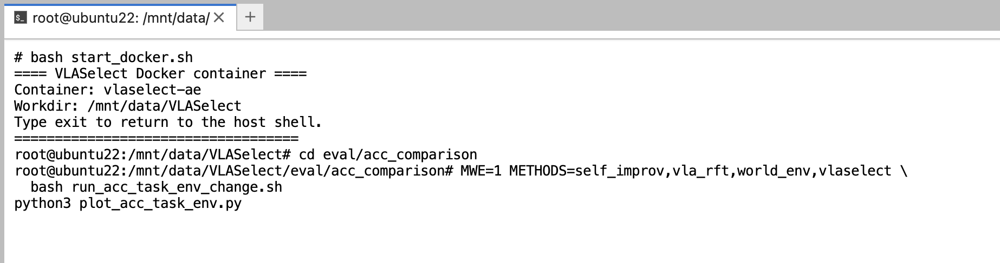
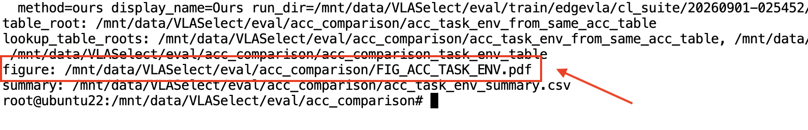
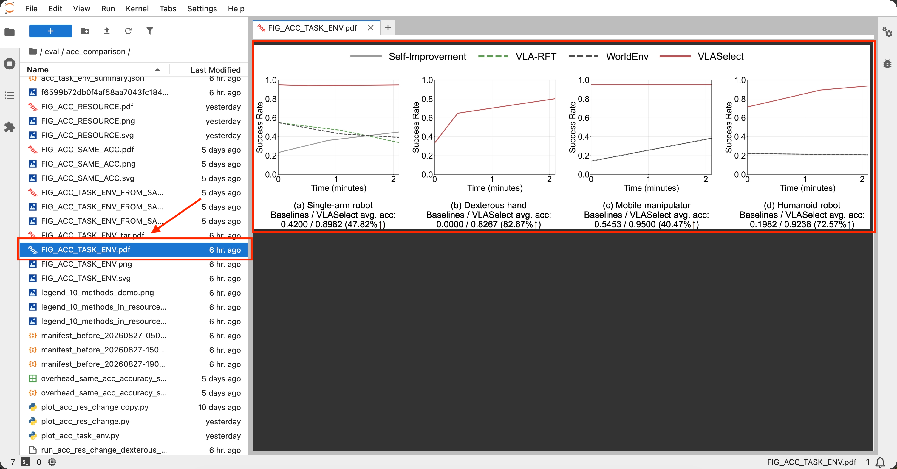
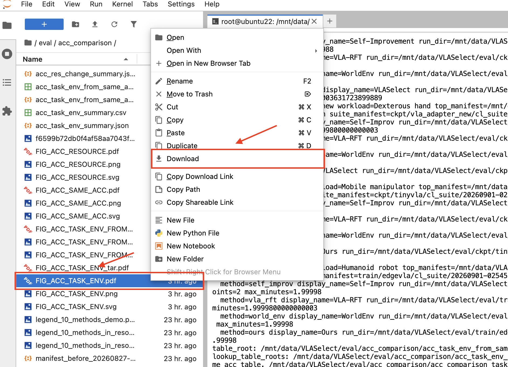

# Instructions for Open Access to Our Preconfigured Small Machine

We provide a **preconfigured small machine** for artifact evaluation. 

Reviewers can access this machine and run the **minimum working examples** directly by following the instructions below.

## 1. Hardware and Software Specifications

<p align="center">
  <table>
    <tr>
      <td><b>Operating System</b></td>
      <td>Ubuntu 22.04.4 LTS (Kernel 6.8)</td>
    </tr>
    <tr>
      <td><b>CPU</b></td>
      <td>Intel Xeon E5-2698 v4 (16C)</td>
    </tr>
    <tr>
      <td><b>Memory</b></td>
      <td>32 GB DDR4</td>
    </tr>
    <tr>
      <td><b>GPU</b></td>
      <td>NVIDIA Tesla V100 (32 GB)</td>
    </tr>
    <tr>
      <td><b>CUDA</b></td>
      <td>Driver 550.127.05, CUDA 12.4</td>
    </tr>
  </table>
</p>

## 2. Access the Environment

- **Step 1**: Open the URL [http://js4.blockelite.cn:24158](http://js4.blockelite.cn:24158) in a web browser (e.g. Chrome or Microsoft Edge). The login page will appear as below:

  <p align="center">
    
  </p>

- **Step 2**: Input the password `Jupyterserver` and click the "Log in" button;

- **Step 3**: The page of **preconfigured environment** will appear as below:

  <p align="center">
    
  </p>

## 3. Launch a Terminal

Click the **"Terminal" button** under the **"Other" panel** to launch a terminal.

<p align="center">
  
</p>

<p align="center">
  
</p>


## 4. Start the Docker Container

Run the following command in the terminal:

```bash
bash start_docker.sh
```

The expected output is shown as below:


<p align="center">
  
</p>

<!-- After the command attaches to the terminal, run all subsequent evaluation commands in the container shell. -->

## 5. Run Minimum Working Examples

Follow [Section 2.2: Step-by-Step Reproduction](README.md#22-step-by-step-reproduction) in the README.md to run the minimum working examples.

The expected terminal output is shown below:

<p align="center">
  
</p>


## 6. Check Results

Use the file manager on the left panel to check the results.

<p align="center">
  
</p>

<br>


## 7. Run Example Experiment 1 (Figure 7): Accuracy Under Tasks/Environment Changes

<!-- To run **Experiment 1**, first complete the procedures in [Sections 2 to 4](#2-access-the-environment) above, and perform the steps below. -->

### Step 1: Enter the environment

Complete the procedures in [Sections 2 to 4](#2-access-the-environment) above:
- [Section 2: Accessing the Environment](#2-access-the-environment)
- [Section 3: Launching a Terminal](#3-launch-a-terminal)
- [Section 4: Starting the Docker container](#4-start-the-docker-container)

### Step 2: Find the evaluation script

The **evaluation script** for Experiment 1 is provided in [Section 2.2.1 Experiment 1: (Figure 7 in Section 5.2.1) Accuracy Under Tasks/Environment Changes](README.md#221-experiment-1-figure-7-in-section-521-accuracy-under-tasksenvironment-changes) in the README.md, i.e.:

```bash
cd eval/acc_comparison

MWE=1 METHODS=self_improv,vla_rft,world_env,vlaselect \
  bash run_acc_task_env_change.sh

python3 plot_acc_task_env.py
```

The **resource requirements** and **expected output** of this experiment are also listed in that section, i.e.:

|  | Expected runtime | Resource requirements | Output |
| --- | --- | --- | --- |
| Minimum working example | 1.5 hours | 20 GB memory<br>32 GB disk space | `eval/acc_comparison/FIG_ACC_TASK_ENV.pdf` |

### Step 3: Run the evaluation script

Run the script (found in Step 2) in the terminal, and wait the completion:

<p align="center">
  
</p>

### Step 4: Check the results

1. **Obtain the output file's path**. After Step 3 completes, the terminal will print the path of the output file:

  <p align="center">
    
  </p>

2. **View the output file**. Use the file manager to locate the file, and double-click the file. The file will be displayed in the right panel:

  <p align="center">
    
  </p>

3. **Download the output file**. Right-click the file in the file manager, and click the "Download" button: 

<p align="center">
  
</p>
