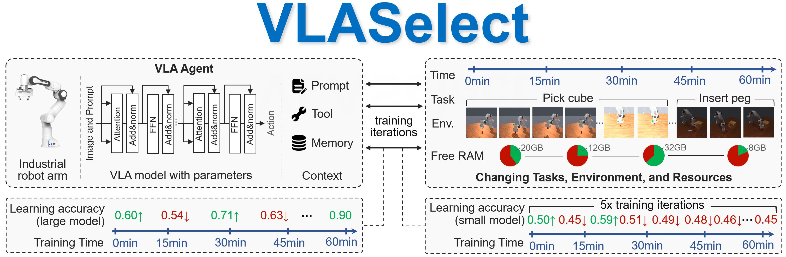

# VLASelect Artifacts Evaluation

This repository contains the artifacts for the paper **"VLASelect: Selective Large-small Model Co-learning for Self-evolving VLA Agents"**, which has been conditionally accepted by EuroSys'27.

## Downloads

[Artifact Checklist](./ARTIFACT-CHECKLIST.md)<br>
[Evaluation Report on a Small Machine](https://github.com/LINC-BIT/VLASelect/blob/main/Artifact%20Evaluation%20Report%20for%20VLASelect.pdf)<br>
[Zenodo for Long-Term Storage](https://zenodo.org/records/22119671)<br>
[Docker Image](https://hub.docker.com/repository/docker/cz22edd/pytorch/tags/maniskillv2/sha256-bfbedf8025c694677d0e252cf07afd1285ce477f47f595f6f3253045320e196e)

## Outline

<a href="#1-artifact-overview">1. Artifact Overview</a><br>
&nbsp;&nbsp;&nbsp;&nbsp;&nbsp;&nbsp;<a href="#11-introduction">1.1 Introduction</a><br>
&nbsp;&nbsp;&nbsp;&nbsp;&nbsp;&nbsp;<a href="#12-preparation-before-artifacts-evaluation">1.2 Preparation Before Artifacts Evaluation</a><br>
&nbsp;&nbsp;&nbsp;&nbsp;&nbsp;&nbsp;&nbsp;&nbsp;&nbsp;&nbsp;&nbsp;&nbsp;<a href="#121-hardware-requirements">1.2.1 Hardware Requirements</a><br>
&nbsp;&nbsp;&nbsp;&nbsp;&nbsp;&nbsp;&nbsp;&nbsp;&nbsp;&nbsp;&nbsp;&nbsp;<a href="#122-software-requirements">1.2.2 Software Requirements</a><br>
&nbsp;&nbsp;&nbsp;&nbsp;&nbsp;&nbsp;&nbsp;&nbsp;&nbsp;&nbsp;&nbsp;&nbsp;<a href="#123-get-source-code">1.2.3 Get Source Code</a><br>
&nbsp;&nbsp;&nbsp;&nbsp;&nbsp;&nbsp;&nbsp;&nbsp;&nbsp;&nbsp;&nbsp;&nbsp;<a href="#124-install-dependencies-if-docker-can-be-installed">1.2.4 Install Dependencies (if Docker can be installed)</a><br>
&nbsp;&nbsp;&nbsp;&nbsp;&nbsp;&nbsp;&nbsp;&nbsp;&nbsp;&nbsp;&nbsp;&nbsp;<a href="#125-install-dependencies-if-docker-cannot-be-installed">1.2.5 Install Dependencies (if Docker cannot be installed)</a><br>
&nbsp;&nbsp;&nbsp;&nbsp;&nbsp;&nbsp;&nbsp;&nbsp;&nbsp;&nbsp;&nbsp;&nbsp;<a href="#126-install-dependencies-for-plotting-scripts">1.2.6 Install Dependencies for Plotting Scripts</a><br>
&nbsp;&nbsp;&nbsp;&nbsp;&nbsp;&nbsp;&nbsp;&nbsp;&nbsp;&nbsp;&nbsp;&nbsp;<a href="#127-about-dataset">1.2.7 About Dataset</a><br>
&nbsp;&nbsp;&nbsp;&nbsp;&nbsp;&nbsp;<a href="#13-treatment-measure-for-unusual-behaviors">1.3 Treatment Measure for Unusual Behaviors</a><br>
<a href="#2-evaluation-reproduction">2. Evaluation Reproduction</a><br>
&nbsp;&nbsp;&nbsp;&nbsp;&nbsp;&nbsp;<a href="#21-one-click-reproduction">2.1 One-click Reproduction</a><br>
&nbsp;&nbsp;&nbsp;&nbsp;&nbsp;&nbsp;<a href="#22-step-by-step-reproduction">2.2 Step-by-Step Reproduction</a><br>
&nbsp;&nbsp;&nbsp;&nbsp;&nbsp;&nbsp;&nbsp;&nbsp;&nbsp;&nbsp;&nbsp;&nbsp;<a href="#221-figure-7-accuracy-under-tasksenvironment-changes">2.2.1 (Figure 7) Accuracy Under Tasks/Environment Changes</a><br>
&nbsp;&nbsp;&nbsp;&nbsp;&nbsp;&nbsp;&nbsp;&nbsp;&nbsp;&nbsp;&nbsp;&nbsp;<a href="#222-figure-8-accuracy-under-available-resource-changes">2.2.2 (Figure 8) Accuracy Under Available Resource Changes</a><br>
&nbsp;&nbsp;&nbsp;&nbsp;&nbsp;&nbsp;&nbsp;&nbsp;&nbsp;&nbsp;&nbsp;&nbsp;<a href="#223-figure-9-and-tables-23-overheads-under-the-same-accuracy">2.2.3 (Figure 9 and Tables 2/3) Overheads Under The Same Accuracy</a><br>
&nbsp;&nbsp;&nbsp;&nbsp;&nbsp;&nbsp;&nbsp;&nbsp;&nbsp;&nbsp;&nbsp;&nbsp;<a href="#224-figure-10-time-breakdown-of-vlaselects-modules">2.2.4 (Figure 10) Time Breakdown of VLASelect's Modules</a><br>
&nbsp;&nbsp;&nbsp;&nbsp;&nbsp;&nbsp;&nbsp;&nbsp;&nbsp;&nbsp;&nbsp;&nbsp;<a href="#225-figure-11-training-time-breakdown-in-each-workload">2.2.5 (Figure 11) Training Time Breakdown in Each Workload</a><br>
&nbsp;&nbsp;&nbsp;&nbsp;&nbsp;&nbsp;&nbsp;&nbsp;&nbsp;&nbsp;&nbsp;&nbsp;<a href="#226-figure-12-design-choice-validation-by-ablation">2.2.6 (Figure 12) Design Choice Validation by Ablation</a><br>
&nbsp;&nbsp;&nbsp;&nbsp;&nbsp;&nbsp;&nbsp;&nbsp;&nbsp;&nbsp;&nbsp;&nbsp;<a href="#227-discussion-1-sim-to-real-transfer">2.2.7 Discussion 1: Sim-to-real transfer</a><br>
&nbsp;&nbsp;&nbsp;&nbsp;&nbsp;&nbsp;&nbsp;&nbsp;&nbsp;&nbsp;&nbsp;&nbsp;<a href="#228-discussion-2-icl-in-context-learning">2.2.8 Discussion 2: ICL (In-Context Learning)</a><br>
&nbsp;&nbsp;&nbsp;&nbsp;&nbsp;&nbsp;&nbsp;&nbsp;&nbsp;&nbsp;&nbsp;&nbsp;<a href="#229-discussion-3-maximum-supported-model-size">2.2.9 Discussion 3: Maximum Supported Model Size</a><br>
&nbsp;&nbsp;&nbsp;&nbsp;&nbsp;&nbsp;&nbsp;&nbsp;&nbsp;&nbsp;&nbsp;&nbsp;<a href="#2210-discussion-4-applicability-to-multi-agent-scenarios">2.2.10 Discussion 4: Applicability to multi-agent scenarios</a><br>
<a href="#3-supporting-various-vla-models-scaling-strategies-and-knowledge-exchange-granularities">3. Supporting Various VLA Models, Scaling Strategies, and Knowledge Exchange Granularities</a><br>
&nbsp;&nbsp;&nbsp;&nbsp;&nbsp;&nbsp;<a href="#31-example-1-vla-adapter">3.1 Example 1: VLA-Adapter</a><br>
&nbsp;&nbsp;&nbsp;&nbsp;&nbsp;&nbsp;&nbsp;&nbsp;&nbsp;&nbsp;&nbsp;&nbsp;<a href="#311-supporting-the-model">3.1.1 Supporting the model</a><br>
&nbsp;&nbsp;&nbsp;&nbsp;&nbsp;&nbsp;&nbsp;&nbsp;&nbsp;&nbsp;&nbsp;&nbsp;<a href="#312-supporting-different-scaling-strategies">3.1.2 Supporting different scaling strategies</a><br>
&nbsp;&nbsp;&nbsp;&nbsp;&nbsp;&nbsp;&nbsp;&nbsp;&nbsp;&nbsp;&nbsp;&nbsp;<a href="#313-supporting-different-knowledge-exchange-granularities">3.1.3 Supporting different knowledge exchange granularities</a><br>
&nbsp;&nbsp;&nbsp;&nbsp;&nbsp;&nbsp;<a href="#32-example-2-tinyvla">3.2 Example 2: TinyVLA</a><br>
&nbsp;&nbsp;&nbsp;&nbsp;&nbsp;&nbsp;&nbsp;&nbsp;&nbsp;&nbsp;&nbsp;&nbsp;<a href="#321-supporting-the-model">3.2.1 Supporting the model</a><br>
&nbsp;&nbsp;&nbsp;&nbsp;&nbsp;&nbsp;&nbsp;&nbsp;&nbsp;&nbsp;&nbsp;&nbsp;<a href="#322-supporting-different-scaling-strategies">3.2.2 Supporting different scaling strategies</a><br>
&nbsp;&nbsp;&nbsp;&nbsp;&nbsp;&nbsp;&nbsp;&nbsp;&nbsp;&nbsp;&nbsp;&nbsp;<a href="#323-supporting-different-knowledge-exchange-granularities">3.2.3 Supporting different knowledge exchange granularities</a><br>
&nbsp;&nbsp;&nbsp;&nbsp;&nbsp;&nbsp;<a href="#33-example-3-edgevla">3.3 Example 3: EdgeVLA</a><br>
&nbsp;&nbsp;&nbsp;&nbsp;&nbsp;&nbsp;&nbsp;&nbsp;&nbsp;&nbsp;&nbsp;&nbsp;<a href="#331-supporting-the-model">3.3.1 Supporting the model</a><br>
&nbsp;&nbsp;&nbsp;&nbsp;&nbsp;&nbsp;&nbsp;&nbsp;&nbsp;&nbsp;&nbsp;&nbsp;<a href="#332-supporting-different-scaling-strategies">3.3.2 Supporting different scaling strategies</a><br>
&nbsp;&nbsp;&nbsp;&nbsp;&nbsp;&nbsp;&nbsp;&nbsp;&nbsp;&nbsp;&nbsp;&nbsp;<a href="#333-supporting-different-knowledge-exchange-granularities">3.3.3 Supporting different knowledge exchange granularities</a><br>

## 1. Artifact Overview


### 1.1 Introduction

- **Background**: 

  - VLA (Vision-Language-Action) model-based agents such as
  robot arms, dexterous hands and humanoid robots are revolutionizing our lives. 
  - These agents usually run in **open ended,
  interactive environments** where new tasks start, surroundings change, or available resources fluctuate. 
  - In existing agentic AI systems, the resource-intensive training of deployed
  VLA models has become a critical bottleneck. 

- **Method**: 

  - In this paper,
  we present VLASelect, a framework that takes the dynamics
  of agents’ interactive environment into account to enable
  **large-small model collaborative learning**. 
  - In online RL, VLASelect employs an agent’s small model to quickly explore the
  environment, **selectively transfers** its positive knowledge to
  the agent’s large model, and compensates its learning ability
  by swapping in the large model’s most accuracy-related neurons. 
  - In doing so, our approach combines the strengths of
  large models’ high learning capacity and small models’ low
  training costs via **neuron-grained knowledge exchange**. 

    

- **Evaluation**: 
  - Our experiments compare 9 state-of-the-art VLA
  learning techniques across 4 embodied AI agents.
  - VLASelect
  achieves as much as 40.12% increase in task success rate,
  25.6% decrease in memory footprint and 11.55x reduction on
  energy consumption.


### 1.2 Preparation Before Artifacts Evaluation

#### 1.2.1 Hardware Requirements

- **Option 1: Recommended hardware for fully running our artifacts**:

  | RAM | CPU | Disk | GPU |
  |---|---|---|---|
   128 GB | One 64-core server CPU<br>(e.g., Intel(R) Xeon(R) Gold 6430) | At least<br>150 GB free | One NVIDIA GPU with<br>more than 60 GB VRAM<br>(e.g., A100) |

- **Option 2: Minimum hardware requirements for running minimal working examples**:

  |  | RAM | CPU | Disk | GPU |
    |---|---|---|---|---|
    | Single-CPU server | 16–32 GB | One 8-core server CPU (e.g., Intel Xeon E-2388G) | At least 80 GB free | — |
    | GPU-equipped server | 32–64 GB | One 12-core server CPU (e.g., Intel Xeon Silver 4310) | At least 80 GB free | One NVIDIA GPU with 8–12 GB VRAM (e.g., NVIDIA RTX 3060) |
    | CPU-only desktop | 16–32 GB | One 16-core desktop CPU (e.g., Intel Core i7-13700) | At least 80 GB free | Integrated graphics |
    | GPU-equipped desktop | 16–32 GB | One 20-core desktop CPU (e.g., Intel Core i7-14700) | At least 80 GB free | One NVIDIA GPU with 8 GB VRAM (e.g., NVIDIA RTX 4060) |
    | CPU-only laptop | 16–32 GB | One 12-core CPU (e.g., Intel Core Ultra 7 155U) | At least 80 GB free | Integrated graphics |
    | GPU-equipped laptop | 16–32 GB | One 16-core CPU (e.g., Intel Core i7-14650HX) | At least 80 GB free | One NVIDIA GPU with 8 GB VRAM (e.g., RTX 4060) |

#### 1.2.2 Software Requirements

- **Option 1: Recommended software for fully running our artifacts**:

  | Operating System | CUDA | Others |
  |---|---|---|
  | Ubuntu LTS 22.04.4 LTS | CUDA 13.0 | Kernel 6.8.0-124-generic<br>Docker 29.2.1 |
      
- **Option 2: Minimum software requirements for running minimal working examples**:

  | Operating System | CUDA | Others |
    |---|---|---|
    | Ubuntu LTS 20.04+ | CUDA 12.x+<br>(when using a GPU) | Kernel 5.4+<br>Docker 29.0+ |
    | Windows 10+ | CUDA 12.x+<br>(when using a GPU) | Docker 29.0+ |
    | macOS 14+ | - | - |
    | Debian 11+ | CUDA 12.x+<br>(when using a GPU) | Kernel 5.4+<br>Docker 29.0+ |
    | RHEL 8+ | CUDA 12.x+<br>(when using a GPU) | Kernel 5.4+<br>Docker 29.0+ |


#### 1.2.3 Get Source Code

  You can obtain the source code for artifacts evaluation by the following command. **The code does not perform any malicious or destructive operations**.

  ```bash
  git clone https://github.com/LINC-BIT/VLASelect.git
  ```

#### 1.2.4 Install Dependencies (if Docker can be installed)

- **Step 1: Install Docker**

  ```bash
  # Add Docker's official GPG key:
  sudo apt update
  sudo apt install ca-certificates curl
  sudo install -m 0755 -d /etc/apt/keyrings
  sudo curl -fsSL https://download.docker.com/linux/ubuntu/gpg -o /etc/apt/keyrings/docker.asc
  sudo chmod a+r /etc/apt/keyrings/docker.asc

  # Add the repository to Apt sources:
  sudo tee /etc/apt/sources.list.d/docker.sources <<EOF
  Types: deb
  URIs: https://download.docker.com/linux/ubuntu
  Suites: $(. /etc/os-release && echo "${UBUNTU_CODENAME:-$VERSION_CODENAME}")
  Components: stable
  Architectures: $(dpkg --print-architecture)
  Signed-By: /etc/apt/keyrings/docker.asc
  EOF

  sudo apt update

  sudo apt install docker-ce docker-ce-cli containerd.io docker-buildx-plugin docker-compose-plugin

  sudo systemctl status docker --no-pager
  sudo docker run hello-world
  ```
  [Example running screenshots](install-step-1-example.md)

- **Step 2: Install Docker plugin for using CUDA**
  
  ```bash
  sudo apt-get update
  sudo apt-get install -y --no-install-recommends ca-certificates curl gnupg2

  curl -fsSL https://nvidia.github.io/libnvidia-container/gpgkey \
    | sudo gpg --dearmor -o /usr/share/keyrings/nvidia-container-toolkit-keyring.gpg

  curl -s -L https://nvidia.github.io/libnvidia-container/stable/deb/nvidia-container-toolkit.list \
    | sed 's#deb https://#deb [signed-by=/usr/share/keyrings/nvidia-container-toolkit-keyring.gpg] https://#g' \
    | sudo tee /etc/apt/sources.list.d/nvidia-container-toolkit.list

  sudo apt-get update
  sudo apt-get install -y nvidia-container-toolkit
  sudo nvidia-ctk runtime configure --runtime=docker
  sudo systemctl restart docker
  ```
  [Example running screenshots](install-step-2-example.md)

- **Step 3: Install the required dependencies of this artifact:**

  ```bash
  cd <VLASelect directory>

  # Option 1: 
  # pull the full Docker image (33GB)
  # without installing other dependencies
  bash dep.sh

  # Option 2: 
  # pull the minimum Docker image (100MB)
  # and install other dependencies in the Docker container
  TYPE=100M bash dep.sh
  ```
  [Example running screenshots](install-step-3-example.md)

- **Step 4: Check the installation:**

  ```bash
  bash start_docker.sh
  python -c "import torch; print(torch.__version__)"
  python -c "import torch; print(torch.cuda.is_available())"
  python -c "import torch; print(torch.cuda.get_device_name(0) if torch.cuda.is_available() else 'CUDA not available')"
  ```
  [Example running screenshots](imgs/4.1.png)

#### 1.2.5 Install Dependencies (if Docker cannot be installed)

- If you cannot install Docker (e.g. no root permission), skip Section 1.2.4 and run the following commands instead. 

  ```bash
  # Option 1: install dependencies without Docker in a x86 machine
  cd <VLASelect directory>
  TORCH_VERSION=2.4.0 \
  TORCHVISION_VERSION=0.19.0 \
  TORCHAUDIO_VERSION=2.4.0 \
  TORCH_INDEX_URL=https://download.pytorch.org/whl/cu124 \
  bash dep-non-docker.sh

  # Option 2: install dependencies without Docker in a ARM machine
  ARM=1 bash dep-non-docker.sh
  ```
  [Example running screenshots](imgs/no-docker.png)

#### 1.2.6 Install Dependencies for Plotting Scripts

- Run the command below to install dependencies for plotting scripts:
  ```bash
  pip install matplotlib==3.10.8 pypdf==6.16.2
  ```

#### 1.2.7 About Dataset

- **Dataset for pre-training**: 

  We use one demonstration dataset in the ManiSkill Benchmark for pre-training VLA models. It is stored in [Hugging Face](https://huggingface.co/datasets/haosulab/ManiSkill_PickCube). You can download it by the following command:
  ```bash
  python -m mani_skill.utils.download_demo PushCube-v1
  ``` 

- **Dataset for online RL training**:

  We do not use any dataset for online RL training. The data for online RL training is sampled from the ManiSkill Benchmark's environments.

### 1.3 Treatment Measure for Unusual Behaviors

| Unusual Behavior | Treatment |
|---|---|
| **Out-of-memory error during the reproduction**: You see errors like `torch.OutOfMemoryError: CUDA out of memory` when running the reproduction script. | 1. Use a hardware that satisfies the [minimum requirements](#121-hardware-requirements).<br>2. Run the minimum working example. |
| **Lack of model checkpoints**: You see errors like `FileNotFoundError: [Errno 2] No such file or directory: 'xxx.pt'` when running the reproduction script. | Rerun `dep.sh` to download the required model checkpoints. |


## 2. Evaluation Reproduction

### 2.1 One-click Reproduction

We provide a one-click script `eval/run.sh` that runs all experiments sequentially and produces resulting figures and tables.

- **(Recommended) Option 1: Minimun working example (completed within 1 day and 20GB memory)**
  ```bash
  cd <VLASelect directory>
  bash start_docker.sh
  cd <VLASelect directory in the container>/eval
  MWE=1 bash run.sh
  ```
- **Option 2: Full run (requiring 15 days and 60GB memory to complete)**
  ```bash
  cd <VLASelect directory>
  bash start_docker.sh
  cd <VLASelect directory in the container>/eval
  bash run.sh
  ```


The reproducing steps of each experiment are described in Section 2.2.


### 2.2 Step-by-Step Reproduction

Run the following command at the beginning:

```bash
cd <VLASelect directory>
bash start_docker.sh
cd <VLASelect directory in the container>/eval
```

And you can run the following commands to reproduce each figure/table in our evaluation.

#### 2.2.1 (Figure 7) Accuracy Under Tasks/Environment Changes

- **Option 1:** Commands for minimum working examples on three representative methods:
  ```bash
  cd acc_comparison

  # You can run four workloads by one command:
  MWE=1 METHODS=self_improv,vla_rft,world_env,vlaselect bash run_acc_task_env_change.sh
  python3 plot_acc_task_env.py

  # Or you can run each workloads step by step:
  MWE=1 METHODS=self_improv,vla_rft,world_env,vlaselect bash run_acc_task_env_change_single_arm_robot.sh
  MWE=1 METHODS=self_improv,vla_rft,world_env,vlaselect bash run_acc_task_env_change_mobile_manipulator.sh
  MWE=1 METHODS=self_improv,vla_rft,world_env,vlaselect bash run_acc_task_env_change_dexterous_hand.sh
  MWE=1 METHODS=self_improv,vla_rft,world_env,vlaselect bash run_acc_task_env_change_humanoid_robot.sh
  python3 plot_acc_task_env.py
  ```
- **Option 2:** Commands for minimum working examples on all methods:
  ```bash
  cd acc_comparison

  # You can run four workloads by one command:
  MWE=1 bash run_acc_task_env_change.sh
  python3 plot_acc_task_env.py

  # Or you can run each workloads step by step:
  MWE=1 bash run_acc_task_env_change_single_arm_robot.sh
  MWE=1 bash run_acc_task_env_change_mobile_manipulator.sh
  MWE=1 bash run_acc_task_env_change_dexterous_hand.sh
  MWE=1 bash run_acc_task_env_change_humanoid_robot.sh
  python3 plot_acc_task_env.py
  ```
- **Option 3:** Commands for full run:
  ```bash
  cd acc_comparison

  # You can run four workloads by one command:
  bash run_acc_task_env_change.sh
  python3 plot_acc_task_env.py

  # Or you can run each workloads step by step:
  bash run_acc_task_env_change_single_arm_robot.sh
  bash run_acc_task_env_change_mobile_manipulator.sh
  bash run_acc_task_env_change_dexterous_hand.sh
  bash run_acc_task_env_change_humanoid_robot.sh
  python3 plot_acc_task_env.py
  ```

- The three options' resource requirements and outputs are listed below:

  | | Resource Requirements | Example Running Outputs |
  | --- | --- | --- |
  | Minimum working example on three methods | 1.5 hours<br>20GB memory<br>32GB disk space | [Link](https://github.com/LINC-BIT/VLASelect/blob/main/results_acc.md#minimal-working-example) |
  | Minimum working example on all methods | 3.5 hours<br>20GB memory<br>55GB disk space | [Link](https://github.com/LINC-BIT/VLASelect/blob/main/results_acc.md#minimal-working-example) |
  | Full run | 140 hours<br>60GB memory<br>55GB disk space | [Link](https://github.com/LINC-BIT/VLASelect/blob/main/results_acc.md#full-run) |

- **Note:** In minimum working examples, we have limited the training time for each method to 120s. However, the total runtime remains several hours due to:
  - loading large model checkpoints (>1GB) for each method
  - initializing RL environments based on the physical simulation engine
  - evaluating each method's accuracy periodically


#### 2.2.2 (Figure 8) Accuracy Under Available Resource Changes

- **Option 1:** Commands for minimum working examples on three representative methods:

  ```bash
  cd acc_comparison

  # You can run four workloads by one command:
  MWE=1 METHODS=self_improv,vla_rft,world_env,vlaselect bash run_acc_res_change.sh
  python3 plot_acc_res_change.py

  # Or you can run each workloads step by step:
  MWE=1 METHODS=self_improv,vla_rft,world_env,vlaselect bash run_acc_res_change_single_arm_robot.sh
  MWE=1 METHODS=self_improv,vla_rft,world_env,vlaselect bash run_acc_res_change_mobile_manipulator.sh
  MWE=1 METHODS=self_improv,vla_rft,world_env,vlaselect bash run_acc_res_change_dexterous_hand.sh
  MWE=1 METHODS=self_improv,vla_rft,world_env,vlaselect bash run_acc_res_change_humanoid_robot.
  python3 plot_acc_res_change.py
  ```

- **Option 2:** Commands for minimum working examples on all methods:

  ```bash
  cd acc_comparison

  # You can run four workloads by one command:
  MWE=1 bash run_acc_res_change.sh
  python3 plot_acc_res_change.py

  # Or you can run each workloads step by step:
  MWE=1 bash run_acc_res_change_single_arm_robot.sh
  MWE=1 bash run_acc_res_change_mobile_manipulator.sh
  MWE=1 bash run_acc_res_change_dexterous_hand.sh
  MWE=1 bash run_acc_res_change_humanoid_robot.sh
  python3 plot_acc_res_change.py
  ```

- **Option 3:** Commands for full run:

  ```bash
  cd acc_comparison

  # You can run four workloads by one command:
  bash run_acc_res_change.sh
  python3 plot_acc_res_change.py

  # Or you can run each workloads step by step:
  bash run_acc_res_change_single_arm_robot.sh
  bash run_acc_res_change_mobile_manipulator.sh
  bash run_acc_res_change_dexterous_hand.sh
  bash run_acc_res_change_humanoid_robot.sh
  python3 plot_acc_res_change.py
  ```

- The three options' resource requirements and outputs are listed below:

  | | Resource Requirements | Example Running Outputs |
  | --- | --- | --- |
  | Minimum working example on three methods | 1.5 hours<br>20GB memory<br>32GB disk space | [Link](https://github.com/LINC-BIT/VLASelect/blob/main/results_acc.md#minimal-working-example-1) |
  | Minimum working example on all methods | 3.5 hours<br>20GB memory<br>55GB disk space| [Link](https://github.com/LINC-BIT/VLASelect/blob/main/results_acc.md#minimal-working-example-1) |
  | Full run | 140 hours<br>60GB memory<br>55GB disk space | [Link](https://github.com/LINC-BIT/VLASelect/blob/main/results_acc.md#full-run-1) |


#### 2.2.3 (Figure 9 and Tables 2/3) Overheads Under The Same Accuracy

- **Option 1:** Commands for minimum working examples on three representative methods:
  ```bash
  cd overhead

  # You can run four workloads by one command:
  bash overhead_same_acc.sh
  python3 plot_overhead.py

  # Or you can run each workloads step by step:
  bash overhead_same_acc_single_arm_robot.sh
  bash overhead_same_acc_mobile_manipulator.sh
  bash overhead_same_acc_dexterous_hand.sh
  bash overhead_same_acc_humanoid_robot.sh
  python3 plot_overhead.py
  ```
- **Option 2:** Commands for minimum working examples on all methods:
  ```bash
  cd overhead

  # You can run four workloads by one command:
  bash overhead_same_acc.sh
  python3 plot_overhead.py

  # Or you can run each workloads step by step:
  bash overhead_same_acc_single_arm_robot.sh
  bash overhead_same_acc_mobile_manipulator.sh
  bash overhead_same_acc_dexterous_hand.sh
  bash overhead_same_acc_humanoid_robot.sh
  python3 plot_overhead.py
  ```
- **Option 3:** Commands for full run:
  ```bash
  cd overhead

  # You can run four workloads by one command:
  bash overhead_same_acc.sh
  python3 plot_overhead.py

  # Or you can run each workloads step by step:
  bash overhead_same_acc_single_arm_robot.sh
  bash overhead_same_acc_mobile_manipulator.sh
  bash overhead_same_acc_dexterous_hand.sh
  bash overhead_same_acc_humanoid_robot.sh
  python3 plot_overhead.py
  ```

- The three options' resource requirements and outputs are listed below:

  | | Resource Requirements | Example Running Outputs |
  | --- | --- | --- |
  | Minimum working example on three methods | 1.5 hours<br>20GB memory<br>32GB disk space | [Link](https://github.com/LINC-BIT/VLASelect/blob/main/results_overhead.md#minimal-working-example) |
  | Minimum working example on all methods | 3.5 hours<br>20GB memory<br>55GB disk space | [Link](https://github.com/LINC-BIT/VLASelect/blob/main/results_overhead.md#minimal-working-example) |
  | Full run | 140 hours<br>60GB memory<br>55GB disk space | [Link](https://github.com/LINC-BIT/VLASelect/blob/main/results_overhead.md#full-run) |


#### 2.2.4 (Figure 10) Time Breakdown of VLASelect's Modules

- Commands for full run:
  ```bash
  cd overhead
  bash overhead_breakdown/run.sh
  ```
- The resource requirements and outputs are listed below:
  | Resource Requirements | Example Running Outputs |
  | --- | --- |
  | 40 minutes<br>60GB memory<br>30GB disk space | [Link](https://github.com/LINC-BIT/VLASelect/blob/main/results_overhead.md#minimal-working-example-1) |


#### 2.2.5 (Figure 11) Training Time Breakdown in Each Workload

- **Option 1:** Commands for minimum working examples on three representative methods:
  ```bash
  cd overhead

  # You can run four workloads by one command:
  MWE=1 METHODS=self_improv,vla_rft,world_env,vlaselect bash overhead_breakdown_all_methods.sh
  python3 plot_breakdown_all_methods.py

  # Or you can run each workloads step by step:
  MWE=1 METHODS=self_improv,vla_rft,world_env,vlaselect bash overhead_breakdown_all_methods_single_arm_robot.sh
  MWE=1 METHODS=self_improv,vla_rft,world_env,vlaselect bash overhead_breakdown_all_methods_mobile_manipulator.sh
  MWE=1 METHODS=self_improv,vla_rft,world_env,vlaselect bash overhead_breakdown_all_methods_dexterous_hand.sh
  MWE=1 METHODS=self_improv,vla_rft,world_env,vlaselect bash overhead_breakdown_all_methods_humanoid_robot.sh
  python3 plot_breakdown_all_methods.py
  ```
- **Option 2:** Commands for minimum working examples on all methods:
  ```bash
  cd overhead

  # You can run four workloads by one command:
  MWE=1 bash overhead_breakdown_all_methods.sh
  python3 plot_breakdown_all_methods.py

  # Or you can run each workloads step by step:
  MWE=1 bash overhead_breakdown_all_methods_single_arm_robot.sh
  MWE=1 bash overhead_breakdown_all_methods_mobile_manipulator.sh
  MWE=1 bash overhead_breakdown_all_methods_dexterous_hand.sh
  MWE=1 bash overhead_breakdown_all_methods_humanoid_robot.sh
  python3 plot_breakdown_all_methods.py
  ```
- **Option 3:** Commands for full run:
  ```bash
  cd overhead

  # You can run four workloads by one command:
  bash overhead_breakdown_all_methods.sh
  python3 plot_breakdown_all_methods.py

  # Or you can run each workloads step by step:
  bash overhead_breakdown_all_methods_single_arm_robot.sh
  bash overhead_breakdown_all_methods_mobile_manipulator.sh
  bash overhead_breakdown_all_methods_dexterous_hand.sh
  bash overhead_breakdown_all_methods_humanoid_robot.sh
  python3 plot_breakdown_all_methods.py
  ```

- The three options' resource requirements and outputs are listed below:

  | | Resource Requirements | Example Running Outputs |
  | --- | --- | --- |
  | Minimum working example on three methods | 1.5 hours<br>20GB memory<br>32GB disk space | [Link](https://github.com/LINC-BIT/VLASelect/blob/main/results_overhead.md#minimal-working-example-2) |
  | Minimum working example on all methods | 3.5 hours<br>20GB memory<br>55GB disk space | [Link](https://github.com/LINC-BIT/VLASelect/blob/main/results_overhead.md#minimal-working-example-2) |
  | Full run | 140 hours<br>60GB memory<br>55GB disk space | [Link](https://github.com/LINC-BIT/VLASelect/blob/main/results_overhead.md#full-run-2) |


#### 2.2.6 (Figure 12) Design Choice Validation by Ablation

- **Option 1:** Commands for minimum working examples:
  ```bash
  cd ablation
  MWE=1 bash run_ablation.sh
  python3 plot_ablation.py
  ```
- **Option 2:** Commands for full run:
  ```bash
  cd ablation
  bash run_ablation.sh
  python3 plot_ablation.py
  ```

- The two options' resource requirements and outputs are listed below:

  | | Resource Requirements | Example Running Outputs |
  | --- | --- | --- |
  | Minimum working example | 1 hours<br>20GB memory<br>30GB disk space | [Link](https://github.com/LINC-BIT/VLASelect/blob/main/ablation_results.md#minimal-working-example) |
  | Full run | 40 hours<br>60GB memory<br>30GB disk space | [Link](https://github.com/LINC-BIT/VLASelect/blob/main/ablation_results.md#full-run) |


#### 2.2.7 Discussion 1: Sim-to-real transfer

- Commands for full run:
  ```bash
  cd discussion
  bash run_sim_to_real.sh
  ```
- The resource requirements and outputs are listed below:

  <table>
    <thead>
      <tr>
        <th></th>
        <th>Resource Requirements</th>
        <th>Example Running Outputs</th>
      </tr>
    </thead>
    <tbody>
      <tr>
        <td>DOFBOT-SE sim-to-real transfer</td>
        <td>a DOFBOT-SE single-arm robot</td>
        <td>
          <video
            src="https://github.com/user-attachments/assets/9f7905c2-c88b-4d91-8b25-9d59a78566af"
            controls
            width="400">
          </video>
        </td>
      </tr>
      <tr>
        <td>AmazingHand sim-to-real transfer</td>
        <td>an AmazingHand dexterous hand</td>
        <td>
          <video
            src="https://github.com/user-attachments/assets/c56c4114-c24c-4c35-b272-e9cf03848504"
            controls
            width="400">
          </video>
        </td>
      </tr>
    </tbody>
  </table>


#### 2.2.8 Discussion 2: ICL (In-Context Learning)
- **Option 1:** Commands for minimum working examples:
  ```bash
  cd discussion
  MWE=1 bash compare_icl.sh
  ```
- **Option 2:** Commands for full run:
  ```bash
  cd discussion
  bash compare_icl.sh
  ```
- The two options' resource requirements and outputs are listed below:

  | | Resource Requirements | Example Running Outputs |
  | --- | --- | --- |
  | Minimum working example | 10 minutes<br>20GB memory<br>8GB disk space | [Link](https://github.com/LINC-BIT/VLASelect/blob/main/results_discussion.md#minimal-working-example) |
  | Full run | 7 hours<br>60GB memory<br>8GB disk space | [Link](https://github.com/LINC-BIT/VLASelect/blob/main/results_discussion.md#discussion-2-icl-in-context-learning) |

#### 2.2.9 Discussion 3: Maximum Supported Model Size
- Commands for full run:
  ```bash
  cd discussion
  MODEL_SIZE_LIMIT_FAMILY=tinyvla bash sweep_model_size.sh
  ```
- The resource requirements and outputs are listed below:
  | Resource Requirements | Experiment Results |
  | --- | --- |
  | 1 hours<br>32GB memory<br>3GB disk space | [Link](https://github.com/LINC-BIT/VLASelect/blob/main/results_discussion.md#discussion-3-maximum-supported-model-size) |

#### 2.2.10 Discussion 4: Applicability to multi-agent scenarios**
- **Option 1:** Commands for minimum working examples:
  ```bash
  cd discussion
  MWE=1 bash run_multi_agent.sh
  ```
- **Option 2:** Commands for full run:
  ```bash
  cd discussion
  bash run_multi_agent.sh
  ```

- The two options' resource requirements and outputs are listed below:

  | | Resource Requirements | Example Running Outputs |
  | --- | --- | --- |
  | Minimum working example | 20 minutes<br>20GB memory<br>1GB disk space | [Link](https://github.com/LINC-BIT/VLASelect/blob/main/results_discussion.md#minimal-working-example-1) |
  | Full run | 7 hours<br>60GB memory<br>1GB disk space | [Link](https://github.com/LINC-BIT/VLASelect/blob/main/results_discussion.md#discussion-4-applicability-to-multi-agent-scenarios) |


## 3. Supporting Various VLA Models, Scaling Strategies, and Knowledge Exchange Granularities

VLASelect can support various **VLA models**, **scaling strategies** (e.g. knowledge distillation and dynamic pruning), and **knowledge exchange granularities** (e.g. block, layer, attention head, and channel/neuron).

We provide three examples on three different VLA models: VLA-Adapter, TinyVLA, EdgeVLA. They differ in the network architecture, as shown in the figure below.


### 3.1 Example 1: VLA-Adapter

#### 3.1.1 Supporting the model

- **Supporting steps**:

  - **Step 1:** Creating a new file, and creating a class `VLAAdapterImplementation` inherited from `VLAModelInterface`.

    ```python
    class VLAAdapterImplementation(VLAModelInterface)
    ```

  - **Step 2:** Defining its key properties (e.g. model name and dimensions of state and action).

    ```python
    model_name = "vla_adapter"
    state_dim = 105
    action_dim = 16
    ```

  - **Step 3:** Implementing its functions for model initialization, forward operations, and backward operations. 

    ```python
    # Examples:

    # 1. model initialization: how to initialize the large model
    def build_policy(self, model_dir: Path, *, args: Any, device: torch.device) -> nn.Module:
        policy = self.policy_class(model_dir, device=device, **kwargs)
        return policy

    # 2. forward operation: how to extract image data from the environment
    def extract_rgb_batch_from_obs(self, obs: Any) -> torch.Tensor:
        return self.reference_api.extract_rgb_batch_from_obs(obs)

    # 3. backward operation: how to adjust learning rate
    def set_backbone_learning_rate(self, optimizer: Any, learning_rate: float) -> None:
        self.reference_api.set_optimizer_group_lr(optimizer, "vla", learning_rate)
    ```

    Full implementation guidance refers to [Implementation Guidance](IMPL_GUIDE.md).

  - **Step 4:** Initializing the implemented class `VLAAdapterImplementation`.

    ```python
    model_impl = VLAAdapterImplementation()
    ```

  - **Step 5:** Passing the initialized model implementation to the function of online RL training, and starting the training.

    ```python
    run_training(model_impl, parse_args())
    ```

- You can verify these steps as below:

  - **Option 1:** Commands for minimum working examples:
    ```bash
    MWE=1 bash api/vla_model_interface_examples/vla_adapter_impl_verify.sh
    ```
  - **Option 2:** Commands for full run:
    ```bash
    bash api/vla_model_interface_examples/vla_adapter_impl_verify.sh
    ```
  - The two options' resource requirements and outputs are listed below:

    | | Resource Requirements | Example Running Outputs |
    | --- | --- | --- |
    | Minimum working example | 3 minutes<br>20GB memory | [Link](https://github.com/LINC-BIT/VLASelect/blob/main/model_support.md#311-supporting-the-vla-adapter) |
    | Full run | 3 hours<br>60GB memory | - |


#### 3.1.2 Supporting different scaling strategies

Based on the example in Section 3.1.1, you can support VLA-Adapter with 10 other scaling strategies as listed below:

- **Knowledge Distillation**
  - **Logit Distillation**: Distill the large model's output logits to the small model. To use this method, you can set the online RL function `run_training()`'s third argument to `LogitDistillationScaling()`:
    ```python
    run_training(model_impl, parse_args(), LogitDistillationScaling())
    ```
  - **Feature Distillation**: Distill the large model's intermediate features to the small model. To use this method, you can set the online RL function `run_training()`'s third argument to `FeatureDistillationScaling()`:
    ```python
    run_training(model_impl, parse_args(), FeatureDistillationScaling())
    ```
  - **Attention Distillation**: Distill the large model's attention scores to the small model. To use this method, you can set the online RL function `run_training()`'s third argument to `AttentionDistillationScaling()`:
    ```python
    run_training(model_impl, parse_args(), AttentionDistillationScaling())
    ```
  - **Data Distillation**: Distill the large model's generated data/samples to the small model. To use this method, you can set the online RL function `run_training()`'s third argument to `DataDistillationScaling()`:
    ```python
    run_training(model_impl, parse_args(), DataDistillationScaling())
    ```
  - **MiniLLM**: Distill the large model's output logits using a novel reverse KL loss (proposed in the paper "(ICLR'24) MiniLLM: Knowledge Distillation of Large Language Models"). To use this method, you can set the online RL function `run_training()`'s third argument to `MiniLLMScaling()`:
    ```python
    run_training(model_impl, parse_args(), MiniLLMScaling())
    ```
  - **DistiLLM**: Distill the large model's output logits using a novel skew Kullback-Leibler divergence loss (proposed in the paper "(ICML'24) DistiLLM: Towards Efficient Distillation of Large Language Models"). To use this method, you can set the online RL function `run_training()`'s third argument to `DistiLLMScaling()`:
    ```python
    run_training(model_impl, parse_args(), DistiLLMScaling())
    ```
- **Dynamic Pruning**:
  - **LLM in a Flash**：Remove the most unimportant neurons in FFN layers according to the given dataset. It is proposed in the paper "(ACL'24) 
LLM in a flash: Efficient Large Language Model Inference with Limited Memory". To use this method, you can set the online RL function `run_training()`'s third argument to `LLMInAFlashScaling()`:
    ```python
    run_training(model_impl, parse_args(), LLMInAFlashScaling())
    ```
  - **PowerInfer**：Remove the most unimportant neurons in Attention and FFN layers according to the given dataset. It is proposed in the paper "(SOSP'24) 
PowerInfer: Fast Large Language Model Serving with a Consumer-grade GPU". To use this method, you can set the online RL function `run_training()`'s third argument to `PowerInferScaling()`:
    ```python
    run_training(model_impl, parse_args(), PowerInferScaling())
    ```
  - **LLM-Pruner**：A task-agnostic structured pruning method in https://github.com/horseee/LLM-Pruner. To use this method, you can set the online RL function `run_training()`'s third argument to `LLMPrunerScaling()`:
    ```python
    run_training(model_impl, parse_args(), LLMPrunerScaling())
    ```
  - **EdgeTA**：Remove the most unimportant neurons in Attention and FFN layers according to the given dataset, and conduct large-small collaborative training. It is proposed in the paper "(TMC'24) EdgeTA: Neuron-Grained Scaling of Foundation Models in Edge-Side Retraining". To use this method, you can set the online RL function `run_training()`'s third argument to `EdgeTAScaling()`:
    ```python
    run_training(model_impl, parse_args(), EdgeTAScaling())
    ```

You can verify these methods as below:

  - **Option 1:** Commands for minimum working examples on three representative methods:
    ```bash
    MWE=1 bash api/vla_model_interface_examples/vla_adapter_impl_verify-all_scaling_methods-only4.sh
    ```
  - **Option 2:** Commands for minimum working examples on all methods:
    ```bash
    MWE=1 bash api/vla_model_interface_examples/vla_adapter_impl_verify-all_scaling_methods.sh
    ```
  - **Option 3:** Commands for full run:
    ```bash
    bash api/vla_model_interface_examples/vla_adapter_impl_verify-all_scaling_methods.sh
    ```
  - The three options' resource requirements and outputs are listed below:

    | | Resource Requirements | Example Running Outputs |
    | --- | --- | --- |
    | Minimum working example on three representative methods | 20 minutes<br>20GB memory | [Link](https://github.com/LINC-BIT/VLASelect/blob/main/model_support.md#312-supporting-different-scaling-strategies) |
    | Minimum working example on all methods | 60 minutes<br>20GB memory | [Link](https://github.com/LINC-BIT/VLASelect/blob/main/model_support.md#312-supporting-different-scaling-strategies) |
    | Full run | 40 hours<br>60GB memory | - |


#### 3.1.3 Supporting different knowledge exchange granularities

Based on the example in Section 3.1.1, you can support VLA-Adapter at different knowledge exchange strategies as listed below:

- **block**: To perform block-grained knowledge exchange, you can set the online RL function `run_training()`'s third argument to `BlockKnowledgeExchange()`:
    ```python
    run_training(model_impl, parse_args(), BlockKnowledgeExchange())
    ```
- **layer**: To perform layer-grained knowledge exchange, you can set the online RL function `run_training()`'s third argument to `LayerKnowledgeExchange()`:
    ```python
    run_training(model_impl, parse_args(), LayerKnowledgeExchange())
    ```
- **attention head**: To perform attention-head-grained knowledge exchange, you can set the online RL function `run_training()`'s third argument to `AttentionHeadKnowledgeExchange()`:
    ```python
    run_training(model_impl, parse_args(), AttentionHeadKnowledgeExchange())
    ```
- **channel/neuron**: The channel is equivalent to the neuron because each neuron corresponds to one channel in VLA models. To perform channel/neuron-grained knowledge exchange, you can set the online RL function `run_training()`'s third argument to `NeuronKnowledgeExchange()`:
    ```python
    run_training(model_impl, parse_args(), NeuronKnowledgeExchange())
    ```

You can verify these granularities as below:

  - **Option 1:** Commands for minimum working examples:
    ```bash
    MWE=1 bash api/vla_model_interface_examples/vla_adapter_impl_verify-all_granularities.sh
    ```
  - **Option 2:** Commands for full run:
    ```bash
    bash api/vla_model_interface_examples/vla_adapter_impl_verify-all_granularities.sh
    ```
  - The two options' resource requirements and outputs are listed below:

    | | Resource Requirements | Example Running Outputs |
    | --- | --- | --- |
    | Minimum working example | 30 minutes<br>20GB memory | [Link](https://github.com/LINC-BIT/VLASelect/blob/main/model_support.md#313-supporting-different-knowledge-exchange-granularities) |
    | Full run | 15 hours<br>60GB memory | - |


### 3.2 Example 2: TinyVLA

#### 3.2.1 Supporting the model

- **Supporting steps**:

  - **Step 1:** Creating a new file, and creating a class `TinyVLAImplementation` inherited from `VLAModelInterface`.

    ```python
    class TinyVLAImplementation(VLAModelInterface)
    ```

  - **Step 2:** Defining its key properties (e.g. model name and dimensions of state and action).

    ```python
    model_name = "tinyvla"
    state_dim = 44
    action_dim = 8
    ```

  - **Step 3:** Implementing its functions for model initialization, forward operations, and backward operations. 

    ```python
    # Examples:

    # 1. model initialization: how to initialize the large model
    def build_policy(self, model_dir: Path, *, args: Any, device: torch.device) -> nn.Module:
        policy = self.policy_class(model_dir, device=device, **kwargs)
        return policy

    # 2. forward operation: how to extract image data from the environment
    def extract_rgb_batch_from_obs(self, obs: Any) -> torch.Tensor:
        return self.reference_api.extract_rgb_batch_from_obs(obs)

    # 3. backward operation: how to adjust learning rate
    def set_backbone_learning_rate(self, optimizer: Any, learning_rate: float) -> None:
        self.reference_api.set_optimizer_group_lr(optimizer, "vla", learning_rate)
    ```

    Full implementation guidance refers to [Implementation Guidance](IMPL_GUIDE.md).

  - **Step 4:** Initializing the implemented class `TinyVLAImplementation`.

    ```python
    model_impl = TinyVLAImplementation()
    ```

  - **Step 5:** Passing the initialized model implementation to the function of online RL training, and starting the training.

    ```python
    run_training(model_impl, parse_args())
    ```

- You can verify these steps as below:

  - **Option 1:** Commands for minimum working examples:
    ```bash
    MWE=1 bash api/vla_model_interface_examples/tinyvla_impl_verify.sh
    ```
  - **Option 2:** Commands for full run:
    ```bash
    bash api/vla_model_interface_examples/tinyvla_impl_verify.sh
    ```
  - The two options' resource requirements and outputs are listed below:

    | | Resource Requirements | Example Running Outputs |
    | --- | --- | --- |
    | Minimum working example | 3 minutes<br>20GB memory | [Link](https://github.com/LINC-BIT/VLASelect/blob/main/model_support.md#321-supporting-the-tinyvla) |
    | Full run | 3 hours<br>60GB memory | - |

#### 3.2.2 Supporting different scaling strategies

Based on the example in Section 3.2.1, you can support TinyVLA with 10 other scaling strategies. 

The process is similar to the one in Section 3.1.2, which sets the online RL function `run_training()`'s third argument to the specific interface (e.g. `LogitDistillationScaling()`).

```python
# 1. support knowledge distillation: logit distillation
run_training(model_impl, parse_args(), LogitDistillationScaling())

# 2. support knowledge distillation: feature distillation
run_training(model_impl, parse_args(), FeatureDistillationScaling())

# 3. support knowledge distillation: attention distillation
run_training(model_impl, parse_args(), AttentionDistillationScaling())

# 4. support knowledge distillation: data distillation
run_training(model_impl, parse_args(), DataDistillationScaling())

# 5. support knowledge distillation: MiniLLM
run_training(model_impl, parse_args(), MiniLLMScaling())

# 6. support knowledge distillation: DistiLLM distillation
run_training(model_impl, parse_args(), DistiLLMScaling())

# 7. support dynamic pruning: LLM in a Flash
run_training(model_impl, parse_args(), LLMInAFlashScaling())

# 8. support dynamic pruning: PowerInfer
run_training(model_impl, parse_args(), PowerInferScaling())

# 9. support dynamic pruning: LLM-Pruner
run_training(model_impl, parse_args(), LLMPrunerScaling())

# 10. support dynamic pruning: EdgeTA
run_training(model_impl, parse_args(), EdgeTAScaling())
```

You can verify these methods as below:

  - **Option 1:** Commands for minimum working examples on three representative methods:
    ```bash
    MWE=1 bash api/vla_model_interface_examples/tinyvla_impl_verify-all_scaling_methods-only4.sh
    ```
  - **Option 2:** Commands for minimum working examples on all methods:
    ```bash
    MWE=1 bash api/vla_model_interface_examples/tinyvla_impl_verify-all_scaling_methods.sh
    ```
  - **Option 3:** Commands for full run:
    ```bash
    bash api/vla_model_interface_examples/tinyvla_impl_verify-all_scaling_methods.sh
    ```
  - The three options' resource requirements and outputs are listed below:

    | | Resource Requirements | Example Running Outputs |
    | --- | --- | --- |
    | Minimum working example on three representative methods | 20 minutes<br>20GB memory | [Link](https://github.com/LINC-BIT/VLASelect/blob/main/model_support.md#322-supporting-different-scaling-strategies) |
    | Minimum working example on all methods | 60 minutes<br>20GB memory | [Link](https://github.com/LINC-BIT/VLASelect/blob/main/model_support.md#322-supporting-different-scaling-strategies) |
    | Full run | 40 hours<br>60GB memory | - |


#### 3.2.3 Supporting different knowledge exchange granularities

Based on the example in Section 3.2.1, you can support TinyVLA with other knowledge exchange granularities. 

The process is similar to the one in Section 3.1.3, which sets the online RL function `run_training()`'s third argument to the specific interface (e.g. `BlockKnowledgeExchange()`).

```python
# 1. support block granularity
run_training(model_impl, parse_args(), BlockKnowledgeExchange())

# 2. support layer granularity
run_training(model_impl, parse_args(), LayerKnowledgeExchange())

# 3. support attention head granularity
run_training(model_impl, parse_args(), AttentionHeadKnowledgeExchange())

# 4. support channel/neuron granularity
run_training(model_impl, parse_args(), NeuronKnowledgeExchange())
```

You can verify these granularities as below:

  - **Option 1:** Commands for minimum working examples:
    ```bash
    MWE=1 bash api/vla_model_interface_examples/tinyvla_impl_verify-all_granularities.sh
    ```
  - **Option 2:** Commands for full run:
    ```bash
    bash api/vla_model_interface_examples/tinyvla_impl_verify-all_granularities.sh
    ```
  - The two options' resource requirements and outputs are listed below:

    | | Resource Requirements | Example Running Outputs |
    | --- | --- | --- |
    | Minimum working example | 30 minutes<br>20GB memory | [Link](https://github.com/LINC-BIT/VLASelect/blob/main/model_support.md#323-supporting-different-knowledge-exchange-granularities) |
    | Full run | 15 hours<br>60GB memory | - |


### 3.3 Example 3: EdgeVLA

#### 3.3.1 Supporting the model

- **Supporting steps**:

  - **Step 1:** Creating a new file, and creating a class `EdgeVLAImplementation` inherited from `VLAModelInterface`.

    ```python
    class EdgeVLAImplementation(VLAModelInterface)
    ```

  - **Step 2:** Defining its key properties (e.g. model name and dimensions of state and action).

    ```python
    model_name = "edgevla"
    state_dim = 73
    action_dim = 12
    ```

  - **Step 3:** Implementing its functions for model initialization, forward operations, and backward operations. 

    ```python
    # Examples:

    # 1. model initialization: how to initialize the large model
    def build_policy(self, model_dir: Path, *, args: Any, device: torch.device) -> nn.Module:
        policy = self.policy_class(model_dir, device=device, **kwargs)
        return policy

    # 2. forward operation: how to extract image data from the environment
    def extract_rgb_batch_from_obs(self, obs: Any) -> torch.Tensor:
        return self.reference_api.extract_rgb_batch_from_obs(obs)

    # 3. backward operation: how to adjust learning rate
    def set_backbone_learning_rate(self, optimizer: Any, learning_rate: float) -> None:
        self.reference_api.set_optimizer_group_lr(optimizer, "vla", learning_rate)
    ```

    Full implementation guidance refers to [Implementation Guidance](IMPL_GUIDE.md).

  - **Step 4:** Initializing the implemented class `EdgeVLAImplementation`.

    ```python
    model_impl = EdgeVLAImplementation()
    ```

  - **Step 5:** Passing the initialized model implementation to the function of online RL training, and starting the training.

    ```python
    run_training(model_impl, parse_args())
    ```

- You can verify these steps as below:

  - **Option 1:** Commands for minimum working examples:
    ```bash
    MWE=1 bash api/vla_model_interface_examples/edgevla_impl_verify.sh
    ```
  - **Option 2:** Commands for full run:
    ```bash
    bash api/vla_model_interface_examples/edgevla_impl_verify.sh
    ```
  - The two options' resource requirements and outputs are listed below:

    | | Resource Requirements | Example Running Outputs |
    | --- | --- | --- |
    | Minimum working example | 3 minutes<br>20GB memory | [Link](https://github.com/LINC-BIT/VLASelect/blob/main/model_support.md#331-supporting-for-the-edgevla) |
    | Full run | 3 hours<br>60GB memory | - |

#### 3.3.2 Supporting different scaling strategies

Based on the example in Section 3.3.1, you can support EdgeVLA with 10 other scaling strategies. 

The process is similar to the one in Section 3.1.2, which sets the online RL function `run_training()`'s third argument to the specific interface (e.g. `LogitDistillationScaling()`).

```python
# 1. support knowledge distillation: logit distillation
run_training(model_impl, parse_args(), LogitDistillationScaling())

# 2. support knowledge distillation: feature distillation
run_training(model_impl, parse_args(), FeatureDistillationScaling())

# 3. support knowledge distillation: attention distillation
run_training(model_impl, parse_args(), AttentionDistillationScaling())

# 4. support knowledge distillation: data distillation
run_training(model_impl, parse_args(), DataDistillationScaling())

# 5. support knowledge distillation: MiniLLM
run_training(model_impl, parse_args(), MiniLLMScaling())

# 6. support knowledge distillation: DistiLLM distillation
run_training(model_impl, parse_args(), DistiLLMScaling())

# 7. support dynamic pruning: LLM in a Flash
run_training(model_impl, parse_args(), LLMInAFlashScaling())

# 8. support dynamic pruning: PowerInfer
run_training(model_impl, parse_args(), PowerInferScaling())

# 9. support dynamic pruning: LLM-Pruner
run_training(model_impl, parse_args(), LLMPrunerScaling())

# 10. support dynamic pruning: EdgeTA
run_training(model_impl, parse_args(), EdgeTAScaling())
```

You can verify these methods as below:

  - **Option 1:** Commands for minimum working examples on three representative methods:
    ```bash
    MWE=1 bash api/vla_model_interface_examples/edgevla_impl_verify-all_scaling_methods-only4.sh
    ```
  - **Option 2:** Commands for minimum working examples on all methods:
    ```bash
    MWE=1 bash api/vla_model_interface_examples/edgevla_impl_verify-all_scaling_methods.sh
    ```
  - **Option 3:** Commands for full run:
    ```bash
    bash api/vla_model_interface_examples/edgevla_impl_verify-all_scaling_methods.sh
    ```
  - The three options' resource requirements and outputs are listed below:

    | | Resource Requirements | Example Running Outputs |
    | --- | --- | --- |
    | Minimum working example on three representative methods | 20 minutes<br>20GB memory | [Link](https://github.com/LINC-BIT/VLASelect/blob/main/model_support.md#332-baseline-comparison-on-edgevla) |
    | Minimum working example on all methods | 60 minutes<br>20GB memory | [Link](https://github.com/LINC-BIT/VLASelect/blob/main/model_support.md#332-baseline-comparison-on-edgevla) |
    | Full run | 40 hours<br>60GB memory | - |


#### 3.3.3 Supporting different knowledge exchange granularities

Based on the example in Section 3.3.1, you can support EdgeVLA with other knowledge exchange granularities. 

The process is similar to the one in Section 3.1.3, which sets the online RL function `run_training()`'s third argument to the specific interface (e.g. `BlockKnowledgeExchange()`).

```python
# 1. support block granularity
run_training(model_impl, parse_args(), BlockKnowledgeExchange())

# 2. support layer granularity
run_training(model_impl, parse_args(), LayerKnowledgeExchange())

# 3. support attention head granularity
run_training(model_impl, parse_args(), AttentionHeadKnowledgeExchange())

# 4. support channel/neuron granularity
run_training(model_impl, parse_args(), NeuronKnowledgeExchange())
```

You can verify these granularities as below:

  - **Option 1:** Commands for minimum working examples:
    ```bash
    MWE=1 bash api/vla_model_interface_examples/edgevla_impl_verify-all_granularities.sh
    ```
  - **Option 2:** Commands for full run:
    ```bash
    bash api/vla_model_interface_examples/edgevla_impl_verify-all_granularities.sh
    ```
  - The two options' resource requirements and outputs are listed below:

    | | Resource Requirements | Example Running Outputs |
    | --- | --- | --- |
    | Minimum working example | 30 minutes<br>20GB memory | [Link](https://github.com/LINC-BIT/VLASelect/blob/main/model_support.md#333-swapping-granularity-ablation-on-edgevla) |
    | Full run | 15 hours<br>60GB memory | - |
