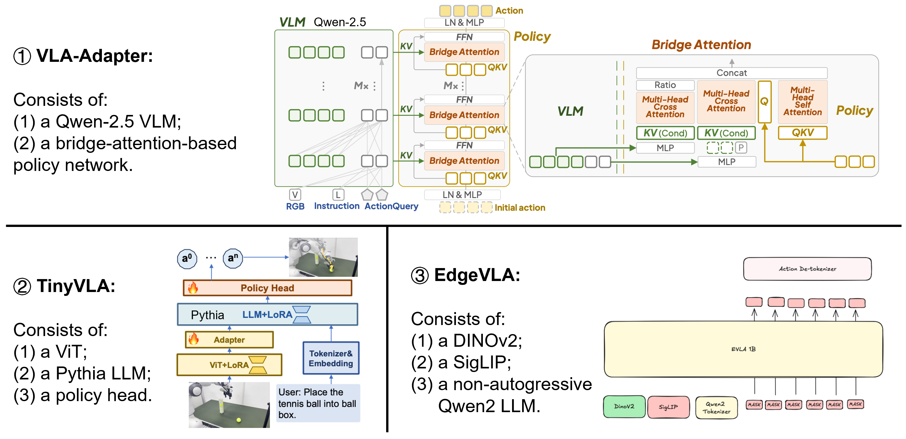

# VLASelect Artifacts Evaluation

This repository contains the artifacts for the paper **"VLASelect: Selective Large-small Model Co-learning for Self-evolving VLA Agents"(VLASelect)**.

- [VLASelect Artifacts Evaluation](#vlaselect-artifacts-evaluation)
  - [2. Primary Evaluation](#2-primary-evaluation)
    - [2.1 Quick Start](#21-quick-start)
      - [2.1.1 Get source code](#211-get-source-code)
      - [2.1.2 Install dependencies](#212-install-dependencies)
      - [2.1.3 One-click run](#213-one-click-run)
    - [2.2 Step-by-Step Reproducing](#22-step-by-step-reproducing)
      - [2.2.1 Accuracy Experiments](#221-accuracy-experiments)
      - [2.2.2 Overhead Experiments](#222-overhead-experiments)
      - [2.2.3 Ablation Experiments](#223-ablation-experiments)
      - [2.2.4 Discussion Experiments](#224-discussion-experiments)
      - [2.2.5 Resource Summary](#225-resource-summary)
  - [3. Supporting Various VLA Models, Scaling Strategies, and Knowledge Exchange Granularities](#3-supporting-various-vla-models-scaling-strategies-and-knowledge-exchange-granularities)
    - [3.1 Example 1: VLA-Adapter](#31-example-1-vla-adapter)
      - [3.1.1 Supporting the model](#311-supporting-the-model)
      - [3.1.2 Supporting different scaling strategies](#312-supporting-different-scaling-strategies)
      - [3.1.3 Supporting different knowledge exchange granularities](#313-supporting-different-knowledge-exchange-granularities)
    - [3.2 Example 2: TinyVLA](#32-example-2-tinyvla)
      - [3.2.1 Supporting the model](#321-supporting-the-model)
      - [3.2.2 Supporting different scaling strategies](#322-supporting-different-scaling-strategies)
      - [3.2.3 Supporting different knowledge exchange granularities](#323-supporting-different-knowledge-exchange-granularities)
    - [3.3 Example 3: EdgeVLA](#33-example-3-edgevla)
      - [3.3.1 Supporting the model](#331-supporting-the-model)
      - [3.3.2 Supporting different scaling strategies](#332-supporting-different-scaling-strategies)
      - [3.3.3 Supporting different knowledge exchange granularities](#333-supporting-different-knowledge-exchange-granularities)
  

## 2. Primary Evaluation

### 2.1 Quick Start

#### 2.1.1 Get source code

We provide the source code of VLASelect together with the scripts for primary evaluation. You can obtain the artifact package by the following command:

```bash
git clone https://github.com/LINC-BIT/VLASelect.git
```

If the artifact is distributed as an archived package instead of a git repository, please unpack it and enter the root directory of VLASelect before running the following commands.

#### 2.1.2 Install dependencies

- **Hardware**
  - **Recommended environments**: A device with at least 128 GB of RAM, one NVIDIA GPU with more than 60 GB of device memory (e.g., NVIDIA A100), two CPUs with at least 64 cores each (e.g., Intel(R) Xeon(R) Gold 6430), and 150 GB of free disk space.
  - **Minimum requirements**:
    - Single-CPU server: 16-32 GB RAM, one 8-core server CPU (e.g., Intel Xeon E-2388G), and at least 80 GB of free disk space.
    - GPU-equipped server: 32-64 GB RAM, one 12-core server CPU (e.g., Intel Xeon Silver 4310), one mid-range NVIDIA GPU with 8-12 GB VRAM (e.g., NVIDIA RTX 3060), and at least 80 GB of free disk space.
    - CPU-only desktop: 16-32 GB RAM, one 16-core desktop CPU with integrated graphics (e.g., Dell OptiPlex 7010 Plus Tower with Intel Core i7-13700), and at least 80 GB of free disk space.
    - GPU-equipped desktop: 16-32 GB RAM, one 20-core desktop CPU (e.g., Intel Core i7-14700), one consumer NVIDIA GPU with 8 GB VRAM (e.g., Dell XPS Desktop 8960 with RTX 4060), and at least 80 GB of free disk space.
    - CPU-only laptop: 16-32 GB RAM, one 12-core mobile CPU with integrated graphics (e.g., Lenovo ThinkPad X1 Carbon Gen 12 with Intel Core Ultra 7 155U), and at least 80 GB of free disk space.
    - GPU-equipped laptop: 16-32 GB RAM, one 16-core mobile CPU (e.g., Intel Core i7-14650HX), one NVIDIA laptop GPU with 8 GB VRAM (e.g., Lenovo Legion 5i Gen 9 with RTX 4060), and at least 80 GB of free disk space.
  - Sim-to-real evaluation also requires a DOFBOT-SE single-arm robot and an AmazingHand dexterous hand.

- **Software**
  - **Recommended environments**: Ubuntu 22.04.4 LTS (other distributions would be fine) with kernel 6.8.0-124-generic. Its CUDA version should be above 13.0.
  - **Minimum requirements**:
    - Ubuntu: Ubuntu 20.04 LTS or above with Docker and kernel 5.4+. If GPU is used, install a compatible NVIDIA driver and CUDA 12.x or above.
    - Windows: Windows 10 or above with Docker Desktop. If GPU is used, install a compatible NVIDIA driver and CUDA 12.x or above.
    - macOS: macOS 14 or above with Docker Desktop.
    - Debian: Debian 11 or above with Docker and kernel 5.10+. If GPU is used, install a compatible NVIDIA driver and CUDA 12.x or above.
    - RHEL: RHEL 8 or above with Docker and kernel 4.18+. If GPU is used, install a compatible NVIDIA driver and CUDA 12.x or above.

- **Dependency installation steps**
  - Example desktop: a Lenovo Legion T5 26IAB7 desktop running Ubuntu 22.04 LTS with kernel 5.15.0-78-generic, 16 GB RAM, an Intel Core i7-12700 CPU, and one NVIDIA RTX 3080 Ti GPU with 12 GB VRAM and 13.0 CUDA version.
    1. Install Docker Engine on the host machine by following the Ubuntu guide: https://docs.docker.com/engine/install/ubuntu/.

       1.1 Open a terminal and run the following commands to add the Docker official GPG key and Ubuntu `apt` repository.
        ```bash
        # Add Docker's official GPG key:
        sudo apt update
        sudo apt install ca-certificates curl
        sudo install -m 0755 -d /etc/apt/keyrings
        sudo curl -fsSL https://download.docker.com/linux/ubuntu/gpg -o /etc/apt/keyrings/docker.asc
        sudo chmod a+r /etc/apt/keyrings/docker.asc

        # Add the repository to Apt sources:
        sudo tee /etc/apt/sources.list.d/docker.sources <<EOF
        Types: deb
        URIs: https://download.docker.com/linux/ubuntu
        Suites: $(. /etc/os-release && echo "${UBUNTU_CODENAME:-$VERSION_CODENAME}")
        Components: stable
        Architectures: $(dpkg --print-architecture)
        Signed-By: /etc/apt/keyrings/docker.asc
        EOF

        sudo apt update
        ```
       

       
       1.2 Install `docker-ce`, `docker-ce-cli`, `containerd.io`, `docker-buildx-plugin`, and `docker-compose-plugin`.
        ```bash
        sudo apt install docker-ce docker-ce-cli containerd.io docker-buildx-plugin docker-compose-plugin
        ```
       


       1.3 Verify that Docker is installed correctly. If the output matches the figure below without errors, it is correct.
        ```bash
        sudo systemctl status docker --no-pager
        sudo docker run hello-world
        ```
       

    2. Install `nvidia-container-toolkit` by following the official guide: https://docs.nvidia.com/datacenter/cloud-native/container-toolkit/latest/install-guide.html.

       2.1 Add the NVIDIA Container Toolkit `apt` repository on Ubuntu.
        ```bash
        sudo apt-get update
        sudo apt-get install -y --no-install-recommends ca-certificates curl gnupg2

        curl -fsSL https://nvidia.github.io/libnvidia-container/gpgkey \
          | sudo gpg --dearmor -o /usr/share/keyrings/nvidia-container-toolkit-keyring.gpg

        curl -s -L https://nvidia.github.io/libnvidia-container/stable/deb/nvidia-container-toolkit.list \
          | sed 's#deb https://#deb [signed-by=/usr/share/keyrings/nvidia-container-toolkit-keyring.gpg] https://#g' \
          | sudo tee /etc/apt/sources.list.d/nvidia-container-toolkit.list

        sudo apt-get update
        ```
       

       2.2 Install `nvidia-container-toolkit`.
        ```bash
        sudo apt-get install -y nvidia-container-toolkit
        ```
        
       2.3 Run `sudo nvidia-ctk runtime configure --runtime=docker` to configure the Docker runtime.
        ```bash
        sudo nvidia-ctk runtime configure --runtime=docker
        ```
       

       2.4 Restart the Docker service to apply the NVIDIA runtime configuration and verify GPU access from Docker.
        ```bash
        sudo systemctl restart docker
        ```
       

    3. Run `bash dep.sh` in the repository root to pull the image and create the container.

       ```bash
       cd <VLASelect directory>
       bash dep.sh

       # Optional: use the lightweight ~100 MB image to start the container quickly,
       # then let dep.sh install the remaining runtime inside the container automatically
       TYPE=100M bash dep.sh
       ```
       
       If successful, this step generates `start_docker.sh`.
       
       The default `bash dep.sh` path uses the full image with the required runtime preinstalled. The `TYPE=100M bash dep.sh` path uses a lightweight bootstrap image that keeps only a minimal Python and system layer in the image itself, and then installs the remaining runtime into the container on first setup.

       If you want to build the lightweight image locally instead of pulling it from Docker Hub, run:

       ```bash
       cd <VLASelect directory>
       bash docker/100m/build-image.sh
       ```

    4. Start the container and check whether PyTorch works correctly. If the machine supports a GPU, also check `torch.cuda.is_available()`.

       ```bash
       bash start_docker.sh
       python -c "import torch; print(torch.__version__)"
       python -c "import torch; print(torch.cuda.is_available())"
       python -c "import torch; print(torch.cuda.get_device_name(0) if torch.cuda.is_available() else 'CUDA not available')"
       ```
       If everything works correctly, the output should look like the following.
       
    5. If PyTorch has issues, visit the official PyTorch installation page to get the proper download and installation commands: https://pytorch.org/get-started/locally/. For example, if I want to install the CUDA 12.4 build of PyTorch on this machine, which is lower than the host CUDA version, the command is shown below.
       

    - If you do not want to use Docker, run `bash dep-non-docker.sh` instead. Before doing so, check the CUDA version that matches the current device from https://pytorch.org/get-started/locally/. For example, the current project uses `torch==2.4.0`, `torchvision==0.19.0`, and `torchaudio==2.4.0` with the CUDA 12.4 wheel index. For ARM-based hosts, use `ARM=1` to enable the ARM defaults in `dep-non-docker.sh`.

       ```bash
       cd <VLASelect directory>
       TORCH_VERSION=2.4.0 \
       TORCHVISION_VERSION=0.19.0 \
       TORCHAUDIO_VERSION=2.4.0 \
       TORCH_INDEX_URL=https://download.pytorch.org/whl/cu124 \
       bash dep-non-docker.sh

       # ARM example
       ARM=1 bash dep-non-docker.sh
       ```
       


#### 2.1.3 One-click run
We provide a one-click script `run.sh` in the root directory of `eval`, which can automatically run the experiments involved in the main claims of the paper. The specific reproducing steps of each experiment are described in the following subsections.

```bash
cd <VLASelect directory>
# Run the command below to enter the Docker container
bash start_docker.sh
# Then you can start the experiment
cd <VLASelect directory in the container>/eval
bash run.sh
```

### 2.2 Step-by-Step Reproducing

Use the following common workflow before running a specific experiment.

```bash
cd <VLASelect directory>
bash start_docker.sh
cd <VLASelect directory in the container>/eval
```

You can then start the experiments by running the following commands.

#### 2.2.1 Accuracy Experiments

**Accuracy Under Tasks/Environment Changes**


1. **Minimum Working Example**: you can use the following code to run the minimum working example and check whether the code runs correctly. [[Example running results]]()

```bash
cd acc_comparison
MWE=1 bash run_acc_task_env_change.sh
python3 plot_acc_task_env.py
```

2. **Full run**: you can use the following code to reproduce the full experiment. [[Example running results]]()

```bash
cd acc_comparison
bash run_acc_task_env_change.sh
python3 plot_acc_task_env.py
```

On machines with fewer CPU cores, you can reduce the default host-side thread usage with `CPU_THREAD_LIMIT=2 bash run_acc_task_env_change.sh`, or use `MWE=1` for a lighter check.

3. **Switch models**: For example, if the four workloads use `octo`, `vla_adapter_new`, `tinyvla`, and `edgevla`, respectively, run `MODEL_SELECTION=octo,vla_adapter_new,tinyvla,edgevla bash run_acc_task_env_change.sh`.

The result file will be stored as `acc_comparison/FIG_ACC_TASK_ENV.pdf`, which corresponds to Fig. 8 in the paper.

**Accuracy Under Available Resource Changes**


1. **Minimum Working Example**: you can use the following code to run the minimum working example and check whether the code runs correctly. [[Example running results]]()

```bash
cd acc_comparison
MWE=1 bash run_acc_res_change.sh
python3 plot_acc_res_change.py
```

2. **Full run**: you can use the following code to reproduce the full experiment. [[Example running results]]()

```bash
cd acc_comparison
bash run_acc_res_change.sh
python3 plot_acc_res_change.py
```

3. **Switch models**: For example, if the four workloads use `octo`, `vla_adapter_new`, `tinyvla`, and `edgevla`, respectively, run `MODEL_SELECTION=octo,vla_adapter_new,tinyvla,edgevla bash run_acc_res_change.sh`.

The result file will be stored as `acc_comparison/FIG_ACC_RESOURCE.pdf`, which corresponds to Fig. 8 in the paper.

#### 2.2.2 Overhead Experiments

**Overheads Under The Same Accuracy**


1. **Minimum Working Example**: you can use the following code to run the minimum working example and check whether the code runs correctly. [[Example running results]]()

```bash
cd overhead
MWE=1 bash overhead_same_acc.sh
python3 plot_overhead.py
```

2. **Full run**: you can use the following code to reproduce the full experiment. [[Example running results]]()

```bash
cd overhead
bash overhead_same_acc.sh
python3 plot_overhead.py
```

3. **Switch models**: For example, if the four workloads use `octo`, `vla_adapter_new`, `tinyvla`, and `edgevla`, respectively, run `MODEL_SELECTION=octo,vla_adapter_new,tinyvla,edgevla bash overhead_same_acc.sh`.

The result files will be stored as `overhead/FIG_MEMORY_FOOTPOINT.pdf`, `overhead/overhead_breakdown_table/TAB_OVERHEAD.csv`, and `overhead/overhead_breakdown_table/TAB_ENERGY.csv`, which correspond to Fig. 9, Table 2, and Table 3 in the paper, respectively.


**Time Breakdown of VLASelect's Modules**

1. **Minimum Working Example**: you can use the following code to run the minimum working example and check whether the code runs correctly. [[Example running results]]()

```bash
cd overhead
MWE=1 bash overhead_breakdown_modules.sh
python3 plot_breakdown_modules.py
```

2. **Full run**: you can use the following code to reproduce the full experiment. [[Example running results]]()

```bash
cd overhead
bash overhead_breakdown_modules.sh
python3 plot_breakdown_modules.py
```

3. **Switch models**: For example, if the four workloads use `octo`, `vla_adapter_new`, `tinyvla`, and `edgevla`, respectively, run `MODEL_SELECTION=octo,vla_adapter_new,tinyvla,edgevla bash overhead_breakdown_modules.sh`.

The result file will be stored as `overhead/FIG_BREAKDOWN_MODULES.pdf`, which corresponds to Fig. 10 in the paper.

**Time Breakdown of Sampling and Training for All Methods**

1. **Minimum Working Example**: you can use the following code to run the minimum working example and check whether the code runs correctly. [[Example running results]]()

```bash
cd overhead
MWE=1 bash overhead_breakdown_all_methods.sh
python3 plot_breakdown_all_methods.py
```

2. **Full run**: you can use the following code to reproduce the full experiment. [[Example running results]]()

```bash
cd overhead
bash overhead_breakdown_all_methods.sh
python3 plot_breakdown_all_methods.py
```

3. **Switch models**: For example, if the four workloads use `octo`, `vla_adapter_new`, `tinyvla`, and `edgevla`, respectively, run `MODEL_SELECTION=octo,vla_adapter_new,tinyvla,edgevla bash overhead_breakdown_all_methods.sh`.

The result file will be stored as `overhead/FIG_BREAKDOWN_ALL_METHODS.pdf`, which corresponds to Fig. 11 in the paper.

#### 2.2.3 Ablation Experiments

1. **Minimum Working Example**: you can use the following code to run the minimum working example and check whether the code runs correctly. [[Example running results]]()

```bash
cd ablation
MWE=1 bash run_ablation.sh
python3 plot_ablation.py
```

2. **Full run**: you can use the following code to reproduce the full experiment. [[Example running results]]()

```bash
cd ablation
bash run_ablation.sh
python3 plot_ablation.py
```

3. **Switch models**: For example, if the workload uses `octo`, run `MODEL_SELECTION=octo bash run_ablation.sh`.

The result file will be stored as `ablation/FIG_ABLATION.pdf`, which corresponds to Fig. 12 in the paper.

#### 2.2.4 Discussion Experiments

The sim-to-real results need to be summarized manually and the results of the other experiments are printed to the console, so no
  scripts are provided for plotting curves or summarizing tables/figures.

**Sim-to-real transfer**


1. **Minimum Working Example**: you can use the following code to run the minimum working example and check whether the code runs correctly. [[Example running results]]()
```bash
cd discussion
MWE=1 bash run_sim_to_real.sh
```

2. **Full run**: you can use the following code to reproduce the full experiment. [[Example running results]]()

```bash
cd discussion
bash run_sim_to_real.sh
```

3. **Switch models**: For example, if the workload uses `octo`, run `MODEL_SELECTION=octo bash run_sim_to_real.sh`.

**ICL**


1. **Minimum Working Example**: you can use the following code to run the minimum working example and check whether the code runs correctly. [[Example running results]]()

```bash
cd discussion
MWE=1 bash compare_icl.sh
```

2. **Full run**: you can use the following code to reproduce the full experiment. [[Example running results]]()

```bash
cd discussion
bash compare_icl.sh
```

3. **Switch models**: For example, if the workload uses `octo`, run `MODEL_SELECTION=octo bash compare_icl.sh`.

**Applicability to VLA models**


1. **Minimum Working Example**: you can use the following code to run the minimum working example and check whether the code runs correctly. [[Example running results]]()

```bash
cd discussion
MWE=1 MODEL_SELECTION=octo bash run_vla_models.sh
```

2. **Full run**: you can use the following code to reproduce the full experiment. [[Example running results]]()

```bash
cd discussion
MODEL_SELECTION=octo,vla_adapter_new,tinyvla,edgevla bash run_vla_models.sh
```

3. **Switch models**: For example, if the workload uses `octo`, run `MODEL_SELECTION=octo bash run_vla_models.sh`.

**Maximum supported model size**


1. **Minimum Working Example**: you can use the following code to run the minimum working example and check whether the code runs correctly. [[Example running results]]()

```bash
cd discussion
MWE=1 MODEL_SIZE_LIMIT_FAMILY=tinyvla bash sweep_model_size.sh
```

2. **Full run**: you can use the following code to reproduce the full experiment. [[Example running results]]()

```bash
cd discussion
MODEL_SIZE_LIMIT_FAMILY=tinyvla bash sweep_model_size.sh
```

3. **Switch models**: For example, if the workload uses `octo`, run `MODEL_SELECTION=octo bash sweep_model_size.sh`.

**Applicability to multi-agent scenarios**


1. **Minimum Working Example**: you can use the following code to run the minimum working example and check whether the code runs correctly. [[Example running results]]()

```bash
cd discussion
MWE=1 bash run_multi_agent.sh
```

2. **Full run**: you can use the following code to reproduce the full experiment. [[Example running results]]()

```bash
cd discussion
bash run_multi_agent.sh
```

3. **Switch models**: For example, if the workload uses `octo`, run `MODEL_SELECTION=octo bash run_multi_agent.sh`.

#### 2.2.5 Resource Summary


- **Full runs**
  - **Accuracy under tasks/environment changes**: up to 200 hours in total and about 15-32 GB of GPU memory for VLASelect or up to about 60 GB for some baselines.
  - **Accuracy under resource changes**: up to 200 hours in total and about 15-32 GB of GPU memory for VLASelect or up to about 60 GB for some baselines.
  - **Overheads under the same accuracy**: up to 140 hours in total and about 15-32 GB of GPU memory for VLASelect or up to about 60 GB for some baselines.
  - **Breakdown for all methods**: also up to about 140 hours in total, but the time-breakdown scene is more complex than the same-accuracy overhead test, so a 32 GB-or-larger GPU is strongly recommended.
  - **Breakdown for VLASelect modules**: the camera/rendering buffers are much heavier here; use about 50 GB of free VRAM as a practical target for the full run.
  - **Ablation**: up to 55 hours in total for the full set of 11 design choices, and at a similar GPU-memory level to the primary online evaluation.
  - **Discussion experiments**: the ICL discussion takes up to 5 hours in total. The other discussion scripts except sim-to-real typically take up to 15 minutes per run with about 16-32 GB of GPU memory. The multi-agent discussion creates large camera groups and is best run on a 50 GB-class GPU for the full configuration. The sim-to-real discussion mainly depends on the manual real-robot execution process, and its GPU memory usage is about 16 GB.
- **MWE**:
  - **Accuracy under tasks/environment changes**: up to 20 minutes in total, with about 8-20 GB of GPU memory.
  - **Accuracy under resource changes**: up to 20 minutes in total, with about 8-20 GB of GPU memory.
  - **Overheads under the same accuracy**: up to 20 minutes in total, with about 8-20 GB of GPU memory.
  - **Breakdown for all methods**: up to 20 minutes in total, with about 8-20 GB of GPU memory.
  - **Breakdown for VLASelect modules**: up to 20 minutes in total, with about 8-20 GB of GPU memory.
  - **Ablation**: up to 25 minutes in total, with about 8-20 GB of GPU memory.
  - **Discussion experiments**: up to 5 minutes in total, with about 8-20 GB of GPU memory in typical runs.

## 3. Supporting Various VLA Models, Scaling Strategies, and Knowledge Exchange Granularities

VLASelect can support various **VLA models**, **scaling strategies** (e.g. knowledge distillation and dynamic pruning), and **knowledge exchange granularities** (e.g. block, layer, attention head, and channel/neuron).

We provide three examples on three different VLA models: VLA-Adapter, TinyVLA, EdgeVLA. They differ in the network architecture, as shown in the figure below.



### 3.1 Example 1: VLA-Adapter

#### 3.1.1 Supporting the model

- **Supporting steps**:

  - **Step 1:** Creating a new file, and creating a class `VLAAdapterImplementation` inherited from `VLAModelInterface`.

    ```python
    class VLAAdapterImplementation(VLAModelInterface)
    ```

  - **Step 2:** Defining its key properties (e.g. model name and dimensions of state and action).

    ```python
    model_name = "vla_adapter"
    state_dim = 105
    action_dim = 16
    ```

  - **Step 3:** Implementing its functions for model initialization, forward operations, and backward operations. 

    ```python
    # Examples:

    # 1. model initialization: how to initialize the large model
    def build_policy(self, model_dir: Path, *, args: Any, device: torch.device) -> nn.Module:
        policy = self.policy_class(model_dir, device=device, **kwargs)
        return policy

    # 2. forward operation: how to extract image data from the environment
    def extract_rgb_batch_from_obs(self, obs: Any) -> torch.Tensor:
        return self.reference_api.extract_rgb_batch_from_obs(obs)

    # 3. backward operation: how to adjust learning rate
    def set_backbone_learning_rate(self, optimizer: Any, learning_rate: float) -> None:
        self.reference_api.set_optimizer_group_lr(optimizer, "vla", learning_rate)
    ```

    Full implementation guidance refers to [Implementation Guidance](IMPL_GUIDE.md).

  - **Step 4:** Initializing the implemented class `VLAAdapterImplementation`.

    ```python
    model_impl = VLAAdapterImplementation()
    ```

  - **Step 5:** Passing the initialized model implementation to the function of online RL training, and starting the training.

    ```python
    run_training(model_impl, parse_args())
    ```

- **Minimum working example**:
  
  We provide an example implementation in `api/vla_model_interface_examples/vla_adapter_impl.py`, and a corresponding script of minimum running example as below. [[Example running results]](imgs/3.1.1-mwe.png)
    ```bash
    # completed within 5 minutes
    MWE=1 bash api/vla_model_interface_examples/vla_adapter_impl_verify.sh
    ```

- **Full run**:
  
  You can also run the full working example by the command below. [[Example running results]]()
  ```bash
  bash api/vla_model_interface_examples/vla_adapter_impl_verify.sh
  ```

#### 3.1.2 Supporting different scaling strategies

Based on the example in Section 3.1.1, you can support VLA-Adapter with 10 other scaling strategies as listed below:

- **Knowledge Distillation**
  - **Logit Distillation**: Distill the large model's output logits to the small model. You can use this method by initializing interface `LogitDistillationScaling` in Section 3.1.1's Step 5:
    ```python
    run_training(model_impl, parse_args(), LogitDistillationScaling())
    ```
  - **Feature Distillation**: Distill the large model's intermediate features to the small model. You can use this method by initializing interface `FeatureDistillationScaling` in Section 3.1.1's Step 5:
    ```python
    run_training(model_impl, parse_args(), FeatureDistillationScaling())
    ```
  - **Attention Distillation**: Distill the large model's attention scores to the small model. You can use this method by initializing interface `AttentionDistillationScaling` in Section 3.1.1's Step 5:
    ```python
    run_training(model_impl, parse_args(), AttentionDistillationScaling())
    ```
  - **Data Distillation**: Distill the large model's generated data/samples to the small model. You can use this method by initializing interface `DataDistillationScaling` in Section 3.1.1's Step 5:
    ```python
    run_training(model_impl, parse_args(), DataDistillationScaling())
    ```
  - **MiniLLM**: Distill the large model's output logits using a novel reverse KL loss (proposed in the paper "(ICLR'24) MiniLLM: Knowledge Distillation of Large Language Models"). You can use this method by initializing interface `MiniLLMScaling` in Section 3.1.1's Step 5:
    ```python
    run_training(model_impl, parse_args(), MiniLLMScaling())
    ```
  - **DistiLLM**: Distill the large model's output logits using a novel skew Kullback-Leibler divergence loss (proposed in the paper "(ICML'24) DistiLLM: Towards Efficient Distillation of Large Language Models"). You can use this method by initializing interface `DistiLLMScaling` in Section 3.1.1's Step 5:
    ```python
    run_training(model_impl, parse_args(), DistiLLMScaling())
    ```
- **Dynamic Pruning**:
  - **LLM in a Flash**：Remove the most unimportant neurons in FFN layers according to the given dataset. It is proposed in the paper "(ACL'24) 
LLM in a flash: Efficient Large Language Model Inference with Limited Memory". You can use this method by initializing interface `LLMInAFlashScaling` in Section 3.1.1's Step 5:
    ```python
    run_training(model_impl, parse_args(), LLMInAFlashScaling())
    ```
  - **PowerInfer**：Remove the most unimportant neurons in Attention and FFN layers according to the given dataset. It is proposed in the paper "(SOSP'24) 
PowerInfer: Fast Large Language Model Serving with a Consumer-grade GPU". You can use this method by initializing interface `PowerInferScaling` in Section 3.1.1's Step 5:
    ```python
    run_training(model_impl, parse_args(), PowerInferScaling())
    ```
  - **LLM-Pruner**：A task-agnostic structured pruning method in https://github.com/horseee/LLM-Pruner. You can use this method by initializing interface `LLMPrunerScaling` in Section 3.1.1's Step 5:
    ```python
    run_training(model_impl, parse_args(), LLMPrunerScaling())
    ```
  - **EdgeTA**：Remove the most unimportant neurons in Attention and FFN layers according to the given dataset, and conduct large-small collaborative training. It is proposed in the paper "(TMC'24) EdgeTA: Neuron-Grained Scaling of Foundation Models in Edge-Side Retraining". You can use this method by initializing interface `EdgeTAScaling` in Section 3.1.1's Step 5:
    ```python
    run_training(model_impl, parse_args(), EdgeTAScaling())
    ```

**Minimum working example**: 
- **Compare all scaling methods**. You can run the minimum working examples of all scaling methods on VLA-Adapter by the command below. [[Example running results]](imgs/3.1.2-mwe.png)
  ```bash
  MWE=1 bash api/vla_model_interface_examples/vla_adapter_impl_verify-all_scaling_methods.sh
  ```
- **Test one scaling method**. You can run one specific scaling method on VLA-Adapter by the command below.
  ```bash
  MWE=1 bash api/vla_model_interface_examples/vla_adapter_impl_verify.sh --scaling-method <scaling_method_name>
  ```

**Full run**:
- **Compare all scaling methods**. You can run the minimum working examples of all scaling methods on VLA-Adapter by the command below. [[Example running results]]()
  ```bash
  bash api/vla_model_interface_examples/vla_adapter_impl_verify-all_scaling_methods.sh
  ```
- **Test one scaling method**. You can run one specific scaling method on VLA-Adapter by the command below.
  ```bash
  bash api/vla_model_interface_examples/vla_adapter_impl_verify.sh --scaling-method <scaling_method_name>
  ```


#### 3.1.3 Supporting different knowledge exchange granularities

Based on the example in Section 3.1.1, you can support VLA-Adapter at different knowledge exchange strategies as listed below:

- **block**: You can perform block-grained knowledge exchange by initializing interface `BlockKnowledgeExchange` in Section 3.1.1's Step 5:
    ```python
    run_training(model_impl, parse_args(), BlockKnowledgeExchange())
    ```
- **layer**: You can perform layer-grained knowledge exchange by initializing interface `LayerKnowledgeExchange` in Section 3.1.1's Step 5:
    ```python
    run_training(model_impl, parse_args(), LayerKnowledgeExchange())
    ```
- **attention head**: You can perform attention-head-grained knowledge exchange by initializing interface `AttentionHeadKnowledgeExchange` in Section 3.1.1's Step 5:
    ```python
    run_training(model_impl, parse_args(), AttentionHeadKnowledgeExchange())
    ```
- **channel/neuron**: The channel is equivalent to the neuron because each neuron corresponds to one channel in VLA models. You can perform channel/neuron-grained knowledge exchange by initializing interface `NeuronKnowledgeExchange` in Section 3.1.1's Step 5:
    ```python
    run_training(model_impl, parse_args(), NeuronKnowledgeExchange())
    ```

**Minimum working example**: 
- **Comparing all granularities**. You can run the minimum working examples of all granularities on VLA-Adapter by the command below. [[Example running results]](imgs/3.1.3-mwe.png)
  ```bash
  MWE=1 bash api/vla_model_interface_examples/vla_adapter_impl_verify-all_granularities.sh
  ```
- **Test one granularity**. You can run one specific granularity on VLA-Adapter by the command below:
  ```bash
  MWE=1 bash api/vla_model_interface_examples/vla_adapter_impl_verify.sh --knowledge-exchange-granularity <granularity>
  ```

**Full run**:
- **Compare all granularities**. You can run the minimum working examples of all granularities on VLA-Adapter by the command below. [[Example running results]]()
  ```bash
  bash api/vla_model_interface_examples/vla_adapter_impl_verify-all_granularities.sh
  ```
- **Test one granularity**. You can run one specific granularity on VLA-Adapter by the command below:
  ```bash
  bash api/vla_model_interface_examples/vla_adapter_impl_verify.sh --knowledge-exchange-granularity <granularity>
  ```

### 3.2 Example 2: TinyVLA

#### 3.2.1 Supporting the model

- **Supporting steps**:

  - **Step 1:** Creating a new file, and creating a class `TinyVLAImplementation` inherited from `VLAModelInterface`.

    ```python
    class TinyVLAImplementation(VLAModelInterface)
    ```

  - **Step 2:** Defining its key properties (e.g. model name and dimensions of state and action).

    ```python
    model_name = "tinyvla"
    state_dim = 44
    action_dim = 8
    ```

  - **Step 3:** Implementing its functions for model initialization, forward operations, and backward operations. 

    ```python
    # Examples:

    # 1. model initialization: how to initialize the large model
    def build_policy(self, model_dir: Path, *, args: Any, device: torch.device) -> nn.Module:
        policy = self.policy_class(model_dir, device=device, **kwargs)
        return policy

    # 2. forward operation: how to extract image data from the environment
    def extract_rgb_batch_from_obs(self, obs: Any) -> torch.Tensor:
        return self.reference_api.extract_rgb_batch_from_obs(obs)

    # 3. backward operation: how to adjust learning rate
    def set_backbone_learning_rate(self, optimizer: Any, learning_rate: float) -> None:
        self.reference_api.set_optimizer_group_lr(optimizer, "vla", learning_rate)
    ```

    Full implementation guidance refers to [Implementation Guidance](IMPL_GUIDE.md).

  - **Step 4:** Initializing the implemented class `TinyVLAImplementation`.

    ```python
    model_impl = TinyVLAImplementation()
    ```

  - **Step 5:** Passing the initialized model implementation to the function of online RL training, and starting the training.

    ```python
    run_training(model_impl, parse_args())
    ```

- **Minimum working example**:
  
  We provide an example implementation in `api/vla_model_interface_examples/tinyvla_impl.py`, and a corresponding script of minimum running example as below. [[Example running results]]()
    ```bash
    # completed within 5 minutes
    MWE=1 bash api/vla_model_interface_examples/tinyvla_impl_verify.sh
    ```

- **Full run**:
  
  You can also run the full working example by the command below. [[Example running results]]()
  ```bash
  bash api/vla_model_interface_examples/tinyvla_impl_verify.sh
  ```

#### 3.2.2 Supporting different scaling strategies

Based on the example in Section 3.2.1, you can support TinyVLA with 10 other scaling strategies. 

The process is similar to the one in Section 3.1.2, which initializing the specific scaling method interface in the function `run_training()`.

```python
# 1. support knowledge distillation: logit distillation
run_training(model_impl, parse_args(), LogitDistillationScaling())

# 2. support knowledge distillation: feature distillation
run_training(model_impl, parse_args(), FeatureDistillationScaling())

# 3. support knowledge distillation: attention distillation
run_training(model_impl, parse_args(), AttentionDistillationScaling())

# 4. support knowledge distillation: data distillation
run_training(model_impl, parse_args(), DataDistillationScaling())

# 5. support knowledge distillation: MiniLLM
run_training(model_impl, parse_args(), MiniLLMScaling())

# 6. support knowledge distillation: DistiLLM distillation
run_training(model_impl, parse_args(), DistiLLMScaling())

# 7. support dynamic pruning: LLM in a Flash
run_training(model_impl, parse_args(), LLMInAFlashScaling())

# 8. support dynamic pruning: PowerInfer
run_training(model_impl, parse_args(), PowerInferScaling())

# 9. support dynamic pruning: LLM-Pruner
run_training(model_impl, parse_args(), LLMPrunerScaling())

# 10. support dynamic pruning: EdgeTA
run_training(model_impl, parse_args(), EdgeTAScaling())
```

**Minimum working example**: 
- **Compare all scaling methods**. You can run the minimum working examples of all scaling methods on TinyVLA by the command below. [[Example running results]]()
  ```bash
  MWE=1 bash api/vla_model_interface_examples/tinyvla_impl_verify-all_scaling_methods.sh
  ```
- **Test one scaling method**. You can run one specific scaling method on TinyVLA by the command below.
  ```bash
  MWE=1 bash api/vla_model_interface_examples/tinyvla_impl_verify.sh --scaling-method <scaling_method_name>
  ```

**Full run**:
- **Compare all scaling methods**. You can run the minimum working examples of all scaling methods on TinyVLA by the command below. [[Example running results]]()
  ```bash
  bash api/vla_model_interface_examples/tinyvla_impl_verify-all_scaling_methods.sh
  ```
- **Test one scaling method**. You can run one specific scaling method on TinyVLA by the command below.
  ```bash
  bash api/vla_model_interface_examples/tinyvla_impl_verify.sh --scaling-method <scaling_method_name>
  ```

#### 3.2.3 Supporting different knowledge exchange granularities

Based on the example in Section 3.2.1, you can support TinyVLA with other knowledge exchange granularities. 

The process is similar to the one in Section 3.1.3, which initializing the specific granularity interface in the function `run_training()`.

```python
# 1. support block granularity
run_training(model_impl, parse_args(), BlockKnowledgeExchange())

# 2. support layer granularity
run_training(model_impl, parse_args(), LayerKnowledgeExchange())

# 3. support attention head granularity
run_training(model_impl, parse_args(), AttentionHeadKnowledgeExchange())

# 4. support channel/neuron granularity
run_training(model_impl, parse_args(), NeuronKnowledgeExchange())
```

**Minimum working example**: 
- **Comparing all granularities**. You can run the minimum working examples of all granularities on TinyVLA by the command below. [[Example running results]]()
  ```bash
  MWE=1 bash api/vla_model_interface_examples/tiny_vla_impl_verify-all_granularities.sh
  ```
- **Test one granularity**. You can run one specific granularity on TinyVLA by the command below:
  ```bash
  MWE=1 bash api/vla_model_interface_examples/tiny_vla_impl_verify.sh --knowledge-exchange-granularity <granularity>
  ```

**Full run**:
- **Compare all granularities**. You can run the minimum working examples of all granularities on TinyVLA by the command below. [[Example running results]]()
  ```bash
  bash api/vla_model_interface_examples/tiny_vla_impl_verify-all_granularities.sh
  ```
- **Test one granularity**. You can run one specific granularity on TinyVLA by the command below:
  ```bash
  bash api/vla_model_interface_examples/tiny_vla_impl_verify.sh --knowledge-exchange-granularity <granularity>
  ```

### 3.3 Example 3: EdgeVLA

#### 3.3.1 Supporting the model

- **Supporting steps**:

  - **Step 1:** Creating a new file, and creating a class `EdgeVLAImplementation` inherited from `VLAModelInterface`.

    ```python
    class EdgeVLAImplementation(VLAModelInterface)
    ```

  - **Step 2:** Defining its key properties (e.g. model name and dimensions of state and action).

    ```python
    model_name = "edgevla"
    state_dim = 73
    action_dim = 12
    ```

  - **Step 3:** Implementing its functions for model initialization, forward operations, and backward operations. 

    ```python
    # Examples:

    # 1. model initialization: how to initialize the large model
    def build_policy(self, model_dir: Path, *, args: Any, device: torch.device) -> nn.Module:
        policy = self.policy_class(model_dir, device=device, **kwargs)
        return policy

    # 2. forward operation: how to extract image data from the environment
    def extract_rgb_batch_from_obs(self, obs: Any) -> torch.Tensor:
        return self.reference_api.extract_rgb_batch_from_obs(obs)

    # 3. backward operation: how to adjust learning rate
    def set_backbone_learning_rate(self, optimizer: Any, learning_rate: float) -> None:
        self.reference_api.set_optimizer_group_lr(optimizer, "vla", learning_rate)
    ```

    Full implementation guidance refers to [Implementation Guidance](IMPL_GUIDE.md).

  - **Step 4:** Initializing the implemented class `EdgeVLAImplementation`.

    ```python
    model_impl = EdgeVLAImplementation()
    ```

  - **Step 5:** Passing the initialized model implementation to the function of online RL training, and starting the training.

    ```python
    run_training(model_impl, parse_args())
    ```

- **Minimum working example**:
  
  We provide an example implementation in `api/vla_model_interface_examples/edgevla_impl.py`, and a corresponding script of minimum running example as below. [[Example running results]]()
    ```bash
    # completed within 5 minutes
    MWE=1 bash api/vla_model_interface_examples/edgevla_impl_verify.sh
    # draw the running results
    python api/draw.py
    ```

- **Full run**:
  
  You can also run the full working example by the command below. [[Example running results]]()
  ```bash
  bash api/vla_model_interface_examples/edgevla_impl_verify.sh
  ```

#### 3.3.2 Supporting different scaling strategies

Based on the example in Section 3.3.1, you can support EdgeVLA with 10 other scaling strategies. 

The process is similar to the one in Section 3.1.2, which initializing the specific scaling method interface in the function `run_training()`.

```python
# 1. support knowledge distillation: logit distillation
run_training(model_impl, parse_args(), LogitDistillationScaling())

# 2. support knowledge distillation: feature distillation
run_training(model_impl, parse_args(), FeatureDistillationScaling())

# 3. support knowledge distillation: attention distillation
run_training(model_impl, parse_args(), AttentionDistillationScaling())

# 4. support knowledge distillation: data distillation
run_training(model_impl, parse_args(), DataDistillationScaling())

# 5. support knowledge distillation: MiniLLM
run_training(model_impl, parse_args(), MiniLLMScaling())

# 6. support knowledge distillation: DistiLLM distillation
run_training(model_impl, parse_args(), DistiLLMScaling())

# 7. support dynamic pruning: LLM in a Flash
run_training(model_impl, parse_args(), LLMInAFlashScaling())

# 8. support dynamic pruning: PowerInfer
run_training(model_impl, parse_args(), PowerInferScaling())

# 9. support dynamic pruning: LLM-Pruner
run_training(model_impl, parse_args(), LLMPrunerScaling())

# 10. support dynamic pruning: EdgeTA
run_training(model_impl, parse_args(), EdgeTAScaling())
```

**Minimum working example**: 
- **Compare all scaling methods**. You can run the minimum working examples of all scaling methods on EdgeVLA by the command below. [[Example running results]]()
  ```bash
  MWE=1 bash api/vla_model_interface_examples/edgevla_impl_verify-all_scaling_methods.sh
  ```
- **Test one scaling method**. You can run one specific scaling method on EdgeVLA by the command below.
  ```bash
  MWE=1 bash api/vla_model_interface_examples/edgevla_impl_verify.sh --scaling-method <scaling_method_name>
  ```

**Full run**:
- **Compare all scaling methods**. You can run the minimum working examples of all scaling methods on EdgeVLA by the command below. [[Example running results]]()
  ```bash
  bash api/vla_model_interface_examples/edgevla_impl_verify-all_scaling_methods.sh
  ```
- **Test one scaling method**. You can run one specific scaling method on EdgeVLA by the command below.
  ```bash
  bash api/vla_model_interface_examples/edgevla_impl_verify.sh --scaling-method <scaling_method_name>
  ```

#### 3.3.3 Supporting different knowledge exchange granularities

Based on the example in Section 3.3.1, you can support EdgeVLA with other knowledge exchange granularities. 

The process is similar to the one in Section 3.1.3, which initializing the specific granularity interface in the function `run_training()`.

```python
# 1. support block granularity
run_training(model_impl, parse_args(), BlockKnowledgeExchange())

# 2. support layer granularity
run_training(model_impl, parse_args(), LayerKnowledgeExchange())

# 3. support attention head granularity
run_training(model_impl, parse_args(), AttentionHeadKnowledgeExchange())

# 4. support channel/neuron granularity
run_training(model_impl, parse_args(), NeuronKnowledgeExchange())
```

**Minimum working example**: 
- **Comparing all granularities**. You can run the minimum working examples of all granularities on EdgeVLA by the command below. [[Example running results]]()
  ```bash
  MWE=1 bash api/vla_model_interface_examples/tiny_vla_impl_verify-all_granularities.sh
  ```
- **Test one granularity**. You can run one specific granularity on EdgeVLA by the command below:
  ```bash
  MWE=1 bash api/vla_model_interface_examples/tiny_vla_impl_verify.sh --knowledge-exchange-granularity <granularity>
  ```

**Full run**:
- **Compare all granularities**. You can run the minimum working examples of all granularities on EdgeVLA by the command below. [[Example running results]]()
  ```bash
  bash api/vla_model_interface_examples/tiny_vla_impl_verify-all_granularities.sh
  ```
- **Test one granularity**. You can run one specific granularity on EdgeVLA by the command below:
  ```bash
  bash api/vla_model_interface_examples/tiny_vla_impl_verify.sh --knowledge-exchange-granularity <granularity>
  ```

