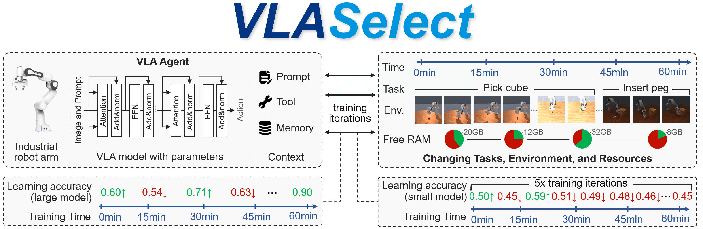
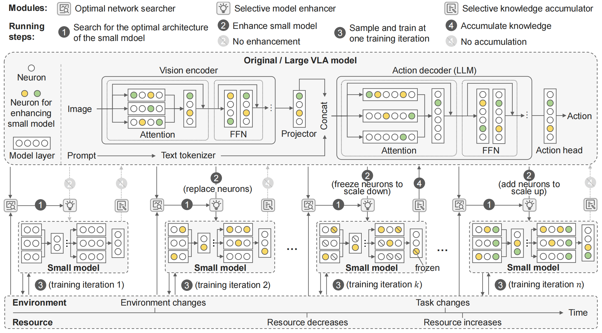

# VLASelect Artifact Evaluation

This repository contains the artifacts for the paper **"VLASelect: Selective Large-small Model Co-learning for Self-evolving VLA Agents"** (conditionally accepted by EuroSys'27).

## Downloads

[Artifact Evaluation Checklist (Available, Functional, Reproduced)](./ARTIFACT-CHECKLIST.md)<br>
[An Evaluation Report on a Small Machine](https://github.com/LINC-BIT/VLASelect/blob/main/Artifact%20Evaluation%20Report%20for%20VLASelect.md)<br>
[An Evaluation Report on the Academic Cloud (CloudLab)]()<br>
[Zenodo for Long-Term Storage](https://zenodo.org/records/22119671)<br>
Docker Image: <br>
&nbsp;&nbsp;&nbsp;&nbsp;&nbsp;&nbsp;[147MB version](https://hub.docker.com/r/cz22edd/pytorch?tag=maniskillv2-100m) (requiring further dependency installation by running [dep-non-docker.sh](./dep-non-docker.sh))<br>
&nbsp;&nbsp;&nbsp;&nbsp;&nbsp;&nbsp;[33GB version](https://hub.docker.com/r/cz22edd/pytorch?tag=maniskillv2) (requiring no further dependency installation)

## Outline (Evaluation process/workflow and Reusability)

<a href="#1-artifact-overview">1. Artifact Overview</a><br>
&nbsp;&nbsp;&nbsp;&nbsp;&nbsp;&nbsp;<a href="#11-introduction">1.1 Introduction</a><br>
&nbsp;&nbsp;&nbsp;&nbsp;&nbsp;&nbsp;<a href="#12-hardwaresoftware-requirements-and-dependencies">1.2 Hardware/software Requirements and Dependencies</a><br>
&nbsp;&nbsp;&nbsp;&nbsp;&nbsp;&nbsp;&nbsp;&nbsp;&nbsp;&nbsp;&nbsp;&nbsp;<a href="#121-hardware-requirements">1.2.1 Hardware Requirements</a><br>
&nbsp;&nbsp;&nbsp;&nbsp;&nbsp;&nbsp;&nbsp;&nbsp;&nbsp;&nbsp;&nbsp;&nbsp;<a href="#122-software-requirements">1.2.2 Software Requirements</a><br>
&nbsp;&nbsp;&nbsp;&nbsp;&nbsp;&nbsp;&nbsp;&nbsp;&nbsp;&nbsp;&nbsp;&nbsp;<a href="#123-get-source-code">1.2.3 Get Source Code</a><br>
&nbsp;&nbsp;&nbsp;&nbsp;&nbsp;&nbsp;&nbsp;&nbsp;&nbsp;&nbsp;&nbsp;&nbsp;<a href="#124-install-dependencies-if-docker-can-be-installed">1.2.4 Install Dependencies (if Docker can be installed)</a><br>
&nbsp;&nbsp;&nbsp;&nbsp;&nbsp;&nbsp;&nbsp;&nbsp;&nbsp;&nbsp;&nbsp;&nbsp;<a href="#125-install-dependencies-if-docker-cannot-be-installed">1.2.5 Install Dependencies (if Docker cannot be installed)</a><br>
&nbsp;&nbsp;&nbsp;&nbsp;&nbsp;&nbsp;&nbsp;&nbsp;&nbsp;&nbsp;&nbsp;&nbsp;<a href="#126-install-dependencies-for-plotting-scripts">1.2.6 Install Dependencies for Plotting Scripts</a><br>
&nbsp;&nbsp;&nbsp;&nbsp;&nbsp;&nbsp;&nbsp;&nbsp;&nbsp;&nbsp;&nbsp;&nbsp;<a href="#127-about-dataset">1.2.7 About Dataset</a><br>
&nbsp;&nbsp;&nbsp;&nbsp;&nbsp;&nbsp;<a href="#13-treatment-measure-for-unusual-behaviors">1.3 Treatment Measure for Unusual Behaviors</a><br>
<a href="#2-evaluation-reproduction">2. Evaluation Reproduction</a><br>
&nbsp;&nbsp;&nbsp;&nbsp;&nbsp;&nbsp;<a href="#21-one-click-reproduction">2.1 One-click Reproduction</a><br>
&nbsp;&nbsp;&nbsp;&nbsp;&nbsp;&nbsp;<a href="#22-step-by-step-reproduction">2.2 Step-by-Step Reproduction</a><br>
&nbsp;&nbsp;&nbsp;&nbsp;&nbsp;&nbsp;&nbsp;&nbsp;&nbsp;&nbsp;&nbsp;&nbsp;<a href="#221-experiment-1-figure-7-in-section-521-accuracy-under-tasksenvironment-changes">2.2.1 Experiment 1: (Figure 7 in Section 5.2.1) Accuracy Under Tasks/Environment Changes</a><br>
&nbsp;&nbsp;&nbsp;&nbsp;&nbsp;&nbsp;&nbsp;&nbsp;&nbsp;&nbsp;&nbsp;&nbsp;<a href="#222-experiment-2-figure-8-in-section-522-accuracy-under-available-resource-changes">2.2.2 Experiment 2: (Figure 8 in Section 5.2.2) Accuracy Under Available Resource Changes</a><br>
&nbsp;&nbsp;&nbsp;&nbsp;&nbsp;&nbsp;&nbsp;&nbsp;&nbsp;&nbsp;&nbsp;&nbsp;<a href="#223-experiment-3-figure-9-and-tables-23-in-section-531-overheads-under-the-same-accuracy">2.2.3 Experiment 3: (Figure 9 and Tables 2/3 in Section 5.3.1) Overheads Under The Same Accuracy</a><br>
&nbsp;&nbsp;&nbsp;&nbsp;&nbsp;&nbsp;&nbsp;&nbsp;&nbsp;&nbsp;&nbsp;&nbsp;<a href="#224-experiment-4-figure-10-in-section-532-time-breakdown-of-vlaselects-modules">2.2.4 Experiment 4: (Figure 10 in Section 5.3.2) Time Breakdown of VLASelect's Modules</a><br>
&nbsp;&nbsp;&nbsp;&nbsp;&nbsp;&nbsp;&nbsp;&nbsp;&nbsp;&nbsp;&nbsp;&nbsp;<a href="#225-experiment-5-figure-11-in-section-532-training-time-breakdown-in-each-workload">2.2.5 Experiment 5: (Figure 11 in Section 5.3.2) Training Time Breakdown in Each Workload</a><br>
&nbsp;&nbsp;&nbsp;&nbsp;&nbsp;&nbsp;&nbsp;&nbsp;&nbsp;&nbsp;&nbsp;&nbsp;<a href="#226-experiment-6-figure-12-in-section-54-design-choice-validation-by-ablation">2.2.6 Experiment 6: (Figure 12 in Section 5.4) Design Choice Validation by Ablation</a><br>
&nbsp;&nbsp;&nbsp;&nbsp;&nbsp;&nbsp;&nbsp;&nbsp;&nbsp;&nbsp;&nbsp;&nbsp;<a href="#227-experiment-7-discussion-1-in-section-55-sim-to-real-transfer">2.2.7 Experiment 7: (Discussion 1 in Section 5.5) Sim-to-real transfer</a><br>
&nbsp;&nbsp;&nbsp;&nbsp;&nbsp;&nbsp;&nbsp;&nbsp;&nbsp;&nbsp;&nbsp;&nbsp;<a href="#228-experiment-8-discussion-2-in-section-55-icl-in-context-learning">2.2.8 Experiment 8: (Discussion 2 in Section 5.5) ICL (In-Context Learning)</a><br>
&nbsp;&nbsp;&nbsp;&nbsp;&nbsp;&nbsp;&nbsp;&nbsp;&nbsp;&nbsp;&nbsp;&nbsp;<a href="#229-experiment-9-discussion-3-in-section-55-maximum-supported-model-size">2.2.9 Experiment 9: (Discussion 3 in Section 5.5) Maximum Supported Model Size</a><br>
&nbsp;&nbsp;&nbsp;&nbsp;&nbsp;&nbsp;&nbsp;&nbsp;&nbsp;&nbsp;&nbsp;&nbsp;<a href="#2210-experiment-10-discussion-4-in-section-55-applicability-to-multi-agent-scenarios">2.2.10 Experiment 10: (Discussion 4 in Section 5.5) Applicability to Multi-Agent Scenarios</a><br>
&nbsp;&nbsp;&nbsp;&nbsp;&nbsp;&nbsp;&nbsp;&nbsp;&nbsp;&nbsp;&nbsp;&nbsp;<a href="#2211-experiment-11-discussion-5-in-section-55-comparison-with-alternative-model-scaling-techniques">2.2.11 Experiment 11: (Discussion 5 in Section 5.5) Comparison with Alternative Model Scaling Techniques</a><br>
&nbsp;&nbsp;&nbsp;&nbsp;&nbsp;&nbsp;&nbsp;&nbsp;&nbsp;&nbsp;&nbsp;&nbsp;<a href="#2212-experiment-12-discussion-6-in-section-55-comparison-between-different-knowledge-exchange-granularities">2.2.12 Experiment 12: (Discussion 6 in Section 5.5) Comparison between Different Knowledge Exchange Granularities</a><br>
&nbsp;&nbsp;&nbsp;&nbsp;&nbsp;&nbsp;&nbsp;&nbsp;&nbsp;&nbsp;&nbsp;&nbsp;<a href="#2213-experiment-13-discussion-7-in-section-55-forgetting-on-previously-learned-environmentstasks">2.2.13 Experiment 13: (Discussion 7 in Section 5.5) Forgetting on Previously Learned Environments/Tasks</a><br>
&nbsp;&nbsp;&nbsp;&nbsp;&nbsp;&nbsp;&nbsp;&nbsp;&nbsp;&nbsp;&nbsp;&nbsp;<a href="#2214-experiment-14-discussion-8-in-section-55-applicability-to-mlpcnn-models">2.2.14 Experiment 14: (Discussion 8 in Section 5.5) Applicability to MLP/CNN models</a><br>
<a href="#3-reusability-integrating-vlaselect-with-vla-models-scaling-strategies-and-knowledge-exchange-granularities">3. Reusability: Integrating VLASelect with VLA Models, Scaling Strategies, and Knowledge Exchange Granularities</a><br>
&nbsp;&nbsp;&nbsp;&nbsp;&nbsp;&nbsp;<a href="#31-example-1-vla-adapter">3.1 Example 1: VLA-Adapter</a><br>
&nbsp;&nbsp;&nbsp;&nbsp;&nbsp;&nbsp;&nbsp;&nbsp;&nbsp;&nbsp;&nbsp;&nbsp;<a href="#311-model-integration-interface">3.1.1 Model Integration Interface</a><br>
&nbsp;&nbsp;&nbsp;&nbsp;&nbsp;&nbsp;&nbsp;&nbsp;&nbsp;&nbsp;&nbsp;&nbsp;<a href="#312-integrating-different-scaling-strategies">3.1.2 Integrating Different Scaling Strategies</a><br>
&nbsp;&nbsp;&nbsp;&nbsp;&nbsp;&nbsp;&nbsp;&nbsp;&nbsp;&nbsp;&nbsp;&nbsp;<a href="#313-integrating-different-knowledge-exchange-granularities">3.1.3 Integrating Different Knowledge Exchange Granularities</a><br>
&nbsp;&nbsp;&nbsp;&nbsp;&nbsp;&nbsp;<a href="#32-example-2-tinyvla">3.2 Example 2: TinyVLA</a><br>
&nbsp;&nbsp;&nbsp;&nbsp;&nbsp;&nbsp;&nbsp;&nbsp;&nbsp;&nbsp;&nbsp;&nbsp;<a href="#321-model-integration-interface">3.2.1 Model Integration Interface</a><br>
&nbsp;&nbsp;&nbsp;&nbsp;&nbsp;&nbsp;&nbsp;&nbsp;&nbsp;&nbsp;&nbsp;&nbsp;<a href="#322-integrating-different-scaling-strategies">3.2.2 Integrating Different Scaling Strategies</a><br>
&nbsp;&nbsp;&nbsp;&nbsp;&nbsp;&nbsp;&nbsp;&nbsp;&nbsp;&nbsp;&nbsp;&nbsp;<a href="#323-integrating-different-knowledge-exchange-granularities">3.2.3 Integrating Different Knowledge Exchange Granularities</a><br>
&nbsp;&nbsp;&nbsp;&nbsp;&nbsp;&nbsp;<a href="#33-example-3-edgevla">3.3 Example 3: EdgeVLA</a><br>
&nbsp;&nbsp;&nbsp;&nbsp;&nbsp;&nbsp;&nbsp;&nbsp;&nbsp;&nbsp;&nbsp;&nbsp;<a href="#331-model-integration-interface">3.3.1 Model Integration Interface</a><br>
&nbsp;&nbsp;&nbsp;&nbsp;&nbsp;&nbsp;&nbsp;&nbsp;&nbsp;&nbsp;&nbsp;&nbsp;<a href="#332-integrating-different-scaling-strategies">3.3.2 Integrating Different Scaling Strategies</a><br>
&nbsp;&nbsp;&nbsp;&nbsp;&nbsp;&nbsp;&nbsp;&nbsp;&nbsp;&nbsp;&nbsp;&nbsp;<a href="#333-integrating-different-knowledge-exchange-granularities">3.3.3 Integrating Different Knowledge Exchange Granularities</a><br>

## 1. Artifact Overview


### 1.1 Introduction

- **Background**: 

  - **Emboded AI agent**: VLA (Vision-Language-Action) model-based agents such as
  robot arms, dexterous hands and humanoid robots are revolutionizing our lives. 
  - **Open environment**: These agents usually run in **open ended,
  interactive environments** where new tasks start, surroundings change, or available resources fluctuate. 
  - **Resource-constrained on-device training**: In existing agentic AI systems, the resource-intensive training of deployed
  VLA models has become a critical bottleneck. 

- **Method: large-small model collaborative learning**: 

  - **Selective knowledge transfer**: In online RL, VLASelect employs an agent’s small model to quickly explore the
  environment, and selectively transfers its positive knowledge to the agent’s large model, and compensates its learning ability
  by swapping in the large model’s most accuracy-related neurons. 
  - **Neuron-grained knowledge exchange**: In doing so, our approach combines the strengths of large models’ high learning capacity and small models’ low
  training costs via low-overhead network neuron exchange. 

    

- **Evaluation**: 
  - Our experiments compare 9 state-of-the-art VLA
  learning techniques across 4 embodied AI agents.
  - VLASelect
  achieves as much as 40.12% increase in task success rate,
  25.6% decrease in memory footprint and 11.55x reduction on
  energy consumption.


### 1.2 Hardware/software Requirements and Dependencies

#### 1.2.1 Hardware Requirements

- **Option 1: Recommended hardware for fully running our artifacts**:

  <table align="center">
    <thead>
      <tr>
        <th>RAM</th>
        <th>CPU</th>
        <th>Disk</th>
        <th>GPU</th>
      </tr>
    </thead>
    <tbody>
      <tr>
        <td>128 GB</td>
        <td>One 64-core server CPU (e.g., Intel(R) Xeon(R) Gold 6430)</td>
        <td>At least<br>150 GB free</td>
        <td>One NVIDIA GPU with more than 60 GB VRAM (e.g., A100)</td>
      </tr>
    </tbody>
  </table>

- **Option 2: Minimum hardware requirements for running minimal working examples**:

  <table align="center">
    <thead>
      <tr>
        <th></th>
        <th>RAM</th>
        <th>CPU</th>
        <th>Disk</th>
        <th>GPU</th>
      </tr>
    </thead>
    <tbody>
      <tr>
        <td>Single-CPU server</td>
        <td>16–32 GB</td>
        <td>One 8-core server CPU (e.g., Intel Xeon E-2388G)</td>
        <td>At least 80 GB free</td>
        <td>—</td>
      </tr>
      <tr>
        <td>GPU-equipped server</td>
        <td>32–64 GB</td>
        <td>One 12-core server CPU (e.g., Intel Xeon Silver 4310)</td>
        <td>At least 80 GB free</td>
        <td>One NVIDIA GPU with 8–12 GB VRAM (e.g., NVIDIA RTX 3060)</td>
      </tr>
      <tr>
        <td>CPU-only desktop</td>
        <td>16–32 GB</td>
        <td>One 16-core desktop CPU (e.g., Intel Core i7-13700)</td>
        <td>At least 80 GB free</td>
        <td>Integrated graphics</td>
      </tr>
      <tr>
        <td>GPU-equipped desktop</td>
        <td>16–32 GB</td>
        <td>One 20-core desktop CPU (e.g., Intel Core i7-14700)</td>
        <td>At least 80 GB free</td>
        <td>One NVIDIA GPU with 8 GB VRAM (e.g., NVIDIA RTX 4060)</td>
      </tr>
      <tr>
        <td>CPU-only laptop</td>
        <td>16–32 GB</td>
        <td>One 12-core CPU (e.g., Intel Core Ultra 7 155U)</td>
        <td>At least 80 GB free</td>
        <td>Integrated graphics</td>
      </tr>
      <tr>
        <td>GPU-equipped laptop</td>
        <td>16–32 GB</td>
        <td>One 16-core CPU (e.g., Intel Core i7-14650HX)</td>
        <td>At least 80 GB free</td>
        <td>One NVIDIA GPU with 8 GB VRAM (e.g., RTX 4060)</td>
      </tr>
    </tbody>
  </table>

#### 1.2.2 Software Requirements

- **Option 1: Recommended software for fully running our artifacts**:

  <table align="center">
    <thead>
      <tr>
        <th>Operating System</th>
        <th>CUDA</th>
        <th>Others</th>
      </tr>
    </thead>
    <tbody>
      <tr>
        <td>Ubuntu LTS 22.04.4 LTS</td>
        <td>CUDA 13.0</td>
        <td>Kernel 6.8.0-124-generic<br>Docker 29.2.1</td>
      </tr>
    </tbody>
  </table>
      
- **Option 2: Minimum software requirements for running minimal working examples**:

  <table align="center">
    <thead>
      <tr>
        <th>Operating System</th>
        <th>CUDA</th>
        <th>Others</th>
      </tr>
    </thead>
    <tbody>
      <tr>
        <td>Ubuntu LTS 20.04+</td>
        <td>CUDA 12.x+<br>(when using a GPU)</td>
        <td>Kernel 5.4+<br>Docker 29.0+</td>
      </tr>
      <tr>
        <td>Windows 10+</td>
        <td>CUDA 12.x+<br>(when using a GPU)</td>
        <td>Docker 29.0+</td>
      </tr>
      <tr>
        <td>macOS 14+</td>
        <td>-</td>
        <td>-</td>
      </tr>
      <tr>
        <td>Debian 11+</td>
        <td>CUDA 12.x+<br>(when using a GPU)</td>
        <td>Kernel 5.4+<br>Docker 29.0+</td>
      </tr>
      <tr>
        <td>RHEL 8+</td>
        <td>CUDA 12.x+<br>(when using a GPU)</td>
        <td>Kernel 5.4+<br>Docker 29.0+</td>
      </tr>
    </tbody>
  </table>


#### 1.2.3 Get Source Code

  You can obtain the source code for artifacts evaluation by the following command. **The code does not perform any malicious or destructive operations**.

  ```bash
  git clone https://github.com/LINC-BIT/VLASelect.git
  ```

#### 1.2.4 Install Dependencies (if Docker can be installed)

- **Step 1: Install Docker** ([Example running screenshots](install-step-1-example.md))

  ```bash
  # Add Docker's official GPG key:
  sudo apt update
  sudo apt install ca-certificates curl
  sudo install -m 0755 -d /etc/apt/keyrings
  sudo curl -fsSL https://download.docker.com/linux/ubuntu/gpg -o /etc/apt/keyrings/docker.asc
  sudo chmod a+r /etc/apt/keyrings/docker.asc

  # Add the repository to Apt sources:
  sudo tee /etc/apt/sources.list.d/docker.sources <<EOF
  Types: deb
  URIs: https://download.docker.com/linux/ubuntu
  Suites: $(. /etc/os-release && echo "${UBUNTU_CODENAME:-$VERSION_CODENAME}")
  Components: stable
  Architectures: $(dpkg --print-architecture)
  Signed-By: /etc/apt/keyrings/docker.asc
  EOF

  sudo apt update

  sudo apt install docker-ce docker-ce-cli containerd.io docker-buildx-plugin docker-compose-plugin

  sudo systemctl status docker --no-pager
  sudo docker run hello-world
  ```
  

- **Step 2: Install Docker plugin for using CUDA** ([Example running screenshots](install-step-2-example.md))
  
  ```bash
  sudo apt-get update
  sudo apt-get install -y --no-install-recommends ca-certificates curl gnupg2

  curl -fsSL https://nvidia.github.io/libnvidia-container/gpgkey \
    | sudo gpg --dearmor -o /usr/share/keyrings/nvidia-container-toolkit-keyring.gpg

  curl -s -L https://nvidia.github.io/libnvidia-container/stable/deb/nvidia-container-toolkit.list \
    | sed 's#deb https://#deb [signed-by=/usr/share/keyrings/nvidia-container-toolkit-keyring.gpg] https://#g' \
    | sudo tee /etc/apt/sources.list.d/nvidia-container-toolkit.list

  sudo apt-get update
  sudo apt-get install -y nvidia-container-toolkit
  sudo nvidia-ctk runtime configure --runtime=docker
  sudo systemctl restart docker
  ```
  

- **Step 3: Install the required dependencies of this artifact:** ([Example running screenshots](install-step-3-example.md))

  ```bash
  cd <VLASelect directory>

  # Option 1: 
  # pull the full Docker image (33GB)
  # without installing other dependencies
  bash dep.sh

  # Option 2: 
  # pull the minimum Docker image (100MB)
  # and install other dependencies in the Docker container
  TYPE=100M bash dep.sh
  ```
  

- **Step 4: Check the installation:** ([Example running screenshots](imgs/4.1.png))

  ```bash
  bash start_docker.sh
  python -c "import torch; print(torch.__version__)"
  python -c "import torch; print(torch.cuda.is_available())"
  python -c "import torch; print(torch.cuda.get_device_name(0) if torch.cuda.is_available() else 'CUDA not available')"
  ```
  

#### 1.2.5 Install Dependencies (if Docker cannot be installed)

- If you cannot install Docker (e.g. no root permission), skip Section 1.2.4 and run the following commands instead. ([Example running screenshots](imgs/no-docker.png))

  ```bash
  # Option 1: install dependencies without Docker in a x86 machine
  cd <VLASelect directory>
  TORCH_VERSION=2.4.0 \
  TORCHVISION_VERSION=0.19.0 \
  TORCHAUDIO_VERSION=2.4.0 \
  TORCH_INDEX_URL=https://download.pytorch.org/whl/cu124 \
  bash dep-non-docker.sh

  # Option 2: install dependencies without Docker in a ARM machine
  ARM=1 bash dep-non-docker.sh
  ```
  

#### 1.2.6 Install Dependencies for Plotting Scripts

- Run the command below to install dependencies for plotting scripts:
  ```bash
  pip install matplotlib==3.10.8 pypdf==6.16.2
  ```

#### 1.2.7 About Dataset

- **Dataset for pre-training**: 

  We use the demonstration dataset in the ManiSkill Benchmark for pre-training VLA models. It is stored in [Hugging Face](https://huggingface.co/datasets/haosulab/ManiSkill_PickCube). You can download it by the following command:
  ```bash
  python -m mani_skill.utils.download_demo PushCube-v1
  ``` 
  Note that we do not anonymize or discard the raw dataset. 

- **Dataset for online RL training**:

  We do not use any dataset for online RL training. The data for online RL training is sampled from the ManiSkill Benchmark's environments.

### 1.3 Treatment Measure for Unusual Behaviors

<table align="center">
  <thead>
    <tr>
      <th>Unusual Behavior</th>
      <th>Treatment</th>
    </tr>
  </thead>
  <tbody>
    <tr>
      <td><strong>No network connection</strong>: You see Timeout errors when installing dependencies.</td>
      <td>Check the network connection and make sure your machine can access GitHub, Docker Hub, and Hugging Face.</td>
    </tr>
    <tr>
      <td><strong>Missing dependencies</strong>: You see errors like <code>ModuleNotFoundError: No module named 'xxx'</code> when running the reproduction script.</td>
      <td>Rerun <code>dep.sh</code> to download all required dependencies.</td>
    </tr>
    <tr>
      <td><strong>Lack of model checkpoints</strong>: You see errors like <code>FileNotFoundError: [Errno 2] No such file or directory: 'xxx.pt'</code> when running the reproduction script.</td>
      <td>Rerun <code>dep.sh</code> to download all required model checkpoints.</td>
    </tr>
    <tr>
      <td><strong>Out-of-memory error during the reproduction</strong>: You see errors like <code>torch.OutOfMemoryError: CUDA out of memory</code> when running the reproduction script.</td>
      <td>1. Use a hardware that satisfies the <a href="#121-hardware-requirements">minimum requirements</a>.<br>2. Run the minimum working example.</td>
    </tr>
    
    
  </tbody>
</table>

For other unusual behaviors, we will provide remote tech support and send fixes by the **hotfixing mechanism** (i.e. updating dependencies/scripts by only one automatic command: `docker pull` or `git pull`).


## 2. Evaluation Reproduction

### 2.1 One-click Reproduction

We provide a one-click script `eval/run.sh` that runs all experiments sequentially and produces resulting figures and tables.

- **(Recommended) Option 1: Minimum working example (completed within 1 day and 20GB memory)**
  ```bash
  cd <VLASelect directory>
  bash start_docker.sh
  cd <VLASelect directory in the container>/eval
  MWE=1 bash run.sh
  ```
- **Option 2: Full run (completed within 15 days and 60GB memory)**
  ```bash
  cd <VLASelect directory>
  bash start_docker.sh
  cd <VLASelect directory in the container>/eval
  bash run.sh
  ```


The reproducing steps of each experiment are described in Section 2.2.


### 2.2 Step-by-Step Reproduction

Run the following command at the beginning:

```bash
cd <VLASelect directory>
bash start_docker.sh
cd <VLASelect directory in the container>/eval
```

And you can run the following commands to reproduce each figure/table in our evaluation.

**Note:** In minimum working examples, we have limited the training time of each method to less than 5 minutes. However, the total runtime may remain several hours due to:
  - Loading large model checkpoints (>1GB) for each method
  - Initializing RL environments based on the physical simulation engine
  - Evaluating each method's accuracy periodically

#### 2.2.1 Experiment 1: (Figure 7 in Section 5.2.1) Accuracy Under Tasks/Environment Changes

- **Option 1:** Commands for minimum working examples on three representative methods:
  ```bash
  cd acc_comparison

  # You can run four workloads by one command:
  MWE=1 METHODS=self_improv,vla_rft,world_env,vlaselect bash run_acc_task_env_change.sh
  python3 plot_acc_task_env.py

  # Or you can run each workloads step by step:
  MWE=1 METHODS=self_improv,vla_rft,world_env,vlaselect bash run_acc_task_env_change_single_arm_robot.sh
  MWE=1 METHODS=self_improv,vla_rft,world_env,vlaselect bash run_acc_task_env_change_mobile_manipulator.sh
  MWE=1 METHODS=self_improv,vla_rft,world_env,vlaselect bash run_acc_task_env_change_dexterous_hand.sh
  MWE=1 METHODS=self_improv,vla_rft,world_env,vlaselect bash run_acc_task_env_change_humanoid_robot.sh
  python3 plot_acc_task_env.py
  ```
- **Option 2:** Commands for small working examples on all methods:
  ```bash
  cd acc_comparison

  # You can run four workloads by one command:
  MWE=1 bash run_acc_task_env_change.sh
  python3 plot_acc_task_env.py

  # Or you can run each workloads step by step:
  MWE=1 bash run_acc_task_env_change_single_arm_robot.sh
  MWE=1 bash run_acc_task_env_change_mobile_manipulator.sh
  MWE=1 bash run_acc_task_env_change_dexterous_hand.sh
  MWE=1 bash run_acc_task_env_change_humanoid_robot.sh
  python3 plot_acc_task_env.py
  ```
- **Option 3:** Commands for full run:
  ```bash
  cd acc_comparison

  # You can run four workloads by one command:
  bash run_acc_task_env_change.sh
  python3 plot_acc_task_env.py

  # Or you can run each workloads step by step:
  bash run_acc_task_env_change_single_arm_robot.sh
  bash run_acc_task_env_change_mobile_manipulator.sh
  bash run_acc_task_env_change_dexterous_hand.sh
  bash run_acc_task_env_change_humanoid_robot.sh
  python3 plot_acc_task_env.py
  ```

- The three options' resource requirements and outputs are listed below:

  <table align="center">
    <thead>
      <tr>
        <th></th>
        <th>Resource Requirements</th>
        <th>Side-Effects</th>
        <th>Example Running Outputs</th>
      </tr>
    </thead>
    <tbody>
      <tr>
        <td>Minimum working example on three methods</td>
        <td>1.5 hours<br>20GB memory<br>32GB disk space</td>
        <td>Create file<br>eval/acc_comparison/<br>FIG_ACC_TASK_ENV.pdf</td>
        <td><a href="./single%20results/results-2.2.1.md">Link</a></td>
      </tr>
      <tr>
        <td>Small working example on all methods</td>
        <td>3.5 hours<br>20GB memory<br>55GB disk space</td>
        <td>Create file<br>eval/acc_comparison/<br>FIG_ACC_TASK_ENV.pdf</td>
        <td><a href="./single%20results/results-2.2.1.md">Link</a></td>
      </tr>
      <tr>
        <td>Full run</td>
        <td>140 hours<br>60GB memory<br>55GB disk space</td>
        <td>Create file<br>eval/acc_comparison/<br>FIG_ACC_TASK_ENV.pdf</td>
        <td><a href="./single%20results/results-2.2.1.md">Link</a></td>
      </tr>
    </tbody>
  </table>


#### 2.2.2 Experiment 2: (Figure 8 in Section 5.2.2) Accuracy Under Available Resource Changes

- **Option 1:** Commands for minimum working examples on three representative methods:

  ```bash
  cd acc_comparison

  # You can run four workloads by one command:
  MWE=1 METHODS=self_improv,vla_rft,world_env,vlaselect bash run_acc_res_change.sh
  python3 plot_acc_res_change.py

  # Or you can run each workloads step by step:
  MWE=1 METHODS=self_improv,vla_rft,world_env,vlaselect bash run_acc_res_change_single_arm_robot.sh
  MWE=1 METHODS=self_improv,vla_rft,world_env,vlaselect bash run_acc_res_change_mobile_manipulator.sh
  MWE=1 METHODS=self_improv,vla_rft,world_env,vlaselect bash run_acc_res_change_dexterous_hand.sh
  MWE=1 METHODS=self_improv,vla_rft,world_env,vlaselect bash run_acc_res_change_humanoid_robot.
  python3 plot_acc_res_change.py
  ```

- **Option 2:** Commands for small working examples on all methods:

  ```bash
  cd acc_comparison

  # You can run four workloads by one command:
  MWE=1 bash run_acc_res_change.sh
  python3 plot_acc_res_change.py

  # Or you can run each workloads step by step:
  MWE=1 bash run_acc_res_change_single_arm_robot.sh
  MWE=1 bash run_acc_res_change_mobile_manipulator.sh
  MWE=1 bash run_acc_res_change_dexterous_hand.sh
  MWE=1 bash run_acc_res_change_humanoid_robot.sh
  python3 plot_acc_res_change.py
  ```

- **Option 3:** Commands for full run:

  ```bash
  cd acc_comparison

  # You can run four workloads by one command:
  bash run_acc_res_change.sh
  python3 plot_acc_res_change.py

  # Or you can run each workloads step by step:
  bash run_acc_res_change_single_arm_robot.sh
  bash run_acc_res_change_mobile_manipulator.sh
  bash run_acc_res_change_dexterous_hand.sh
  bash run_acc_res_change_humanoid_robot.sh
  python3 plot_acc_res_change.py
  ```

- The three options' resource requirements and outputs are listed below:

  <table align="center">
    <thead>
      <tr>
        <th></th>
        <th>Resource Requirements</th>
        <th>Side-Effects</th>
        <th>Example Running Outputs</th>
      </tr>
    </thead>
    <tbody>
      <tr>
        <td>Minimum working example on three methods</td>
        <td>1.5 hours<br>20GB memory<br>32GB disk space</td>
        <td>Create file<br>eval/acc_comparison/<br>FIG_ACC_RESOURCE.pdf</td>
        <td><a href="./single%20results/results-2.2.2.md">Link</a></td>
      </tr>
      <tr>
        <td>Small working example on all methods</td>
        <td>3.5 hours<br>20GB memory<br>55GB disk space</td>
        <td>Create file<br>eval/acc_comparison/<br>FIG_ACC_RESOURCE.pdf</td>
        <td><a href="./single%20results/results-2.2.2.md">Link</a></td>
      </tr>
      <tr>
        <td>Full run</td>
        <td>140 hours<br>60GB memory<br>55GB disk space</td>
        <td>Create file<br>eval/acc_comparison/<br>FIG_ACC_RESOURCE.pdf</td>
        <td><a href="./single%20results/results-2.2.2.md">Link</a></td>
      </tr>
    </tbody>
  </table>


#### 2.2.3 Experiment 3: (Figure 9 and Tables 2/3 in Section 5.3.1) Overheads Under The Same Accuracy

- **Option 1:** Commands for minimum working examples on three representative methods:
  ```bash
  cd overhead

  # You can run four workloads by one command:
  bash overhead_same_acc.sh
  python3 plot_overhead.py

  # Or you can run each workloads step by step:
  bash overhead_same_acc_single_arm_robot.sh
  bash overhead_same_acc_mobile_manipulator.sh
  bash overhead_same_acc_dexterous_hand.sh
  bash overhead_same_acc_humanoid_robot.sh
  python3 plot_overhead.py
  ```
- **Option 2:** Commands for small working examples on all methods:
  ```bash
  cd overhead

  # You can run four workloads by one command:
  bash overhead_same_acc.sh
  python3 plot_overhead.py

  # Or you can run each workloads step by step:
  bash overhead_same_acc_single_arm_robot.sh
  bash overhead_same_acc_mobile_manipulator.sh
  bash overhead_same_acc_dexterous_hand.sh
  bash overhead_same_acc_humanoid_robot.sh
  python3 plot_overhead.py
  ```
- **Option 3:** Commands for full run:
  ```bash
  cd overhead

  # You can run four workloads by one command:
  bash overhead_same_acc.sh
  python3 plot_overhead.py

  # Or you can run each workloads step by step:
  bash overhead_same_acc_single_arm_robot.sh
  bash overhead_same_acc_mobile_manipulator.sh
  bash overhead_same_acc_dexterous_hand.sh
  bash overhead_same_acc_humanoid_robot.sh
  python3 plot_overhead.py
  ```

- The three options' resource requirements and outputs are listed below:

  <table align="center">
    <thead>
      <tr>
        <th></th>
        <th>Resource Requirements</th>
        <th>Side-Effects</th>
        <th>Example Running Outputs</th>
      </tr>
    </thead>
    <tbody>
      <tr>
        <td>Minimum working example on three methods</td>
        <td>1.5 hours<br>20GB memory<br>32GB disk space</td>
        <td>Create files<br>eval/overhead/<br>FIG_MEMORY_FOOTPOINT.pdf,<br>eval/overhead/<br>TAB_OVERHEAD.csv, and<br>eval/overhead/<br>overhead_breakdown_table/<br>TAB_ENERGY.csv</td>
        <td><a href="./single%20results/results-2.2.3.md">Link</a></td>
      </tr>
      <tr>
        <td>Small working example on all methods</td>
        <td>3.5 hours<br>20GB memory<br>55GB disk space</td>
        <td>Create files<br>eval/overhead/<br>FIG_MEMORY_FOOTPOINT.pdf,<br>eval/overhead/<br>TAB_OVERHEAD.csv, and<br>eval/overhead/<br>overhead_breakdown_table/<br>TAB_ENERGY.csv</td>
        <td><a href="./single%20results/results-2.2.3.md">Link</a></td>
      </tr>
      <tr>
        <td>Full run</td>
        <td>140 hours<br>60GB memory<br>55GB disk space</td>
        <td>Create files<br>eval/overhead/<br>FIG_MEMORY_FOOTPOINT.pdf,<br>eval/overhead/<br>TAB_OVERHEAD.csv, and<br>eval/overhead/<br>overhead_breakdown_table/<br>TAB_ENERGY.csv</td>
        <td><a href="./single%20results/results-2.2.3.md">Link</a></td>
      </tr>
    </tbody>
  </table>


#### 2.2.4 Experiment 4: (Figure 10 in Section 5.3.2) Time Breakdown of VLASelect's Modules

- Commands for full run:
  ```bash
  cd overhead
  bash overhead_breakdown/run.sh
  ```
- The resource requirements and outputs are listed below:
  <table align="center">
    <thead>
      <tr>
        <th>Resource Requirements</th>
        <th>Side-Effects</th>
        <th>Example Running Outputs</th>
      </tr>
    </thead>
    <tbody>
      <tr>
        <td>40 minutes<br>60GB memory<br>30GB disk space</td>
        <td>Create file<br>eval/overhead_breakdown/<br>overhead_breakdown.png</td>
        <td><a href="./single%20results/results-2.2.4.md">Link</a></td>
      </tr>
    </tbody>
  </table>


#### 2.2.5 Experiment 5: (Figure 11 in Section 5.3.2) Training Time Breakdown in Each Workload

- **Option 1:** Commands for minimum working examples on three representative methods:
  ```bash
  cd overhead

  # You can run four workloads by one command:
  MWE=1 METHODS=self_improv,vla_rft,world_env,vlaselect bash overhead_breakdown_all_methods.sh
  python3 plot_breakdown_all_methods.py

  # Or you can run each workloads step by step:
  MWE=1 METHODS=self_improv,vla_rft,world_env,vlaselect bash overhead_breakdown_all_methods_single_arm_robot.sh
  MWE=1 METHODS=self_improv,vla_rft,world_env,vlaselect bash overhead_breakdown_all_methods_mobile_manipulator.sh
  MWE=1 METHODS=self_improv,vla_rft,world_env,vlaselect bash overhead_breakdown_all_methods_dexterous_hand.sh
  MWE=1 METHODS=self_improv,vla_rft,world_env,vlaselect bash overhead_breakdown_all_methods_humanoid_robot.sh
  python3 plot_breakdown_all_methods.py
  ```
- **Option 2:** Commands for small working examples on all methods:
  ```bash
  cd overhead

  # You can run four workloads by one command:
  MWE=1 bash overhead_breakdown_all_methods.sh
  python3 plot_breakdown_all_methods.py

  # Or you can run each workloads step by step:
  MWE=1 bash overhead_breakdown_all_methods_single_arm_robot.sh
  MWE=1 bash overhead_breakdown_all_methods_mobile_manipulator.sh
  MWE=1 bash overhead_breakdown_all_methods_dexterous_hand.sh
  MWE=1 bash overhead_breakdown_all_methods_humanoid_robot.sh
  python3 plot_breakdown_all_methods.py
  ```
- **Option 3:** Commands for full run:
  ```bash
  cd overhead

  # You can run four workloads by one command:
  bash overhead_breakdown_all_methods.sh
  python3 plot_breakdown_all_methods.py

  # Or you can run each workloads step by step:
  bash overhead_breakdown_all_methods_single_arm_robot.sh
  bash overhead_breakdown_all_methods_mobile_manipulator.sh
  bash overhead_breakdown_all_methods_dexterous_hand.sh
  bash overhead_breakdown_all_methods_humanoid_robot.sh
  python3 plot_breakdown_all_methods.py
  ```

- The three options' resource requirements and outputs are listed below:

  <table align="center">
    <thead>
      <tr>
        <th></th>
        <th>Resource Requirements</th>
        <th>Side-Effects</th>
        <th>Example Running Outputs</th>
      </tr>
    </thead>
    <tbody>
      <tr>
        <td>Minimum working example on three methods</td>
        <td>1.5 hours<br>20GB memory<br>32GB disk space</td>
        <td>Create file<br>eval/overhead/<br>FIG_BREAKDOWN_ALL_METHODS.pdf</td>
        <td><a href="./single%20results/results-2.2.5.md">Link</a></td>
      </tr>
      <tr>
        <td>Small working example on all methods</td>
        <td>3.5 hours<br>20GB memory<br>55GB disk space</td>
        <td>Create file<br>eval/overhead/<br>FIG_BREAKDOWN_ALL_METHODS.pdf</td>
        <td><a href="./single%20results/results-2.2.5.md">Link</a></td>
      </tr>
      <tr>
        <td>Full run</td>
        <td>140 hours<br>60GB memory<br>55GB disk space</td>
        <td>Create file<br>eval/overhead/<br>FIG_BREAKDOWN_ALL_METHODS.pdf</td>
        <td><a href="./single%20results/results-2.2.5.md">Link</a></td>
      </tr>
    </tbody>
  </table>


#### 2.2.6 Experiment 6: (Figure 12 in Section 5.4) Design Choice Validation by Ablation

- **Option 1:** Commands for minimum working examples:
  ```bash
  cd ablation
  MWE=1 bash run_ablation.sh
  python3 plot_ablation.py
  ```
- **Option 2:** Commands for full run:
  ```bash
  cd ablation
  bash run_ablation.sh
  python3 plot_ablation.py
  ```

- The two options' resource requirements and outputs are listed below:

  <table align="center">
    <thead>
      <tr>
        <th></th>
        <th>Resource Requirements</th>
        <th>Side-Effects</th>
        <th>Example Running Outputs</th>
      </tr>
    </thead>
    <tbody>
      <tr>
        <td>Minimum working example</td>
        <td>1 hours<br>20GB memory<br>30GB disk space</td>
        <td>Create file<br>eval/ablation/<br>FIG_ABLATION.pdf</td>
        <td><a href="./single%20results/results-2.2.6.md">Link</a></td>
      </tr>
      <tr>
        <td>Full run</td>
        <td>40 hours<br>60GB memory<br>30GB disk space</td>
        <td>Create file<br>eval/ablation/<br>FIG_ABLATION.pdf</td>
        <td><a href="./single%20results/results-2.2.6.md">Link</a></td>
      </tr>
    </tbody>
  </table>


#### 2.2.7 Experiment 7: (Discussion 1 in Section 5.5) Sim-to-real transfer

- Commands for full run:
  ```bash
  cd discussion
  bash run_sim_to_real.sh
  ```
- The resource requirements and outputs are listed below:

  <table align="center">
    <thead>
      <tr>
        <th></th>
        <th>Resource Requirements</th>
        <th>Example Running Outputs</th>
      </tr>
    </thead>
    <tbody>
      <tr>
        <td>DOFBOT-SE sim-to-real transfer</td>
        <td>a DOFBOT-SE single-arm robot</td>
        <td>
          <video
            src="https://github.com/user-attachments/assets/9f7905c2-c88b-4d91-8b25-9d59a78566af"
            controls
            width="400">
          </video>
        </td>
      </tr>
      <tr>
        <td>AmazingHand sim-to-real transfer</td>
        <td>an AmazingHand dexterous hand</td>
        <td>
          <video
            src="https://github.com/user-attachments/assets/c56c4114-c24c-4c35-b272-e9cf03848504"
            controls
            width="400">
          </video>
        </td>
      </tr>
    </tbody>
  </table>


#### 2.2.8 Experiment 8: (Discussion 2 in Section 5.5) ICL (In-Context Learning)
- **Option 1:** Commands for minimum working examples:
  ```bash
  cd discussion
  MWE=1 bash compare_icl.sh
  ```
- **Option 2:** Commands for full run:
  ```bash
  cd discussion
  bash compare_icl.sh
  ```
- The two options' resource requirements and outputs are listed below:

  <table align="center">
    <thead>
      <tr>
        <th></th>
        <th>Resource Requirements</th>
        <th>Side-Effects</th>
        <th>Example Running Outputs</th>
      </tr>
    </thead>
    <tbody>
      <tr>
        <td>Minimum working example</td>
        <td>10 minutes<br>20GB memory<br>8GB disk space</td>
        <td>Create file<br>eval/ckpt/discussion/<br>icl/&lt;STAMP&gt;/<br>icl_accuracy.png</td>
        <td><a href="./single%20results/results-2.2.8.md">Link</a></td>
      </tr>
      <tr>
        <td>Full run</td>
        <td>7 hours<br>60GB memory<br>8GB disk space</td>
        <td>Create file<br>eval/ckpt/discussion/<br>icl/&lt;STAMP&gt;/<br>icl_accuracy.png</td>
        <td><a href="./single%20results/results-2.2.8.md">Link</a></td>
      </tr>
    </tbody>
  </table>

#### 2.2.9 Experiment 9: (Discussion 3 in Section 5.5) Maximum Supported Model Size
- Commands for full run:
  ```bash
  cd discussion
  MODEL_SIZE_LIMIT_FAMILY=tinyvla bash sweep_model_size.sh
  ```
- The resource requirements and outputs are listed below:
  <table align="center">
    <thead>
      <tr>
        <th>Resource Requirements</th>
        <th>Side-Effects</th>
        <th>Experiment Results</th>
      </tr>
    </thead>
    <tbody>
      <tr>
        <td>1 hours<br>32GB memory<br>3GB disk space</td>
        <td>Create file<br>eval/discussion/results/<br>model_size_limit_&lt;STAMP&gt;/<br>summary.csv</td>
        <td><a href="./single%20results/results-2.2.9.md">Link</a></td>
      </tr>
    </tbody>
  </table>

#### 2.2.10 Experiment 10: (Discussion 4 in Section 5.5) Applicability to Multi-Agent Scenarios
- **Option 1:** Commands for minimum working examples:
  ```bash
  cd discussion
  MWE=1 bash run_multi_agent.sh
  ```
- **Option 2:** Commands for full run:
  ```bash
  cd discussion
  bash run_multi_agent.sh
  ```

- The two options' resource requirements and outputs are listed below:

  <table align="center">
    <thead>
      <tr>
        <th></th>
        <th>Resource Requirements</th>
        <th>Side-Effects</th>
        <th>Example Running Outputs</th>
      </tr>
    </thead>
    <tbody>
      <tr>
        <td>Minimum working example</td>
        <td>20 minutes<br>20GB memory<br>1GB disk space</td>
        <td>Create file<br>eval/discussion/results/<br>multi_agent/&lt;STAMP&gt;/<br>accuracy_vs_time.png</td>
        <td><a href="./single%20results/results-2.2.10.md">Link</a></td>
      </tr>
      <tr>
        <td>Full run</td>
        <td>7 hours<br>60GB memory<br>1GB disk space</td>
        <td>Create file<br>eval/discussion/results/<br>multi_agent/&lt;STAMP&gt;/<br>accuracy_vs_time.png</td>
        <td><a href="./single%20results/results-2.2.10.md">Link</a></td>
      </tr>
    </tbody>
  </table>


#### 2.2.11 Experiment 11: (Discussion 5 in Section 5.5) Comparison with Alternative Model Scaling Techniques

- **Option 1:** Commands for minimum working examples on three representative methods:
  ```bash
  cd <VLASelect directory>
  MWE=1 bash api/vla_model_interface_examples/vla_adapter_impl_verify-all_scaling_methods-only4.sh
  ```
- **Option 2:** Commands for small working examples on all methods:
  ```bash
  cd <VLASelect directory>
  MWE=1 bash api/vla_model_interface_examples/vla_adapter_impl_verify-all_scaling_methods.sh
  ```
- **Option 3:** Commands for full run:
  ```bash
  cd <VLASelect directory>
  bash api/vla_model_interface_examples/vla_adapter_impl_verify-all_scaling_methods.sh
  ```
- The three options' resource requirements and outputs are listed below:

  <table align="center">
    <thead>
      <tr>
        <th></th>
        <th>Resource Requirements</th>
        <th>Side-Effects</th>
        <th>Example Running Outputs</th>
      </tr>
    </thead>
    <tbody>
      <tr>
        <td>Minimum working example on three representative methods</td>
        <td>20 minutes<br>20GB memory<br>30GB disk space</td>
        <td>Create file<br>api/results/vla_adapter/<br>scaling_methods_only_4/<br>training_accuracy_curve.png</td>
        <td><a href="./single%20results/results-2.2.11.md">Link</a></td>
      </tr>
      <tr>
        <td>Small working example on all methods</td>
        <td>60 minutes<br>20GB memory<br>30GB disk space</td>
        <td>Create file<br>api/results/vla_adapter/<br>scaling_methods/<br>training_accuracy_curve.png</td>
        <td><a href="./single%20results/results-2.2.11.md">Link</a></td>
      </tr>
      <tr>
        <td>Full run</td>
        <td>40 hours<br>60GB memory<br>30GB disk space</td>
        <td>Create file<br>api/results/vla_adapter/<br>scaling_methods/<br>training_accuracy_curve.png</td>
        <td>-</td>
      </tr>
    </tbody>
  </table>


#### 2.2.12 Experiment 12: (Discussion 6 in Section 5.5) Comparison between Different Knowledge Exchange Granularities

  - **Option 1:** Commands for minimum working examples:
    ```bash
    MWE=1 bash api/vla_model_interface_examples/vla_adapter_impl_verify-all_granularities.sh
    ```
  - **Option 2:** Commands for full run:
    ```bash
    bash api/vla_model_interface_examples/vla_adapter_impl_verify-all_granularities.sh
    ```
  - The two options' resource requirements and outputs are listed below:

    <table align="center">
      <thead>
        <tr>
          <th></th>
          <th>Resource Requirements</th>
          <th>Side-Effects</th>
          <th>Example Running Outputs</th>
        </tr>
      </thead>
      <tbody>
        <tr>
          <td>Minimum working example</td>
          <td>30 minutes<br>20GB memory<br>30GB disk space</td>
          <td>Create file<br>api/results/vla_adapter/<br>knowledge_exchange/<br>training_accuracy_curve.png</td>
          <td><a href="./single%20results/results-2.2.12.md">Link</a></td>
        </tr>
        <tr>
          <td>Full run</td>
          <td>15 hours<br>60GB memory<br>30GB disk space</td>
          <td>Create file<br>api/results/vla_adapter/<br>knowledge_exchange/<br>training_accuracy_curve.png</td>
          <td>-</td>
        </tr>
      </tbody>
    </table>

#### 2.2.13 Experiment 13: (Discussion 7 in Section 5.5) Forgetting on Previously Learned Environments/Tasks

  - **Option 1:** Commands for minimum working examples:
    ```bash
    MWE=1 bash forgetting/measure_forgetting.sh
    ```
  - **Option 2:** Commands for full run:
    ```bash
    bash forgetting/measure_forgetting.sh
    ```
  - The two options' resource requirements and outputs are listed below:

    <table align="center">
      <thead>
        <tr>
          <th></th>
          <th>Resource Requirements</th>
          <th>Side-Effects</th>
          <th>Example Running Outputs</th>
        </tr>
      </thead>
      <tbody>
        <tr>
          <td>Minimum working example</td>
          <td>20 minutes<br>20GB memory<br>30GB disk space</td>
          <td>Create files<br>eval/forgetting/results/<br>&lt;timestamp&gt;/<br>forgetting_summary.{json,csv}<br>and forgetting_accuracy.{png,pdf,svg}</td>
          <td><a href="./single%20results/results-2.2.13.md">Link</a></td>
        </tr>
        <tr>
          <td>Full run</td>
          <td>13 hours<br>60GB memory<br>30GB disk space</td>
          <td>Create files<br>eval/forgetting/results/<br>&lt;timestamp&gt;/<br>forgetting_summary.{json,csv}<br>and forgetting_accuracy.{png,pdf,svg}</td>
          <td>-</td>
        </tr>
      </tbody>
    </table>

#### 2.2.14 Experiment 14: (Discussion 8 in Section 5.5) Applicability to MLP/CNN models

  - **Option 1:** Commands for minimum working examples:
    ```bash
    cd api/model_type
    MWE=1 bash run.sh
    ```
  - **Option 2:** Commands for full run:
    ```bash
    cd api/model_type
    MWE=1 bash run.sh
    ```
  - The two options' resource requirements and outputs are listed below:

    <table align="center">
      <thead>
        <tr>
          <th></th>
          <th>Resource Requirements</th>
          <th>Side-Effects</th>
          <th>Example Running Outputs</th>
        </tr>
      </thead>
      <tbody>
        <tr>
          <td>Minimum working example</td>
          <td>20 minutes<br>20GB memory<br>30GB disk space</td>
          <td>Create files<br>api/model_type/<br>CNN-ACC.png,<br>api/model_type/<br>MLP-ACC.png, and<br>api/model_type/<br>MLP-CNN-ACC-COMPARE.png</td>
          <td><a href="./single%20results/results-2.2.14.md">Link</a></td>
        </tr>
        <tr>
          <td>Full run</td>
          <td>13 hours<br>60GB memory<br>30GB disk space</td>
          <td>Create files<br>api/model_type/<br>CNN-ACC.png,<br>api/model_type/<br>MLP-ACC.png, and<br>api/model_type/<br>MLP-CNN-ACC-COMPARE.png</td>
          <td>-</td>
        </tr>
      </tbody>
    </table>


## 3. Reusability: Integrating VLASelect with VLA Models, Scaling Strategies, and Knowledge Exchange Granularities

VLASelect can integrate various **VLA models**, **scaling strategies** (e.g. knowledge distillation and dynamic pruning), and **knowledge exchange granularities** (e.g. block, layer, attention head, and channel/neuron).

We provide three examples on three different VLA models: VLA-Adapter, TinyVLA, EdgeVLA. They differ in the network architecture, as shown in the table below.

<table align="center">
  <thead>
    <tr>
      <th>Model</th>
      <th>Network Architecture</th>
      <th>Paper Link</th>
    </tr>
  </thead>
  <tbody>
    <tr>
      <td>VLA-Adapter</td>
      <td>Encoder: Qwen 2.5<br>Stem: Bridge-attention-based Transformer</td>
      <td><a href="https://arxiv.org/abs/2509.09372">Link</a></td>
    </tr>
    <tr>
      <td>TinyVLA</td>
      <td>Encoder: ViT<br>Stem: Pythia</td>
      <td><a href="https://arxiv.org/abs/2409.12514">Link</a></td>
    </tr>
    <tr>
      <td>EdgeVLA</td>
      <td>Encoder: DINOv2 + SigLIP<br>Stem: Qwen 2</td>
      <td><a href="https://arxiv.org/abs/2507.14049">Link</a></td>
    </tr>
  </tbody>
</table>

### 3.1 Example 1: VLA-Adapter

#### 3.1.1 Model Integration Interface

- **Detailed integration steps**:

  - **Step 1:** Creating a new file, and creating a class `VLAAdapterImplementation` inherited from `VLAModelInterface`.

    ```python
    class VLAAdapterImplementation(VLAModelInterface)
    ```

  - **Step 2:** Defining its key properties (e.g. model name and dimensions of state and action).

    ```python
    model_name = "vla_adapter"
    state_dim = 105
    action_dim = 16
    ```

  - **Step 3:** Implementing its functions for model initialization, forward operations, and backward operations. 

    ```python
    # Examples:

    # 1. model initialization: how to initialize the large model
    def build_policy(self, model_dir: Path, *, args: Any, device: torch.device) -> nn.Module:
        policy = self.policy_class(model_dir, device=device, **kwargs)
        return policy

    # 2. forward operation: how to extract image data from the environment
    def extract_rgb_batch_from_obs(self, obs: Any) -> torch.Tensor:
        return self.reference_api.extract_rgb_batch_from_obs(obs)

    # 3. backward operation: how to adjust learning rate
    def set_backbone_learning_rate(self, optimizer: Any, learning_rate: float) -> None:
        self.reference_api.set_optimizer_group_lr(optimizer, "vla", learning_rate)
    ```

    All functions to be implemented are listed [here](IMPL_GUIDE.md).

  - **Step 4:** Initializing the implemented class `VLAAdapterImplementation`.

    ```python
    model_impl = VLAAdapterImplementation()
    ```

  - **Step 5:** Passing the initialized model implementation to the function of online RL training, and starting the training.

    ```python
    run_training(model_impl, parse_args())
    ```

- After the integration, you can use VLASelect to train the integrated model:

  - **Option 1:** Commands for minimum working examples:
    ```bash
    MWE=1 bash api/vla_model_interface_examples/vla_adapter_impl_verify.sh
    ```
  - **Option 2:** Commands for full run:
    ```bash
    bash api/vla_model_interface_examples/vla_adapter_impl_verify.sh
    ```
  - The two options' resource requirements and outputs are listed below:

    <table align="center">
      <thead>
        <tr>
          <th></th>
          <th>Resource Requirements</th>
          <th>Side-Effects</th>
          <th>Example Running Outputs</th>
        </tr>
      </thead>
      <tbody>
        <tr>
          <td>Minimum working example</td>
          <td>3 minutes<br>20GB memory<br>30GB disk space</td>
          <td>Create file<br>api/vla_model_interface_examples/<br>outputs/vla_adapter_online_rl_cl/<br>&lt;timestamp&gt;/<br>training_accuracy_curve.png</td>
          <td><a href="./single%20results/results-3.1.1.md">Link</a></td>
        </tr>
        <tr>
          <td>Full run</td>
          <td>3 hours<br>60GB memory<br>30GB disk space</td>
          <td>Create file<br>api/vla_model_interface_examples/<br>outputs/vla_adapter_online_rl_cl/<br>&lt;timestamp&gt;/<br>training_accuracy_curve.png</td>
          <td>-</td>
        </tr>
      </tbody>
    </table>


#### 3.1.2 Integrating Different Scaling Strategies

Based on the example in Section 3.1.1, you can integrate VLA-Adapter with 10 other scaling strategies as listed below:

- **Knowledge Distillation (6 techniques)**
  1. **Logit Distillation**: Distill the large model's output logits to the small model. To use this method, you can set the online RL function `run_training()`'s third argument to `LogitDistillationScaling()`:
      ```python
      run_training(model_impl, parse_args(), LogitDistillationScaling())
      ```
  2. **Feature Distillation**: Distill the large model's intermediate features to the small model. To use this method, you can set the online RL function `run_training()`'s third argument to `FeatureDistillationScaling()`:
      ```python
      run_training(model_impl, parse_args(), FeatureDistillationScaling())
      ```
  3. **Attention Distillation**: Distill the large model's attention scores to the small model. To use this method, you can set the online RL function `run_training()`'s third argument to `AttentionDistillationScaling()`:
      ```python
      run_training(model_impl, parse_args(), AttentionDistillationScaling())
      ```
  4. **Data Distillation**: Distill the large model's generated data/samples to the small model. To use this method, you can set the online RL function `run_training()`'s third argument to `DataDistillationScaling()`:
      ```python
      run_training(model_impl, parse_args(), DataDistillationScaling())
      ```
  5. **MiniLLM**: Distill the large model's output logits using a novel reverse KL loss (proposed in the paper "(ICLR'24) MiniLLM: Knowledge Distillation of Large Language Models"). To use this method, you can set the online RL function `run_training()`'s third argument to `MiniLLMScaling()`:
      ```python
      run_training(model_impl, parse_args(), MiniLLMScaling())
      ```
  6. **DistiLLM**: Distill the large model's output logits using a novel skew Kullback-Leibler divergence loss (proposed in the paper "(ICML'24) DistiLLM: Towards Efficient Distillation of Large Language Models"). To use this method, you can set the online RL function `run_training()`'s third argument to `DistiLLMScaling()`:
      ```python
      run_training(model_impl, parse_args(), DistiLLMScaling())
      ```
- **Dynamic Pruning (4 techniques)**:
  1. **LLM in a Flash**：Remove the most unimportant neurons in FFN layers according to the given dataset. It is proposed in the paper "(ACL'24) 
LLM in a flash: Efficient Large Language Model Inference with Limited Memory". To use this method, you can set the online RL function `run_training()`'s third argument to `LLMInAFlashScaling()`:
      ```python
      run_training(model_impl, parse_args(), LLMInAFlashScaling())
      ```
  2. **PowerInfer**：Remove the most unimportant neurons in Attention and FFN layers according to the given dataset. It is proposed in the paper "(SOSP'24) 
PowerInfer: Fast Large Language Model Serving with a Consumer-grade GPU". To use this method, you can set the online RL function `run_training()`'s third argument to `PowerInferScaling()`:
      ```python
      run_training(model_impl, parse_args(), PowerInferScaling())
      ```
  3. **LLM-Pruner**：A task-agnostic structured pruning method in https://github.com/horseee/LLM-Pruner. To use this method, you can set the online RL function `run_training()`'s third argument to `LLMPrunerScaling()`:
      ```python
      run_training(model_impl, parse_args(), LLMPrunerScaling())
      ```
  4. **EdgeTA**：Remove the most unimportant neurons in Attention and FFN layers according to the given dataset, and conduct large-small collaborative training. It is proposed in the paper "(TMC'24) EdgeTA: Neuron-Grained Scaling of Foundation Models in Edge-Side Retraining". To use this method, you can set the online RL function `run_training()`'s third argument to `EdgeTAScaling()`:
      ```python
      run_training(model_impl, parse_args(), EdgeTAScaling())
      ```

After the integration, you can use VLASelect to train the model with the integrated scaling strategies:

  - **Option 1:** Commands for minimum working examples on three representative methods:
    ```bash
    MWE=1 bash api/vla_model_interface_examples/vla_adapter_impl_verify-all_scaling_methods-only4.sh
    ```
  - **Option 2:** Commands for small working examples on all methods:
    ```bash
    MWE=1 bash api/vla_model_interface_examples/vla_adapter_impl_verify-all_scaling_methods.sh
    ```
  - **Option 3:** Commands for full run:
    ```bash
    bash api/vla_model_interface_examples/vla_adapter_impl_verify-all_scaling_methods.sh
    ```
  - The three options' resource requirements and outputs are listed below:

    <table align="center">
      <thead>
        <tr>
          <th></th>
          <th>Resource Requirements</th>
          <th>Side-Effects</th>
          <th>Example Running Outputs</th>
        </tr>
      </thead>
      <tbody>
        <tr>
          <td>Minimum working example on three representative methods</td>
          <td>20 minutes<br>20GB memory<br>30GB disk space</td>
          <td>Create file<br>api/results/vla_adapter/<br>scaling_methods_only_4/<br>training_accuracy_curve.png</td>
          <td><a href="./single%20results/results-3.1.2.md">Link</a></td>
        </tr>
        <tr>
          <td>Small working example on all methods</td>
          <td>60 minutes<br>20GB memory<br>30GB disk space</td>
          <td>Create file<br>api/results/vla_adapter/<br>scaling_methods/<br>training_accuracy_curve.png</td>
          <td><a href="./single%20results/results-3.1.2.md">Link</a></td>
        </tr>
        <tr>
          <td>Full run</td>
          <td>40 hours<br>60GB memory<br>30GB disk space</td>
          <td>Create file<br>api/results/vla_adapter/<br>scaling_methods/<br>training_accuracy_curve.png</td>
          <td>-</td>
        </tr>
      </tbody>
    </table>


#### 3.1.3 Integrating Different Knowledge Exchange Granularities

Based on the example in Section 3.1.1, you can integrate VLA-Adapter at different knowledge exchange strategies as listed below:

- **Block**: To perform block-grained knowledge exchange, you can set the online RL function `run_training()`'s third argument to `BlockKnowledgeExchange()`:
    ```python
    run_training(model_impl, parse_args(), BlockKnowledgeExchange())
    ```
- **Layer**: To perform layer-grained knowledge exchange, you can set the online RL function `run_training()`'s third argument to `LayerKnowledgeExchange()`:
    ```python
    run_training(model_impl, parse_args(), LayerKnowledgeExchange())
    ```
- **Attention head**: To perform attention-head-grained knowledge exchange, you can set the online RL function `run_training()`'s third argument to `AttentionHeadKnowledgeExchange()`:
    ```python
    run_training(model_impl, parse_args(), AttentionHeadKnowledgeExchange())
    ```
- **Channel / Neuron**: The channel is equivalent to the neuron because each neuron corresponds to one channel in VLA models. To perform channel/neuron-grained knowledge exchange, you can set the online RL function `run_training()`'s third argument to `NeuronKnowledgeExchange()`:
    ```python
    run_training(model_impl, parse_args(), NeuronKnowledgeExchange())
    ```

After the integration, you can use VLASelect to train the model at the integrated knowledge exchange granularities:

  - **Option 1:** Commands for minimum working examples:
    ```bash
    MWE=1 bash api/vla_model_interface_examples/vla_adapter_impl_verify-all_granularities.sh
    ```
  - **Option 2:** Commands for full run:
    ```bash
    bash api/vla_model_interface_examples/vla_adapter_impl_verify-all_granularities.sh
    ```
  - The two options' resource requirements and outputs are listed below:

    <table align="center">
      <thead>
        <tr>
          <th></th>
          <th>Resource Requirements</th>
          <th>Side-Effects</th>
          <th>Example Running Outputs</th>
        </tr>
      </thead>
      <tbody>
        <tr>
          <td>Minimum working example</td>
          <td>30 minutes<br>20GB memory<br>30GB disk space</td>
          <td>Create file<br>api/results/vla_adapter/<br>knowledge_exchange/<br>training_accuracy_curve.png</td>
          <td><a href="./single%20results/results-3.1.3.md">Link</a></td>
        </tr>
        <tr>
          <td>Full run</td>
          <td>15 hours<br>60GB memory<br>30GB disk space</td>
          <td>Create file<br>api/results/vla_adapter/<br>knowledge_exchange/<br>training_accuracy_curve.png</td>
          <td>-</td>
        </tr>
      </tbody>
    </table>


### 3.2 Example 2: TinyVLA

#### 3.2.1 Model Integration Interface

- **Detailed integration steps**:

  - **Step 1:** Creating a new file, and creating a class `TinyVLAImplementation` inherited from `VLAModelInterface`.

    ```python
    class TinyVLAImplementation(VLAModelInterface)
    ```

  - **Step 2:** Defining its key properties (e.g. model name and dimensions of state and action).

    ```python
    model_name = "tinyvla"
    state_dim = 44
    action_dim = 8
    ```

  - **Step 3:** Implementing its functions for model initialization, forward operations, and backward operations. 

    ```python
    # Examples:

    # 1. model initialization: how to initialize the large model
    def build_policy(self, model_dir: Path, *, args: Any, device: torch.device) -> nn.Module:
        policy = self.policy_class(model_dir, device=device, **kwargs)
        return policy

    # 2. forward operation: how to extract image data from the environment
    def extract_rgb_batch_from_obs(self, obs: Any) -> torch.Tensor:
        return self.reference_api.extract_rgb_batch_from_obs(obs)

    # 3. backward operation: how to adjust learning rate
    def set_backbone_learning_rate(self, optimizer: Any, learning_rate: float) -> None:
        self.reference_api.set_optimizer_group_lr(optimizer, "vla", learning_rate)
    ```

    All functions to be implemented are listed [here](IMPL_GUIDE.md).

  - **Step 4:** Initializing the implemented class `TinyVLAImplementation`.

    ```python
    model_impl = TinyVLAImplementation()
    ```

  - **Step 5:** Passing the initialized model implementation to the function of online RL training, and starting the training.

    ```python
    run_training(model_impl, parse_args())
    ```

- After the integration, you can use VLASelect to train the integrated model:

  - **Option 1:** Commands for minimum working examples:
    ```bash
    MWE=1 bash api/vla_model_interface_examples/tinyvla_impl_verify.sh
    ```
  - **Option 2:** Commands for full run:
    ```bash
    bash api/vla_model_interface_examples/tinyvla_impl_verify.sh
    ```
  - The two options' resource requirements and outputs are listed below:

    <table align="center">
      <thead>
        <tr>
          <th></th>
          <th>Resource Requirements</th>
          <th>Side-Effects</th>
          <th>Example Running Outputs</th>
        </tr>
      </thead>
      <tbody>
        <tr>
          <td>Minimum working example</td>
          <td>3 minutes<br>20GB memory<br>30GB disk space</td>
          <td>Create file<br>api/vla_model_interface_examples/<br>outputs/tinyvla_online_rl_cl/<br>&lt;timestamp&gt;/<br>training_accuracy_curve.png</td>
          <td><a href="./single%20results/results-3.2.1.md">Link</a></td>
        </tr>
        <tr>
          <td>Full run</td>
          <td>3 hours<br>60GB memory<br>30GB disk space</td>
          <td>Create file<br>api/vla_model_interface_examples/<br>outputs/tinyvla_online_rl_cl/<br>&lt;timestamp&gt;/<br>training_accuracy_curve.png</td>
          <td>-</td>
        </tr>
      </tbody>
    </table>

#### 3.2.2 Integrating Different Scaling Strategies

Based on the example in Section 3.2.1, you can integrate TinyVLA with 10 other scaling strategies. 

The process is similar to the one in Section 3.1.2, which sets the online RL function `run_training()`'s third argument to the specific interface (e.g. `LogitDistillationScaling()`).

```python
# 1. integrate knowledge distillation: logit distillation
run_training(model_impl, parse_args(), LogitDistillationScaling())

# 2. integrate knowledge distillation: feature distillation
run_training(model_impl, parse_args(), FeatureDistillationScaling())

# 3. integrate knowledge distillation: attention distillation
run_training(model_impl, parse_args(), AttentionDistillationScaling())

# 4. integrate knowledge distillation: data distillation
run_training(model_impl, parse_args(), DataDistillationScaling())

# 5. integrate knowledge distillation: MiniLLM
run_training(model_impl, parse_args(), MiniLLMScaling())

# 6. integrate knowledge distillation: DistiLLM distillation
run_training(model_impl, parse_args(), DistiLLMScaling())

# 7. integrate dynamic pruning: LLM in a Flash
run_training(model_impl, parse_args(), LLMInAFlashScaling())

# 8. integrate dynamic pruning: PowerInfer
run_training(model_impl, parse_args(), PowerInferScaling())

# 9. integrate dynamic pruning: LLM-Pruner
run_training(model_impl, parse_args(), LLMPrunerScaling())

# 10. integrate dynamic pruning: EdgeTA
run_training(model_impl, parse_args(), EdgeTAScaling())
```

After the integration, you can use VLASelect to train the model with the integrated scaling strategies:

  - **Option 1:** Commands for minimum working examples on three representative methods:
    ```bash
    MWE=1 bash api/vla_model_interface_examples/tinyvla_impl_verify-all_scaling_methods-only4.sh
    ```
  - **Option 2:** Commands for small working examples on all methods:
    ```bash
    MWE=1 bash api/vla_model_interface_examples/tinyvla_impl_verify-all_scaling_methods.sh
    ```
  - **Option 3:** Commands for full run:
    ```bash
    bash api/vla_model_interface_examples/tinyvla_impl_verify-all_scaling_methods.sh
    ```
  - The three options' resource requirements and outputs are listed below:

    <table align="center">
      <thead>
        <tr>
          <th></th>
          <th>Resource Requirements</th>
          <th>Side-Effects</th>
          <th>Example Running Outputs</th>
        </tr>
      </thead>
      <tbody>
        <tr>
          <td>Minimum working example on three representative methods</td>
          <td>20 minutes<br>20GB memory<br>30GB disk space</td>
          <td>Create file<br>api/results/tinyvla/<br>scaling_methods_only_4/<br>training_accuracy_curve.png</td>
          <td><a href="./single%20results/results-3.2.2.md">Link</a></td>
        </tr>
        <tr>
          <td>Small working example on all methods</td>
          <td>60 minutes<br>20GB memory<br>30GB disk space</td>
          <td>Create file<br>api/results/tinyvla/<br>scaling_methods/<br>training_accuracy_curve.png</td>
          <td><a href="./single%20results/results-3.2.2.md">Link</a></td>
        </tr>
        <tr>
          <td>Full run</td>
          <td>40 hours<br>60GB memory<br>30GB disk space</td>
          <td>Create file<br>api/results/tinyvla/<br>scaling_methods/<br>training_accuracy_curve.png</td>
          <td>-</td>
        </tr>
      </tbody>
    </table>


#### 3.2.3 Integrating Different Knowledge Exchange Granularities

Based on the example in Section 3.2.1, you can integrate TinyVLA with other knowledge exchange granularities. 

The process is similar to the one in Section 3.1.3, which sets the online RL function `run_training()`'s third argument to the specific interface (e.g. `BlockKnowledgeExchange()`).

```python
# 1. integrate block granularity
run_training(model_impl, parse_args(), BlockKnowledgeExchange())

# 2. integrate layer granularity
run_training(model_impl, parse_args(), LayerKnowledgeExchange())

# 3. integrate attention head granularity
run_training(model_impl, parse_args(), AttentionHeadKnowledgeExchange())

# 4. integrate channel/neuron granularity
run_training(model_impl, parse_args(), NeuronKnowledgeExchange())
```

After the integration, you can use VLASelect to train the model at the integrated knowledge exchange granularities:

  - **Option 1:** Commands for minimum working examples:
    ```bash
    MWE=1 bash api/vla_model_interface_examples/tinyvla_impl_verify-all_granularities.sh
    ```
  - **Option 2:** Commands for full run:
    ```bash
    bash api/vla_model_interface_examples/tinyvla_impl_verify-all_granularities.sh
    ```
  - The two options' resource requirements and outputs are listed below:

    <table align="center">
      <thead>
        <tr>
          <th></th>
          <th>Resource Requirements</th>
          <th>Side-Effects</th>
          <th>Example Running Outputs</th>
        </tr>
      </thead>
      <tbody>
        <tr>
          <td>Minimum working example</td>
          <td>30 minutes<br>20GB memory<br>30GB disk space</td>
          <td>Create file<br>api/results/tinyvla/<br>knowledge_exchange/<br>training_accuracy_curve.png</td>
          <td><a href="./single%20results/results-3.2.3.md">Link</a></td>
        </tr>
        <tr>
          <td>Full run</td>
          <td>15 hours<br>60GB memory<br>30GB disk space</td>
          <td>Create file<br>api/results/tinyvla/<br>knowledge_exchange/<br>training_accuracy_curve.png</td>
          <td>-</td>
        </tr>
      </tbody>
    </table>


### 3.3 Example 3: EdgeVLA

#### 3.3.1 Model Integration Interface

- **Detailed integration steps**:

  - **Step 1:** Creating a new file, and creating a class `EdgeVLAImplementation` inherited from `VLAModelInterface`.

    ```python
    class EdgeVLAImplementation(VLAModelInterface)
    ```

  - **Step 2:** Defining its key properties (e.g. model name and dimensions of state and action).

    ```python
    model_name = "edgevla"
    state_dim = 73
    action_dim = 12
    ```

  - **Step 3:** Implementing its functions for model initialization, forward operations, and backward operations. 

    ```python
    # Examples:

    # 1. model initialization: how to initialize the large model
    def build_policy(self, model_dir: Path, *, args: Any, device: torch.device) -> nn.Module:
        policy = self.policy_class(model_dir, device=device, **kwargs)
        return policy

    # 2. forward operation: how to extract image data from the environment
    def extract_rgb_batch_from_obs(self, obs: Any) -> torch.Tensor:
        return self.reference_api.extract_rgb_batch_from_obs(obs)

    # 3. backward operation: how to adjust learning rate
    def set_backbone_learning_rate(self, optimizer: Any, learning_rate: float) -> None:
        self.reference_api.set_optimizer_group_lr(optimizer, "vla", learning_rate)
    ```

    All functions to be implemented are listed [here](IMPL_GUIDE.md).

  - **Step 4:** Initializing the implemented class `EdgeVLAImplementation`.

    ```python
    model_impl = EdgeVLAImplementation()
    ```

  - **Step 5:** Passing the initialized model implementation to the function of online RL training, and starting the training.

    ```python
    run_training(model_impl, parse_args())
    ```

- After the integration, you can use VLASelect to train the integrated model:

  - **Option 1:** Commands for minimum working examples:
    ```bash
    MWE=1 bash api/vla_model_interface_examples/edgevla_impl_verify.sh
    ```
  - **Option 2:** Commands for full run:
    ```bash
    bash api/vla_model_interface_examples/edgevla_impl_verify.sh
    ```
  - The two options' resource requirements and outputs are listed below:

    <table align="center">
      <thead>
        <tr>
          <th></th>
          <th>Resource Requirements</th>
          <th>Side-Effects</th>
          <th>Example Running Outputs</th>
        </tr>
      </thead>
      <tbody>
        <tr>
          <td>Minimum working example</td>
          <td>3 minutes<br>20GB memory<br>30GB disk space</td>
          <td>Create file<br>api/vla_model_interface_examples/<br>outputs/edgevla_online_rl_cl/<br>&lt;timestamp&gt;/<br>training_accuracy_curve.png</td>
          <td><a href="./single%20results/results-3.3.1.md">Link</a></td>
        </tr>
        <tr>
          <td>Full run</td>
          <td>3 hours<br>60GB memory<br>30GB disk space</td>
          <td>Create file<br>api/vla_model_interface_examples/<br>outputs/edgevla_online_rl_cl/<br>&lt;timestamp&gt;/<br>training_accuracy_curve.png</td>
          <td>-</td>
        </tr>
      </tbody>
    </table>

#### 3.3.2 Integrating Different Scaling Strategies

Based on the example in Section 3.3.1, you can integrate EdgeVLA with 10 other scaling strategies. 

The process is similar to the one in Section 3.1.2, which sets the online RL function `run_training()`'s third argument to the specific interface (e.g. `LogitDistillationScaling()`).

```python
# 1. integrate knowledge distillation: logit distillation
run_training(model_impl, parse_args(), LogitDistillationScaling())

# 2. integrate knowledge distillation: feature distillation
run_training(model_impl, parse_args(), FeatureDistillationScaling())

# 3. integrate knowledge distillation: attention distillation
run_training(model_impl, parse_args(), AttentionDistillationScaling())

# 4. integrate knowledge distillation: data distillation
run_training(model_impl, parse_args(), DataDistillationScaling())

# 5. integrate knowledge distillation: MiniLLM
run_training(model_impl, parse_args(), MiniLLMScaling())

# 6. integrate knowledge distillation: DistiLLM distillation
run_training(model_impl, parse_args(), DistiLLMScaling())

# 7. integrate dynamic pruning: LLM in a Flash
run_training(model_impl, parse_args(), LLMInAFlashScaling())

# 8. integrate dynamic pruning: PowerInfer
run_training(model_impl, parse_args(), PowerInferScaling())

# 9. integrate dynamic pruning: LLM-Pruner
run_training(model_impl, parse_args(), LLMPrunerScaling())

# 10. integrate dynamic pruning: EdgeTA
run_training(model_impl, parse_args(), EdgeTAScaling())
```

After the integration, you can use VLASelect to train the model with the integrated scaling strategies:

  - **Option 1:** Commands for minimum working examples on three representative methods:
    ```bash
    MWE=1 bash api/vla_model_interface_examples/edgevla_impl_verify-all_scaling_methods-only4.sh
    ```
  - **Option 2:** Commands for small working examples on all methods:
    ```bash
    MWE=1 bash api/vla_model_interface_examples/edgevla_impl_verify-all_scaling_methods.sh
    ```
  - **Option 3:** Commands for full run:
    ```bash
    bash api/vla_model_interface_examples/edgevla_impl_verify-all_scaling_methods.sh
    ```
  - The three options' resource requirements and outputs are listed below:

    <table align="center">
      <thead>
        <tr>
          <th></th>
          <th>Resource Requirements</th>
          <th>Side-Effects</th>
          <th>Example Running Outputs</th>
        </tr>
      </thead>
      <tbody>
        <tr>
          <td>Minimum working example on three representative methods</td>
          <td>20 minutes<br>20GB memory<br>30GB disk space</td>
          <td>Create file<br>api/results/edgevla/<br>scaling_methods_only_4/<br>training_accuracy_curve.png</td>
          <td><a href="./single%20results/results-3.3.2.md">Link</a></td>
        </tr>
        <tr>
          <td>Small working example on all methods</td>
          <td>60 minutes<br>20GB memory<br>30GB disk space</td>
          <td>Create file<br>api/results/edgevla/<br>scaling_methods/<br>training_accuracy_curve.png</td>
          <td><a href="./single%20results/results-3.3.2.md">Link</a></td>
        </tr>
        <tr>
          <td>Full run</td>
          <td>40 hours<br>60GB memory<br>30GB disk space</td>
          <td>Create file<br>api/results/edgevla/<br>scaling_methods/<br>training_accuracy_curve.png</td>
          <td>-</td>
        </tr>
      </tbody>
    </table>


#### 3.3.3 Integrating Different Knowledge Exchange Granularities

Based on the example in Section 3.3.1, you can integrate EdgeVLA with other knowledge exchange granularities. 

The process is similar to the one in Section 3.1.3, which sets the online RL function `run_training()`'s third argument to the specific interface (e.g. `BlockKnowledgeExchange()`).

```python
# 1. integrate block granularity
run_training(model_impl, parse_args(), BlockKnowledgeExchange())

# 2. integrate layer granularity
run_training(model_impl, parse_args(), LayerKnowledgeExchange())

# 3. integrate attention head granularity
run_training(model_impl, parse_args(), AttentionHeadKnowledgeExchange())

# 4. integrate channel/neuron granularity
run_training(model_impl, parse_args(), NeuronKnowledgeExchange())
```

After the integration, you can use VLASelect to train the model at the integrated knowledge exchange granularities:

  - **Option 1:** Commands for minimum working examples:
    ```bash
    MWE=1 bash api/vla_model_interface_examples/edgevla_impl_verify-all_granularities.sh
    ```
  - **Option 2:** Commands for full run:
    ```bash
    bash api/vla_model_interface_examples/edgevla_impl_verify-all_granularities.sh
    ```
  - The two options' resource requirements and outputs are listed below:

    <table align="center">
      <thead>
        <tr>
          <th></th>
          <th>Resource Requirements</th>
          <th>Side-Effects</th>
          <th>Example Running Outputs</th>
        </tr>
      </thead>
      <tbody>
        <tr>
          <td>Minimum working example</td>
          <td>30 minutes<br>20GB memory<br>30GB disk space</td>
          <td>Create file<br>api/results/edgevla/<br>knowledge_exchange/<br>training_accuracy_curve.png</td>
          <td><a href="./single%20results/results-3.3.3.md">Link</a></td>
        </tr>
        <tr>
          <td>Full run</td>
          <td>15 hours<br>60GB memory<br>30GB disk space</td>
          <td>Create file<br>api/results/edgevla/<br>knowledge_exchange/<br>training_accuracy_curve.png</td>
          <td>-</td>
        </tr>
      </tbody>
    </table>
