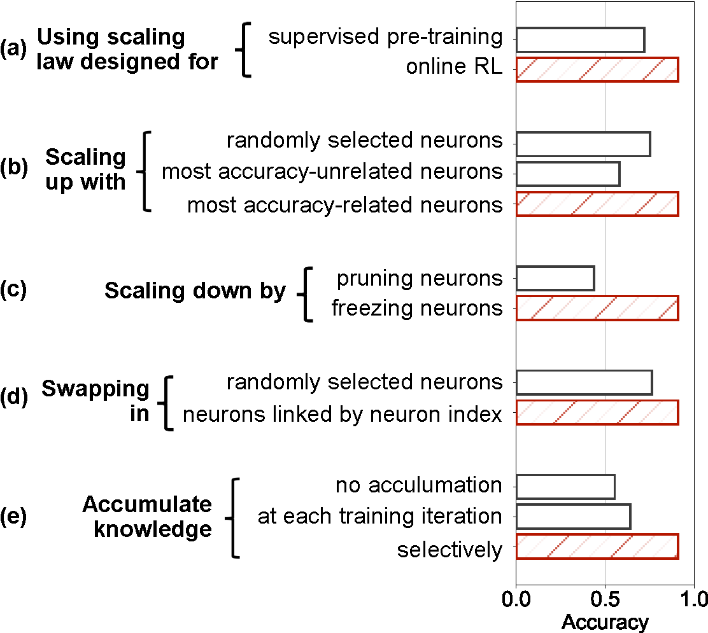
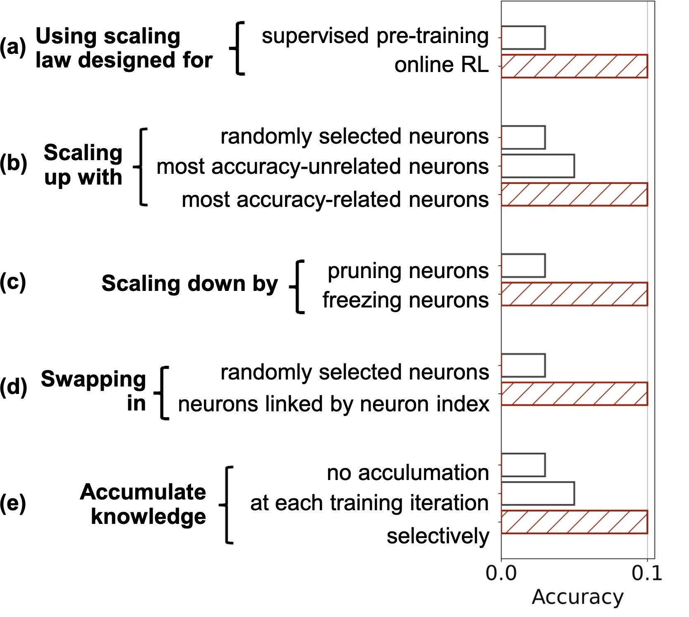

# Example Running Outputs

## (Figure 12 in section 5.4) Design Choice Validation by Ablation

> **Key observation:** under both configurations (full run and minimal working example) **all modules consistently contribute to the final accuracy**.

| | Results |
| :--- | :--- |
| **Full run** |  |
| **Minimal working example** |  |

