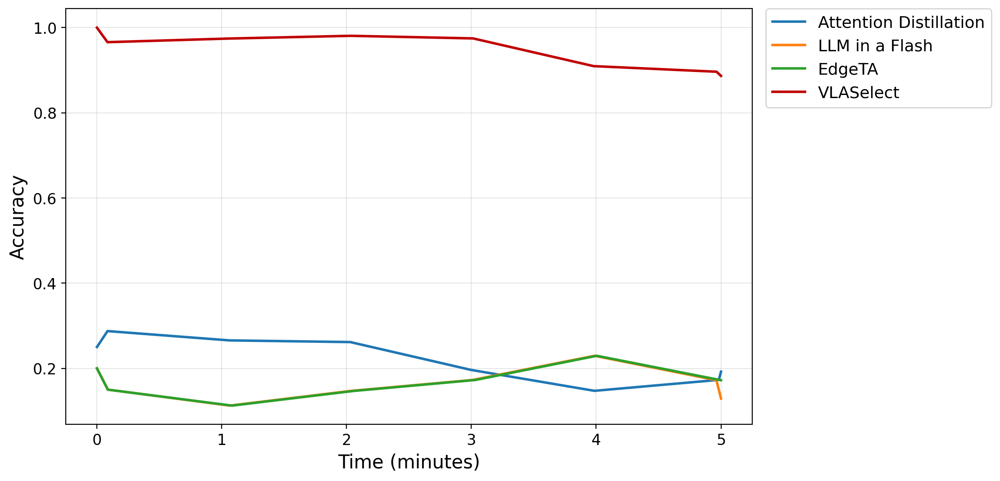
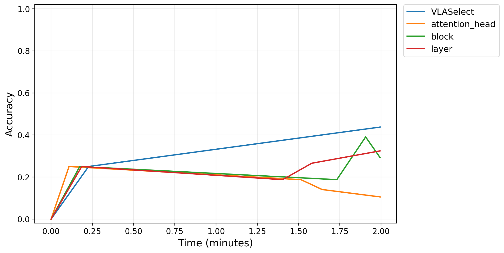

# Example Running Outputs for Supporting Various VLA Models, Scaling Strategies, and Knowledge Exchange Granularities

## 3.1 VLA-Adapter Model Evaluation

### 3.1.1 Supporting the VLA-adapter

### Minimum working example

> **Key observation:** VLASelect adapts models through a unified interface via VLA-Adapter and runs training successfully, with consistent result trends across both platforms.

  

### 3.1.2 Supporting different scaling strategies

> **Key observation:** VLASelect integrates VLA-Adapter and outperforms knowledge distillation and dynamic pruning in selective model scaling.

| | Results |
| :--- | :--- |
| **Minimum working example on three representative methods** |  |
| **Minimum working example on all methods** |  |

  

### 3.1.3 Supporting different knowledge exchange granularities

### Minimum working example

> **Key observation:** VLASelect with VLA-Adapter supports multiple knowledge exchange granularities, with channel/neuron outperforming coarser block, layer, and attention head levels.

  

## 3.2 TinyVLA Model Evaluation

### 3.2.1 Supporting the TinyVLA

### Minimum working example

> **Key observation:** VLASelect supports TinyVLA through a unified adapter interface and trains successfully (only evaluated on constrained testbed).

  

### 3.2.2 Supporting different scaling strategies

> **Key observation:** After integrating TinyVLA, VLASelect also combines with knowledge distillation and dynamic pruning, and its selective model scaling still achieves the best results.

| | Results |
| :--- | :--- |
| **Minimum working example on three representative methods** |  |
| **Minimum working example on all methods** |  |

### 3.2.3 Supporting different knowledge exchange granularities

### Minimum working example

> **Key observation:** For TinyVLA, VLASelect again performs best with channel/neuron-level knowledge exchange compared to coarser block, layer, and attention head granularities.

  

## 3.3 EdgeVLA Model Evaluation

### 3.3.1 Supporting for the EdgeVLA

### Minimum working example

> **Key observation:** VLASelect adapts EdgeVLA via the same unified interface and trains successfully, with consistent result trends across both platforms (only evaluated on constrained testbed).

  

### 3.3.2 Baseline Comparison on EdgeVLA

### Minimum working example

> **Key observation:** Similarly on EdgeVLA, VLASelect outperforms knowledge distillation and dynamic pruning with its selective model scaling approach (only evaluated on constrained testbed).

  

### 3.3.3 Swapping Granularity Ablation on EdgeVLA

### Minimum working example

> **Key observation:** On EdgeVLA, channel/neuron-level knowledge exchange again yields the best results, surpassing coarser block, layer, and attention head granularities (only evaluated on constrained testbed).

  