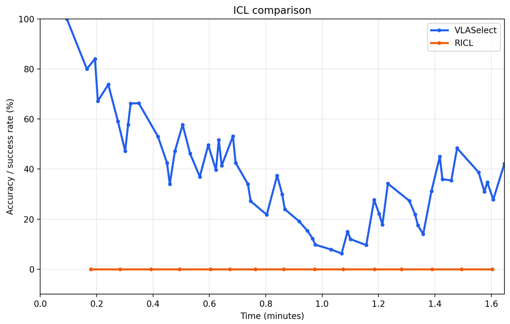
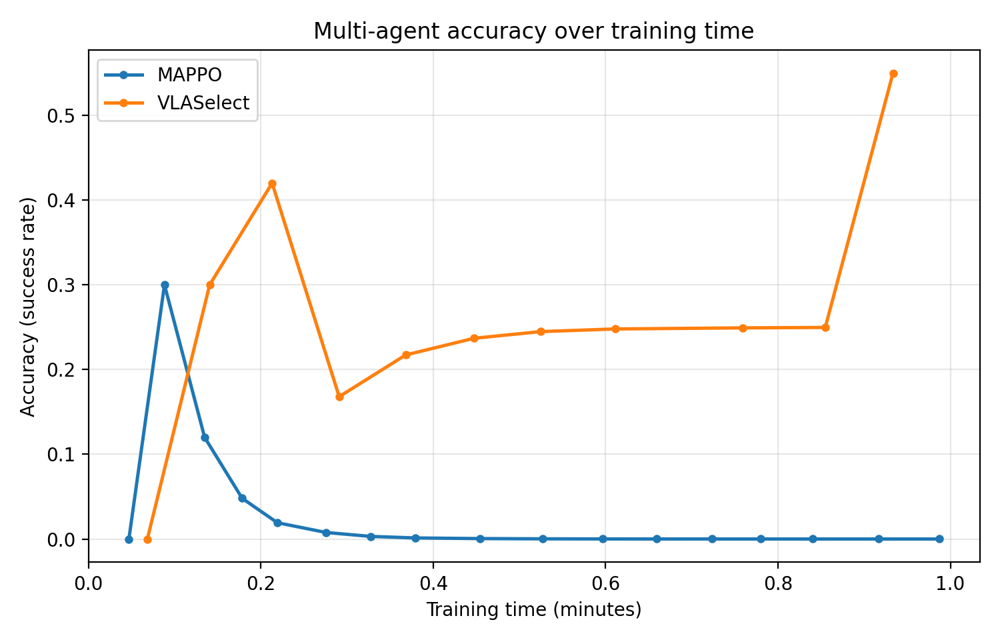

# Expected running outputs

## 2.2.8 (Discussion 2 in Section 5.2): ICL (In-Context Learning)

### Minimal working example

> **Key observation:** RICL fails entirely because the brief runtime is insufficient for its policy to update, whereas VLASelect rapidly adapts and **maintains an average accuracy of 37.2%**.

## 2.2.9 (Discussion 3 in Section 5.3): Maximum Supported Model Size

| Source | Supported Model Size | Hardware / Environment |
| --- | --- | --- |
| **Full run** | Up to 11.3 GB (Xavier), Up to 24.0 GB (Orin) | Jetson Xavier / Jetson Orin |
| **Minimal working example** | ~2.5–24.0 GB | Host with 32 GB VRAM |

## 2.2.10 (Discussion 4 in Section 5.4): Applicability to multi-agent scenarios

### Minimal working example

> **Key observation:** MAPPO completely fails due to the short runtime being insufficient for policy updates, whereas **VLASelect reaches up to 60.0% accuracy**.

#### 2.2.11 (Discussion 5 in Section 5.5) Comparison with Alternative Knowledge Exchange Techniques

##### Minimal working example

| Metric | Value |
| --- | --- |
| Compared knowledge distillation techniques | Logit distillation; Feature distillation; Attention distillation; Data distillation; MiniLLM; DistiLLM |
| Compared dynamic pruning techniques | SPDP; ADP; PowerInfer; LLM in a Flash |
| VLASelect's accuracy improvement than alternative knowledge exchange techniques | **17.19%** |

#### 2.2.12 (Discussion 6 in Section 5.5) Comparison between Different Knowledge Exchange Granularities

##### Minimal working example

| Metric | Value |
| --- | --- |
| Evaluated knowledge exchange granularities | Block; Layer; Attention head; Channel/neuron |
| Best-performing granularity | Channel/neuron |
| Neuron/channel granularity's accuracy improvement than coarser granularties | **23.13%** |

#### 2.2.13 (Discussion 7 in Section 5.5) Forgetting on Previously Learned Environments/Tasks

##### Minimal working example

| Metric | Value |
| --- | --- |
| Baseline techniques | VLA-RFT + EWC; World-Env + EWC; Self-Improvement + EWC |
| VLASelect's accuracy improvement than baseline techniques | **33.18%** |

#### 2.2.14 (Discussion 8 in Section 5.5) Applicability to MLP/CNN models

##### Minimal working example

| Metric | Value |
| --- | --- |
| Evaluated model types | 5-layer MLP; CNN |
| VLASelect's accuracy improvement on MLP than ConRFT | **33.62%** |
| VLASelect's accuracy improvement on CNN than ConRFT | **34.72%** |
