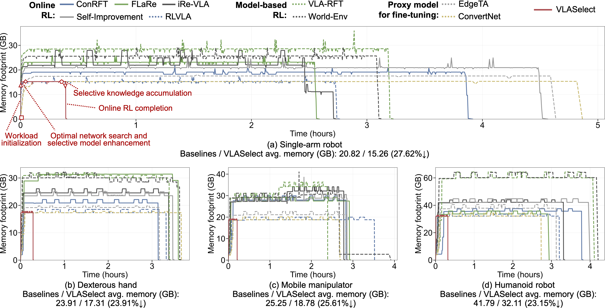
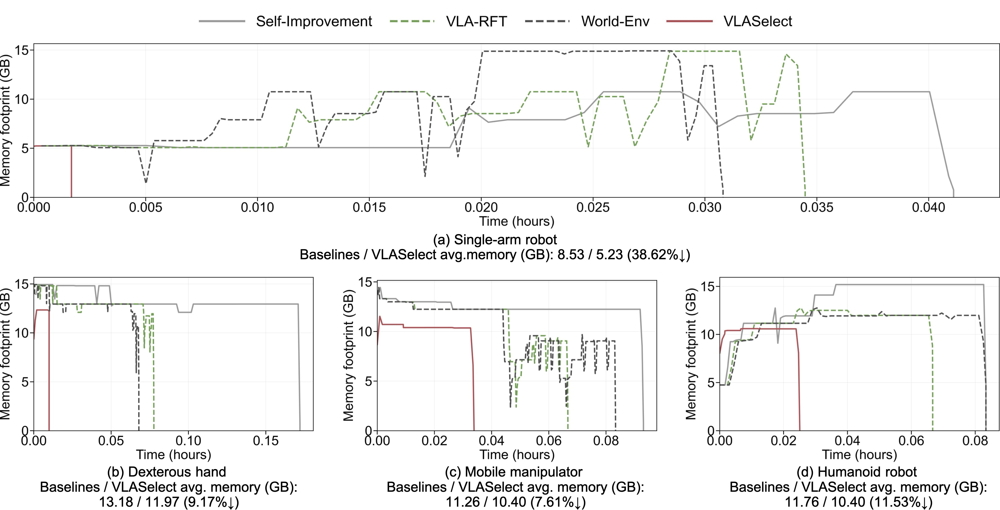
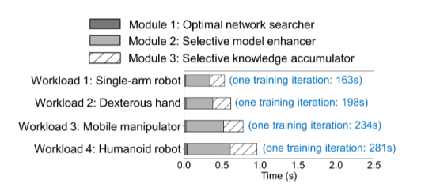
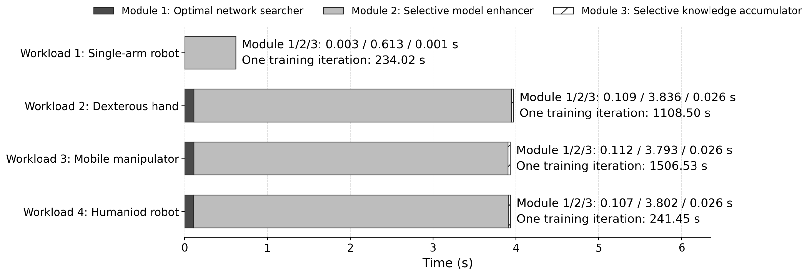
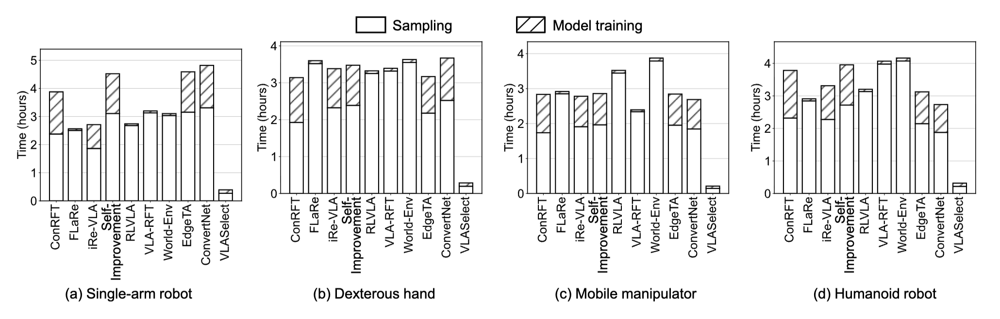
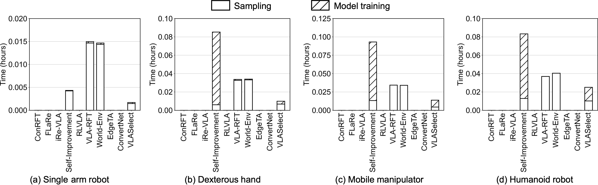

# Example Running Outputs

## (Figure 9 Tables 2/3 in section 5.3.1) Overheads Under The Same Accuracy

> **Key observation:** VLASelect consistently achieves the target accuracy with **the shortest execution** time and **the most reduced resource consumption** compared to all baseline methods.

### Full run

#### Figure 9: Full-scale Example for Memory Footprint Comparison in a new task

  

#### Table 2: Full-scale Example for Average Energy Consumption (kJ) in each new task

| Method | Time (h) - Single-arm | Time (h) - Dexterous | Time (h) - Mobile | Time (h) - Humanoid | Memory (GB) - Single-arm | Memory (GB) - Dexterous | Memory (GB) - Mobile | Memory (GB) - Humanoid | Energy (kJ) - Single-arm | Energy (kJ) - Dexterous | Energy (kJ) - Mobile | Energy (kJ) - Humanoid |
| :--: | :---: | :---: | :---: | :---: | :---: | :---: | :---: | :---: | :---: | :---: | :---: | :---: |
| **ConRFT** | 3.88 | 3.14 | 2.83 | 3.78 | 19.12 | 20.88 | 27.92 | 35.71 | 360.39 | 294.89 | 334.87 | 600.23 |
| **FlaRe** | 2.56 | 3.60 | 2.92 | 2.91 | 23.14 | 31.39 | 27.49 | 33.70 | 295.13 | 384.55 | 384.75 | 492.30 |
| **iRe-VLA** | 2.71 | 3.38 | 2.78 | 3.31 | 21.93 | 24.55 | 27.30 | 42.19 | 253.73 | 374.00 | 382.41 | 630.36 |
| **Self-Improvement** | 4.52 | 3.48 | 2.86 | 3.95 | 20.93 | 23.52 | 27.53 | 42.11 | 547.71 | 309.29 | 337.90 | 763.35 |
| **RLVLA** | 2.74 | 3.32 | 3.52 | 3.20 | 15.26 | 17.31 | 18.78 | 32.11 | 275.99 | 353.41 | 546.13 | 608.56 |
| **VLA-RFT** | 3.20 | 3.39 | 2.39 | 4.07 | 28.54 | 30.99 | 29.04 | 60.02 | 319.56 | 412.78 | 341.89 | 704.55 |
| **World-Env** | 3.10 | 3.63 | 3.87 | 4.16 | 25.66 | 30.05 | 29.27 | 60.23 | 279.42 | 429.66 | 505.86 | 738.14 |
| **EdgeTA** | 4.59 | 3.17 | 2.84 | 3.12 | 17.54 | 19.23 | 21.12 | 37.87 | 523.80 | 382.06 | 440.83 | 467.90 |
| **ConvertNet** | 4.82 | 3.67 | 2.69 | 2.73 | 15.26 | 17.31 | 18.78 | 32.11 | 478.14 | 434.77 | 430.10 | 510.83 |
| **VLASelect** | 0.39 | 0.29 | 0.21 | 0.32 | 15.26 | 17.31 | 18.78 | 32.11 | 45.53 | 34.53 | 28.76 | 47.56 |

  

#### Table 3: Full-scale Example for Overhead comparison under the same learning accuracy

| Method | Trial / Task | Single-arm robot | Dexterous hand | Mobile manipulator | Humanoid robot |
| :--: | :---: | :---: | :---: | :---: | :---: |
| **ConRFT** | Task 1 Task 2 | 342.37 403.51 | 346.31 274.05 | 499.84 291.68 | 787.19 570.22 |
| **FlaRe** | Task 1 Task 2 | 318.06 254.18 | 477.07 317.51 | 461.29 379.37 | 671.17 452.06 |
| **iRe-VLA** | Task 1 Task 2 | 383.33 213.81 | 530.53 204.04 | 505.40 273.55 | 661.88 564.21 |
| **Self-Improvement** | Task 1 Task 2 | 551.76 473.14 | 416.37 293.83 | 497.49 297.81 | 801.52 673.49 |
| **RLVLA** | Task 1 Task 2 | 326.26 206.67 | 360.71 314.32 | 573.44 466.58 | 622.44 458.46 |
| **VLA-RFT** | Task 1 Task 2 | 323.69 277.80 | 433.42 280.17 | 374.09 257.39 | 795.60 632.21 |
| **World-Env** | Task 1 Task 2 | 329.26 265.45 | 339.87 451.14 | 666.90 480.57 | 775.05 639.55 |
| **EdgeTA** | Task 1 Task 2 | 349.40 549.99 | 383.21 282.31 | 464.28 355.50 | 629.97 444.50 |
| **ConvertNet** | Task 1 Task 2 | 608.37 454.23 | 456.51 327.35 | 451.61 378.12 | 536.37 451.60 |
| **VLASelect** | Task 1 Task 2 | 46.06 44.24 | 35.41 25.63 | 39.46 25.57 | 64.71 45.18 |

  

### Minimal working example

#### Figure 9: Minimal Working Example for Memory Footprint Comparison in a new task

#### Table 2: Minimal Working Example for Average Energy Consumption (kJ) in each new task

| Method | Time (h) - Single-arm | Time (h) - Dexterous | Time (h) - Mobile | Time (h) - Humanoid | Memory (GB) - Single-arm | Memory (GB) - Dexterous | Memory (GB) - Mobile | Memory (GB) - Humanoid | Energy (kJ) - Single-arm | Energy (kJ) - Dexterous | Energy (kJ) - Mobile | Energy (kJ) - Humanoid |
| :--- | :---: | :---: | :---: | :---: | :---: | :---: | :---: | :---: | :---: | :---: | :---: | :---: |
| **Self-Improvement** | 0.04 | 0.17 | 0.09 | 0.08 | 7.32 | 13.41 | 12.47 | 12.94 | 15.82 | 62.99 | 37.17 | 25.65 |
| **VLA-RFT** | 0.03 | 0.08 | 0.07 | 0.07 | 8.48 | 13.09 | 11.07 | 11.21 | 13.83 | 27.52 | 26.83 | 25.24 |
| **World-Env** | 0.03 | 0.07 | 0.08 | 0.08 | 9.77 | 13.03 | 10.25 | 11.12 | 12.98 | 23.96 | 33.92 | 33.02 |
| **VLASelect** | 0.01 | 0.01 | 0.03 | 0.03 | 5.23 | 11.97 | 10.40 | 10.40 | 0.58 | 2.96 | 12.28 | 9.91 |

  

#### Table 3: Minimal Working Example for Overhead comparison under the same learning accuracy

| Method | Single-arm robot | Dexterous hand | Mobile manipulator | Humanoid robot |
| :--- | :---: | :---: | :---: | :---: |
| **Self-Improvement** | 15.82 | 62.99 | 37.17 | 26.22 |
| **VLA-RFT** | 13.83 | 27.52 | 26.83 | 24.62 |
| **World-Env** | 12.98 | 23.96 | 33.92 | 33.03 |
| **VLASelect** | 0.68 | 11.37 | 12.28 | 2.58 |

  

## (Figure 10 in section 5.3.2) Time Breakdown of VLASelect's Modules

> **Key observation:** The execution time of VLASelect core modules are obviously less than training iteration time.

| | Results |
| :--- | :--- |
| **Full run** |  |
| **Minimal working example** |  |

---

## (Figure 11 in section 5.3.2) Training Time Breakdown in Each Workload

> **Key observation:** Under identical workloads, VLASelect achieves **shorter runtime** while maintaining high accuracy compared with other baselines.

| | Results |
| :--- | :--- |
| **Full run** |  |
| **Minimal working example** |  |