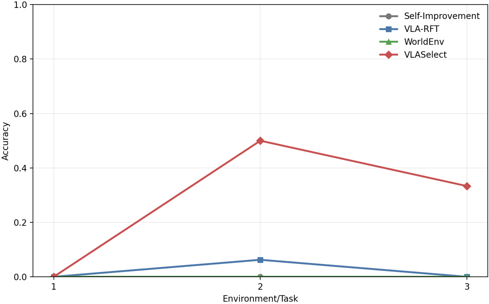

# Example Running Outputs

## 2.2.13 Experiment 13: (Discussion 7 in Section 5.5) Forgetting on Previously Learned Environments/Tasks

### Minimal working example

> **Key observation:** VLASelect achieves higher accuracy on all learned environments/tasks than existing online RL and forgetting mitigation methods.

<table align="center">
  <tbody>
    <tr>
      <td align="center">Baseline techniques</td>
      <td align="center">VLA-RFT + EWC World-Env + EWC Self-Improvement + EWC</td>
    </tr>
    <tr>
      <td align="center">VLASelect's accuracy improvement than baseline techniques</td>
      <td align="center"><strong>33.18%</strong></td>
    </tr>
  </tbody>
</table>

  

  
