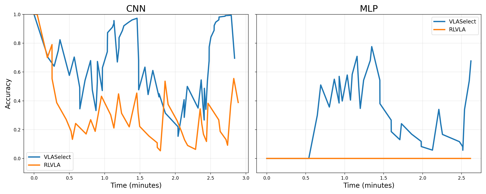

# Example Running Outputs

## 2.2.14 Experiment 14: (Discussion 8 in Section 5.5) Applicability to MLP/CNN models

### Minimal working example

> **Key observation:** VLASelect can apply to MLP and CNN models and achieves higher accuracy than baseline methods (ConRFT).

<table align="center">
  <tbody>
    <tr>
      <td align="center">VLASelect's accuracy improvement on MLP than ConRFT</td>
      <td align="center"><strong>33.62%</strong></td>
    </tr>
    <tr>
      <td align="center">VLASelect's accuracy improvement on CNN than ConRFT</td>
      <td align="center"><strong>34.72%</strong></td>
    </tr>
  </tbody>
</table>

  

