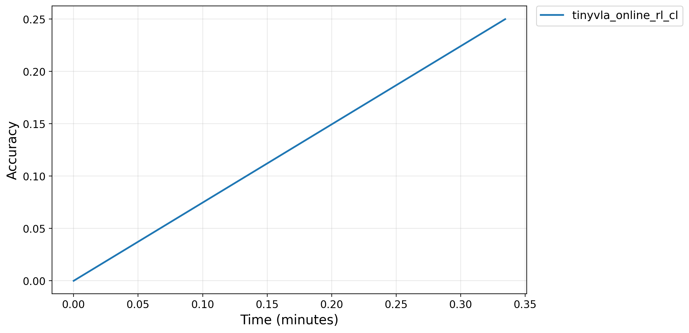

# Example Running Outputs

## 3.2 Example 2: TinyVLA

### 3.2.1 Model Integration Interface

> **Key observation:** VLASelect supports TinyVLA through a unified adapter interface and trains successfully (only evaluated on constrained testbed).

| | Results |
| :---: | :---: |
| **Minimum working example** |  |

  
